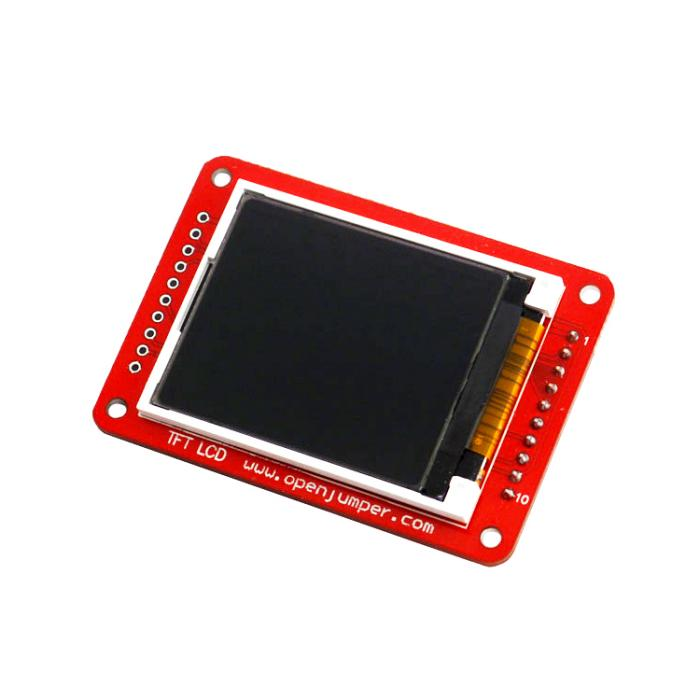
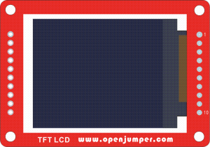
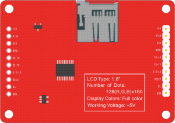

# 1.8英寸TFT液晶屏

## 概述

OJ TFT液晶屏是含有插针和背光的LCD屏，使用TFT library 库文件，你可以显示文本、图片等。液晶背面含有板载的micro-SD卡槽，使您能够存储位图图像并在屏幕上显示。屏幕的引脚扩展接口完全兼容 Arduino Esplora 可以直接插在扩展口上。

## 参数

+ 模块尺寸：60mm*42mm

+ 像素：128（RGB）*160

+ 显示色彩：全彩

+ 供电电压：5V

## 引脚定义

a.正面

b.反面

|引脚号|标识|功能|
|:--|:--|:--|
|1|+5V|电源DC 5V+|
|2|MISO|SPI接口|
|3|SCK|
|4|MOSI|
|5|CS-LD|液晶屏使能|
|6|CS-TF|TF卡使能|
|7|D/C-LD|液晶屏数据/指令控制|
|8|RESET|液晶屏复位|
|9|BL|液晶屏背光控制|

  背光亮：置High，并可通过PWM控制亮度

  背光灭：置Low或悬空10GND电源DC地

## 特点

+ 屏幕尺寸为1.8英寸，点阵格式为160*128。通过使用TFT 库文件，连接TFT至Arduino的SPI通信接口就可以很方便的进行显示。

+ 屏幕工作电压为DC5V。

+ 板载Micro-SD卡槽，配合SD卡库文件可以进行SD卡操作。

+ 可用PWM调节LED背光。

+ 屏幕引脚接口方便连接到Arduino Esplora和Ardiuno Robot。

## 库说明

Arduino TFT库在 Adafruit ST7735 libraries 基础上扩展了 Adafruit GFX 。而GFX库文件是用来绘制普通常规的图形，而ST7735 库对于Arduino 屏来说可以绘制特殊图形。使用这个库文件，就可以像Processing提供的API一样工作。库文件可以向下兼容，这意味着你可以使用Adafruit这里描述的功能。TFT库是依靠SPI 库，所以必须把SPI库添加到例程中使用，如果你希望使用SD卡，你就需要包含SD卡的库文件。

## 库文件下载

Library：[TFT](http://www.openjumper.cn/wp-content/uploads/2013/09/TFT.rar)

datasheet：[TFT](http://www.openjumper.cn/wp-content/uploads/2013/09/TFT.pdf)

## 注意事项

该TFT液晶屏通常使用SPI接口驱动，在Arduino Mega、Ethernet上驱动引脚需要做一定调整。

驱动液晶屏请配套使用本页提供的库文件。