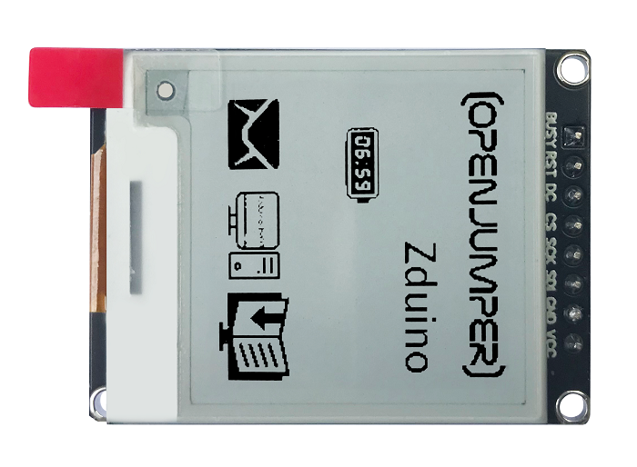
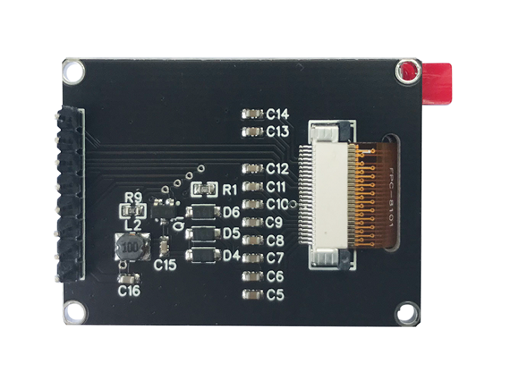
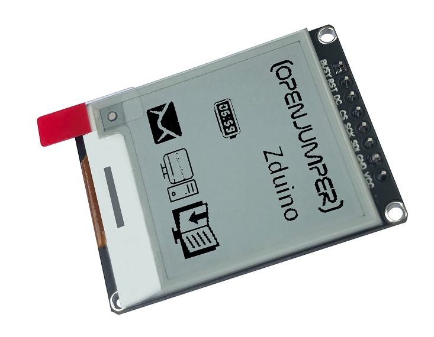

# OJ-1.54寸电子墨水屏

## 产品实拍图

<table border="1">

<tr>
  <td align="center"></td>
  <td align="center"></td>
  <td align="center"></td>
</tr>
<tr>
  <td style="background-color:rgb(232,232,232,0.5) "colspan="3" align="center"> <a href="https://item.taobao.com/item.htm?id=669292502593"><font style="font-size:16px"> 1.54寸电子墨水屏 </font></a> </td>
</tr>
</table>

## 模块参数

+ 电源电压：3.3V/5V

+ 显示尺寸：1.54寸

+ 显示颜色：黑/白

+ 模块尺寸：32.5X43.5（mm）

+ 通讯方式：SPI

+ 分辨率：200*200

## 引脚及对应主板接线说明

|引脚|说明|arduino|esp32|
|:--|:--|:--:|:--:|
|VCC|电源正|VCC|VCC|
|GND|电源负|GND|GND |
|SDI|SPI通讯的MOSI|11|19|
|SCK|SPI通讯的SCK|13|18 |
|CS|SPI片选引脚（低电平有效）|10|17|
|DC|数据/命令控制引脚（高电平数据，低电平命令）|9|16|
|RST|外部复位引脚（低电平复位）|8|15
|BUSY|忙状态输出（高电平表示模块处于上一个进程）|7|14|

## 适用主板

+ Arduino

+ WiFiduino

+ ESP32

+ ESP8266

## Arduino示例程序

```C++
/**
 *  @filename   :   epd1in54b-demo.ino
 *  @brief      :   1.54inch e-paper display (B) demo
 *  @author     :   Yehui from Waveshare
 *  
 *  墨水屏连接：
 *  BUSY_PIN        7
 *  RST_PIN         8
 *  DC_PIN          9
 *  CS_PIN          10
 *  SCK             13
 *  SDI             11 
 */

#include <SPI.h>
#include <epd1in54b_V2.h>
#include <imagedata.h>

void setup() {
  // put your setup code here, to run once:
    Serial.begin(115200);
    Epd epd;
    if (epd.Init() != 0) {
        Serial.print("e-Paper init failed");
        return;
    }
    epd.DisplayClear();
    //epd.DisplayFrame(IMAGE_BLACK, IMAGE_RED);
    epd.DisplayFrame(OpenJumper, IMAGE_RED);
}

void loop() {
  // put your main code here, to run repeatedly:

}
```
## 取模软件

请参考如Arduino中文社区“[何选择取模软件驱动大连佳显电子纸](https://www.arduino.cn/forum.php?mod=viewthread&tid=106627&highlight=%E5%8F%96%E6%A8%A1)”

## 示例程序

[Arduino示例程序](http://download.openjumper.cn/epd1in54b_V2.rar)

[ESP32示例程序](http://download.openjumper.cn/GDEH0154D67_ESP32.rar)