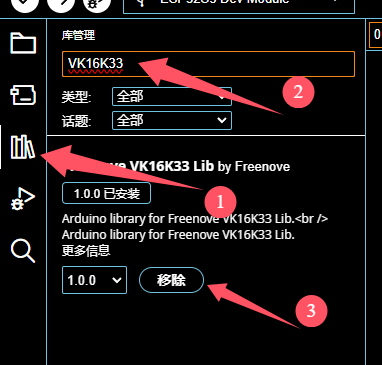
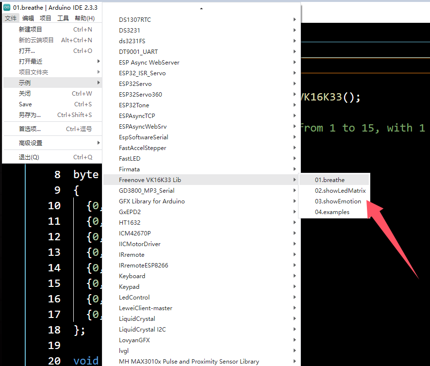

# 点阵屏模块

 <a href="https://item.taobao.com/item.htm?id=863593638892"> 点阵屏模块 </a> 

## 简介

oj点阵屏模块是一款基于XK16K33A芯片的8*16点阵显示屏，适用于Arduino平台，支持Mixly等图形化编程软件，使得编程更加直观和便捷。该点阵屏具有高亮度、低功耗和易于控制的特点，适用于各种显示项目。

## 基本参数

1. 电源电压：5V
2. 驱动：XK16K33A
3. 接口：IIC-PH2.0（适用于Arduino的接口）
4. 点阵尺寸：8行 x 16列
5. 模块尺寸：42mmx81mm
6. 显示颜色：单色（红色）

### 模块固定孔尺寸图

## 硬件接线

供电：将点阵屏板子的VCC和GND连接到Arduino主板的5V和GND。

数据线：将SDA和SCL引脚分别连接到Arduino的SDA和SCL端口。

】

## 使用教程

### arduino示例程序
1、使用arduinoIDE安装点阵模块库文件

2、打开例程下载后，接线测试

### mind+示例

#### 使用mind+安装模块用户库

1. 点击左下角扩展图标

2. 主控板选择Arduino UNO

3. 点击用户库，选择导入用户库

4. 找到资料中的库文件，双击或右下角打开

5. 最后点击导入的库

这样就可以在左边图形块看到了

#### 上传例程接线测试

1. 点击打开项目

2. 选择资料中的示例

3. 点击设备连接

4. 最后点击上传到设备即可

+ 点阵8*8显示

+ 点阵8*16显示

## 注意事项
请勿超出额定电压范围，以免损坏设备。
使用时注意防水防尘，保持电路板清洁。
确保正确连接SDA和SCL引脚以避免通讯故障。

## 常见问题解答
问：连接后无显示？
答：检查电源线及数据线连接是否正确；确认Mnd+配置的Arduino型号是否正确。
问：显示乱码或不完整？
答：请检查I2C通讯是否稳定，可以尝试重新插拔连接线确保接触良好。
