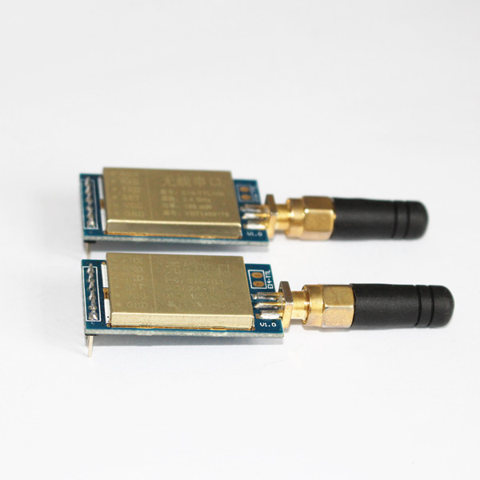

# 2.4G无线调频串口模块

## 参数

+ 型号: E14-TTL100-SMA

+ 尺寸: 20mm*36mm

+ 最大功率: 100mW

+ 参考距离: 2100米

+ 天线类型: SMA（外螺纹内孔）

 

## 特点

+ 采用目前较新的无线射频芯片，以及低功耗高性能单片机构成；
    
+ 具有TTL电平的串口通信接口，支持波特率为1200-115200多达8种波特率；
    
+ 支持串口透传模式，多种空中无线传输速率；
    
+ 内置看门狗，在及其恶劣的工业环境中，也可以保证模块永不死机；
    
+ 内置特有的无线通信算法，精确地的时间分割和同步，保证模块具备充分的数据传输能力、丢包重传能力、误码纠错能力等，其算法远优于业内同行。
    
+ 具备AUX引脚，可以设置为串口繁忙指示和无线繁忙指示
    
+ 抗干扰屏蔽罩，提高接收灵敏度
    
+ 支持调频模式，模块会自动切换信道，从而有效的避开突发干扰，大大提高通信可靠性。

**调频模式：只能支持点对点传输。**

+ 调频模式下，模块接收电流将大大增加，发射电流无影响

+ 调频模式是为最大程度保证通信可靠性而设置，所以其通信速率将降低，此时建议单帧连续传输不高于256字节。

+ 由于模块将根据一定算法规则，收发过程中，频率将产生变化。变化范围不限于用户设定的基本频点。模块具有一个特定的扩频序列。用户无需关系这个序列。

+ 调频模式仅提供0、1、2 三个信道，用户输入参数大于2，将视为等于2。若用户在同一区域内需要更多的通信工作组，可以通过设置不同地址来进行区分。

+ 通信双方必须同时设置为调频模式，方可进行互相通信。

**定频模式：可支持一发多收**

+ 可支持点对多点传输，电流等同于调频模式。

+ 定频模式提供个0-12，共13个信道供用户使用，用户输出参数大于12，将视为等于12.

+ 定频模式下，数据传输速率将高于调频模式。

+ 通信双方必须同时设置为定频模式，方可进行互相通信。

**供电电压：**

支持极宽的供电电压范围，3.0-5.5V 都可以使用，可以用于3.3V或5V系统，其I/O电平也同样兼容

## 用USB-UART模块给模块设置出厂配置步骤：

**模块与USB-UART模块连接：**

VCC————VCC

GND————GND
 
RX————TX

TX————RX
 
**SET(低为设置指令状态，高为工作状态)**

+ 第一步：将主机串口设置为9600、8、N、1（串口调试助手）；
    
+ 第二步：将SET引脚拉低，使SET=0；

+ 第三步：等待模块返回“START”字符；
  
+ 第四步：通过串口发送5字节设置数据到模块；（发送默认设置：C0 12 34 18 00） （16进制发送）

+ 第五步：若命令正确，模块返回“OK”，表示设置成功，否则模块返回“ERROR”，表示设置失败，参数未得到改变。

在出厂设置下，模块串口速率：9600 （停止位校验位为N 1） 空中速率：1K 频点为0 （具体参考用户手册），此下用3个模块通过USB转串口模块连接至电脑，发送数据测试。当其中一点发出数据，另外两个模块接收到模块一发出的数据（如图）

