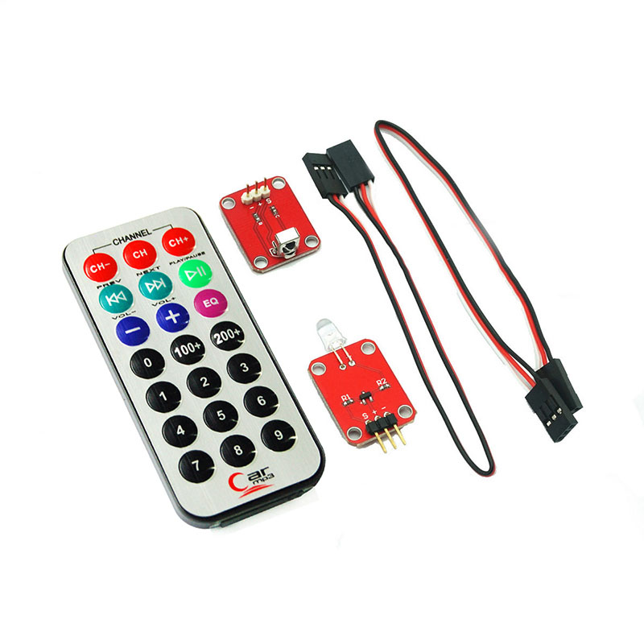

# 红外遥控套件
## 概述

套件包含38K红外接收模块，和一个红外发射模块，及一个红外遥控器。红外发射遥控器发射的38K红外载波信号是由遥控器里的编码芯片对其进行编码。当按下遥控器按键时，遥控器发送出红外载波信号，红外接收器接收到信号时程序对载波信号进行解码，通过数据码的不同来判断按下的是哪个键。此时就可以利用红外遥控套件配合arduino做出简单的红外遥控互动作品。

 

[点我购买](https://item.taobao.com/item.htm?id=557937055050)

## 红外接收模块参数

+ 尺寸：19*26mm 
 
+ 工作电压：5V

+ 调制频率：38KHz

+ 信号类型：数字信号
  
## 红外接收模块引脚定义

+ S：信号脚

+ +：VCC

+ -：GND

## 遥控器参数
+ 按键设置：20个按键（数字0-9、电源、音量等）

+ 电池类型：优质CR2025环保纽扣电池（容量达160mAh）

+ 发射频率：38KHz

+ 发射距离：>8m

+ 有效角度：60度

+ 面贴材料：0.125mmPET（有效寿命2万次）

+ 工作电流：3-5uA（静态）/3-5mA（动态）

+ 外形尺寸：86x40mm

## 示例程序
```C++
/* OPENJUMPER IR Receiver Molule 
www.openjumper.cn */

#include <IRremote.h>


 int RECV_PIN = 11;

 IRrecv irrecv(RECV_PIN);

 decode_results results;

 void setup()
 {
   Serial.begin(9600);
   irrecv.enableIRIn(); // Start the receiver
 }

 void loop() {
   if (irrecv.decode(&results)) {
     Serial.println(results.value, HEX);
     irrecv.resume();    // Receive the next value
   }
 }
```

### 注意：只支持2.0版本以下的红外库

如果接收到的数据全都是FFFFFFFFFF,那就是红外的库太新了。


## 其他资料

[IR Receiver library:https://github.com/shirriff/Arduino-IRremote](https://github.com/shirriff/Arduino-IRremote)

[IR Receiver schematic:IR-Receiver](http://openjumper.cn/wp-content/uploads/2012/08/IR-Receiver.pdf)

