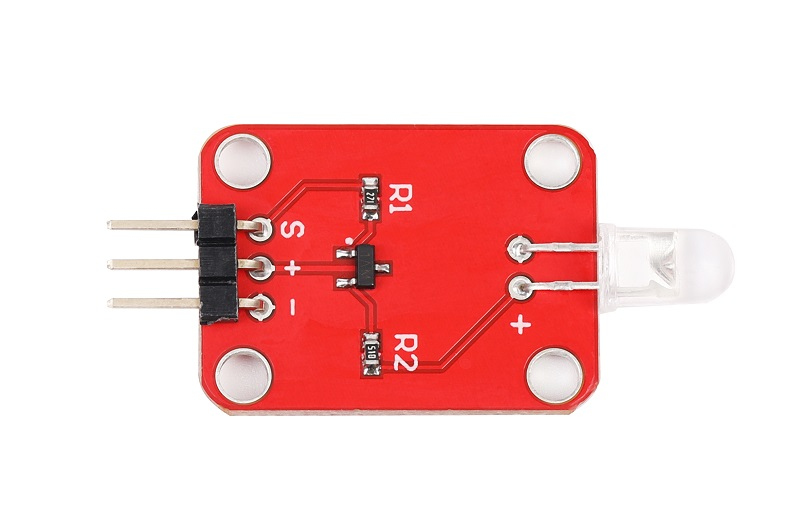
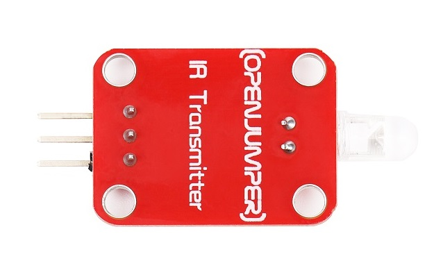
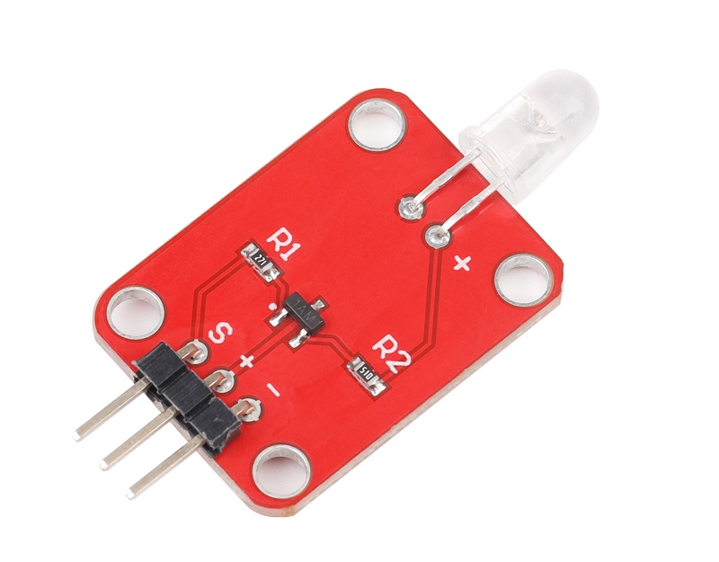
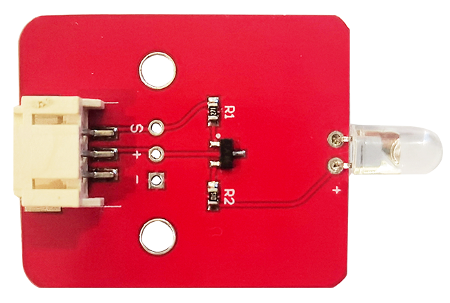
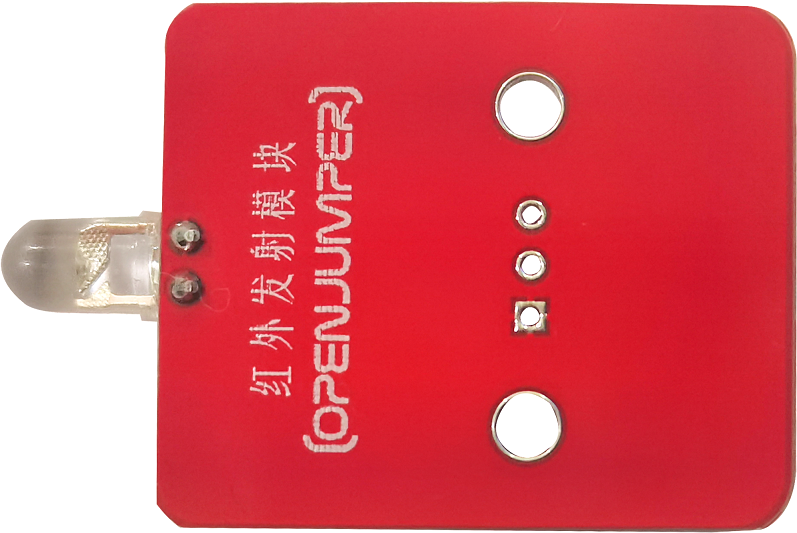
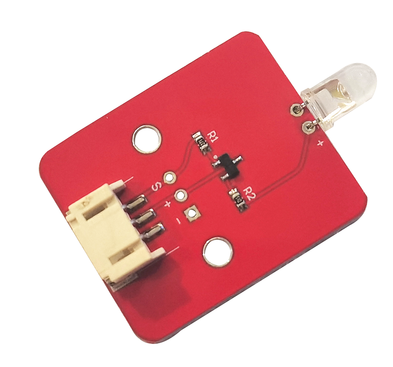
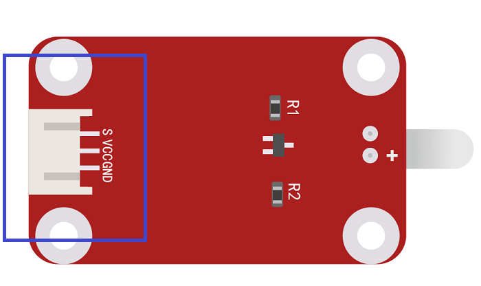

# 红外发射模块

<table border="1">

<tr>
  <td align="center"></td>
  <td align="center"></td>
  <td align="center"></td>
</tr>
<tr>
  <td style="background-color:rgb(232,232,232,0.5) "colspan="3" align="center"><a href="https://item.taobao.com/item.htm?id=538643843712"> <font style="font-size:16px"> 红外发射模块 </font></a> </td>
</tr>
<tr>
  <td align="center"></td>
  <td align="center"></td>
  <td align="center"></td>
</tr>
<tr>
  <td style="background-color:rgb(232,232,232,0.5) "colspan="3" align="center"> <a href="https://item.taobao.com/item.htm?id=592024846984"><font style="font-size:16px"> 红外发射模块 防反接 </font></a> </td>
</tr>
</table>

## 概述
数字红外发射模块利用红外发射头，配合arduino软件编程，使之发射出38KHZ的红外载波。配合红外接收模块使用，这样代替红外遥控器，激发你的灵感，让你更加方便做出自己的创意互动作品。 


## 参数

+ 工作电压：5V 

+ 载波信号：38K红外载波 

+ 信号类型：数字信号 

+ 尺寸：25mm*20mm

## 端口说明

+ S：信号输出

+ +：VCC

+ –：GND
  
  


## 示例程序
```C++
/*OJ IRtransmitter module
 www.openjumper.cn
 */
//将红外发射模块的引脚必须接Arduino板子Pin-3脚。
#include <IRremote.h>    // 引用 IRRemote 程序库
const int buttonPin = 4;                 // 按鍵(pushbutton)接在 pin 4
int buttonState = 0;                     // 按鍵状态
IRsend irsend;                           //定义 IRsend 物件来发射红外信号
void setup()
{
  pinMode(buttonPin, INPUT_PULLUP);             // 把 buttonPin 设置成上拉模式
}

void loop() 
{
  // 读取按键状态
  buttonState = digitalRead(buttonPin);

  // 检查按键是否被按下
  // 有按下的话buttonState 會是LOW
  if (buttonState == LOW) {    
    // 发射红外信号
　　irsend.sendNEC(0xFFA25D, 32);   // OJ红外遥控器 ON按钮的紅外编码, 记得换成你的红外编码
　　  }
}
```
## 其他文档
[Schematic：IR-transmit](http://www.openjumper.cn/wp-content/uploads/2013/06/IR-transmit.pdf)