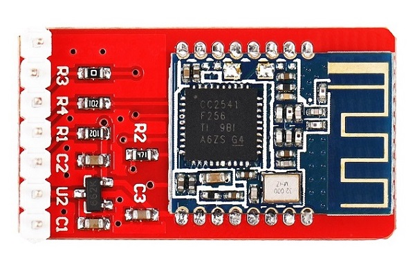
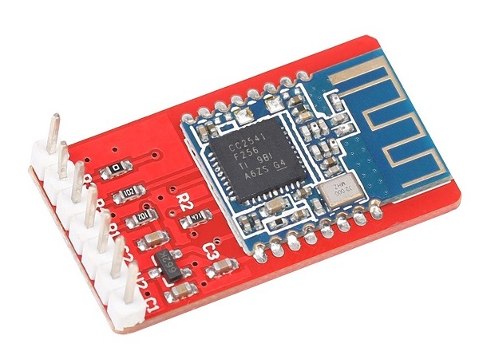
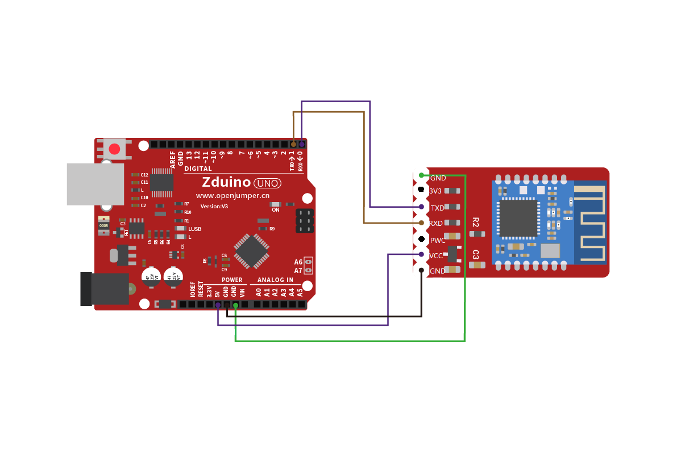
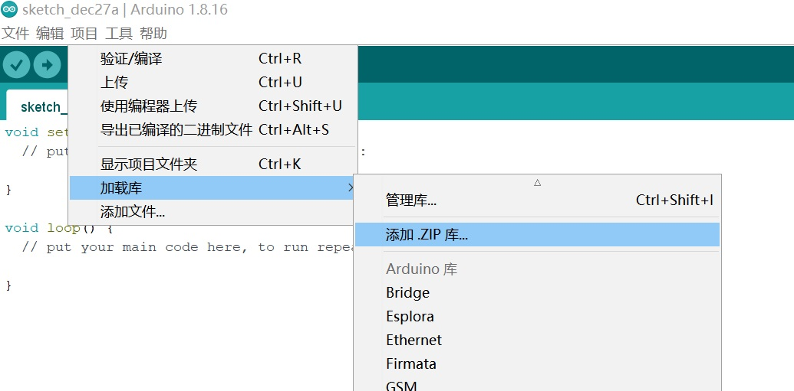
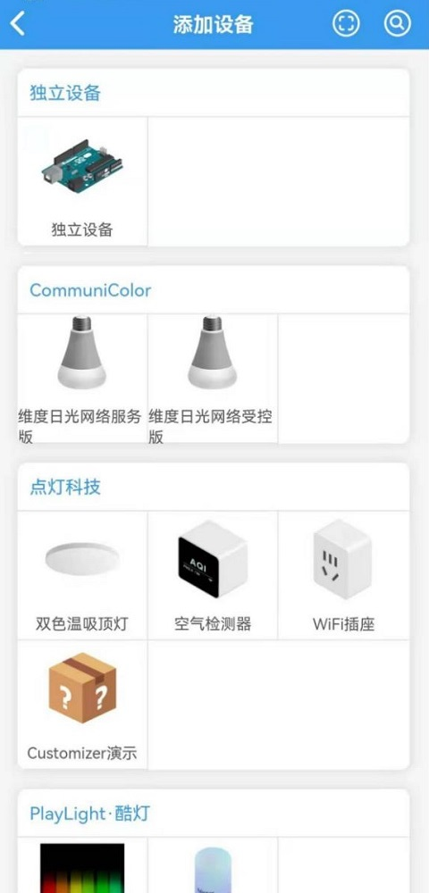
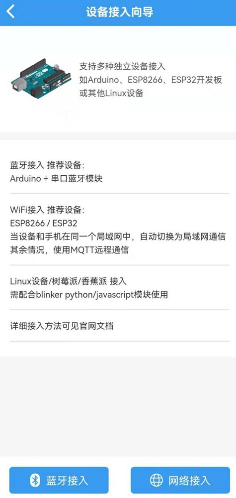
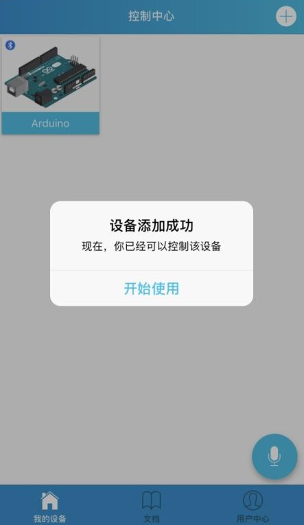

# 蓝牙4.0模块

## 产品概述

蓝牙4.0模块采用TI CC2540芯片，配置256Kb 空间，支持AT 指令，用户可根据需要更改角色（主、从模式）以及串口波特率、设备名称、配对密码等参数，使用灵活。 

**注意：主板连接蓝牙无法上传程序，需要拔掉蓝牙**

<table border="1">

<tr>
  <td align="center"></td>
  <td align="center"></td>
  <td align="center"></td>
</tr>
<tr>
  <td style="background-color:rgb(232,232,232,0.5) "colspan="3" align="center"> <a href="https://item.taobao.com/item.htm?id=552865242257"><font style="font-size:16px"> 蓝牙4.0模块 </font></a> </td>
</tr>
</table>


## 产品参数 

+ 蓝牙协议：Bluetooth Specification V4.0 BLE 串口收发没有字节限制，空旷环境下和iphone4s可以实现100米超远距离通信 
  
+ 工作频率：2.4GHz ISM band 
  
+ 调制方式：GFSK(Gaussian Frequency Shift Keying) 
  
+ 发射功率：-23dbm, -6dbm, 0dbm, 6dbm, 可以通过AT 指令修改 

+ 波特率：默认9600  
 　　　　可调4800~1382400 
  
+ 输入电压：VCC供电 4V~6V  
 　　　　　3V3供电 3.3V 

+ 工作温度：-5°C~+65°C 

+ 其他特性：内置天线  
   　　　　　主从一体

 
## 支持设备

Iphone4S/5/IPad  
Android 4.3

 
## 引脚说明

|序号|标识|说明|连接端口|
|:--|:--|:--|:--|
|1|GND|地|GND|
|2|3V3|3.3V供电输入端|3V3|
|3|TXD|UART接收端|RXD|
|4|RXD|UART发送端|TXD|
|5|P0|P0控制端|D2|
|6|VCC|4-6V供电输入端|5V|
|7|GND|地|GND|

## arduino连线图 



## 测试例程
```C++
#define BLINKER_BLE
#include <Blinker.h>

BlinkerButton Button1("btn-abc");

void Button1_callback(const String & blmc) {
  if (blmc == BLINKER_CMD_BUTTON_TAP) {
    digitalWrite(13,(!digitalRead(13)));

  }
}

void setup(){
  Blinker.begin(0,1,9600);

  pinMode(13, OUTPUT);
  Button1.attach(Button1_callback);
}

void loop(){
  Blinker.run();

}

```

## 操作步骤

### 第一步 下载blinker

使用蓝牙我们首先需要下载蓝牙控制APP，在这里使用IOS平台作为演示，登陆APP store，搜索blinker。

或者直接在安卓应用市场搜索blinker。或者在点灯官网进行下载

[点灯科技 (diandeng.tech)](https://diandeng.tech/)


### 第二步 下载并安装blinker Arduino库

[点击下载](https://diandeng.tech/dev)

</br>

**加载Blinker-library**

</br>


</br>


**将其放在 我的文档—Arduino—libraries 下面，如图所示：**


</br>

**通过Arduino IDE 菜单>项目>加载库>添加.ZIP库 导入到库，如图：**



</br>

### 第三步 

**打开blinker APP，首先添加需要接入的硬件，点击右上方的+号，选择独立设备**

　　　 

</br>

**添加之后选择蓝牙接入**



</br>

**此时APP会开始搜索附近的蓝牙设备，搜索到之后点击连接**

　

</br>

**点击编辑按钮，来设计我们的设备界面**

　 

    测试本文档案列时，在blinker界面点击载入示例进行测试。

为什么没有搜索到设备？

+ android系统要求搜索蓝牙必须开启手机定位服务，个别系统（如华为）不会提示用户打开定位服务
  
   解决办法：开启手机定位服务

+ 使用了蓝牙2.0设备或者其他blinker不支持的蓝牙设备

   解决办法：[点击查看blinker设备端支持](https://diandeng.tech/doc/device-support)

## 其他资料

+ 蓝牙4.0连接方法/蓝牙4.0常用AT命令/蓝牙4.0配置工具：[openjumper_BT4.0](http://www.openjumper.cn/wp-content/uploads/2014/06/openjumper_BT4.0.rar)

+ 蓝牙4.0 苹果设备蓝牙助手： 苹果商店下载LightBlue
