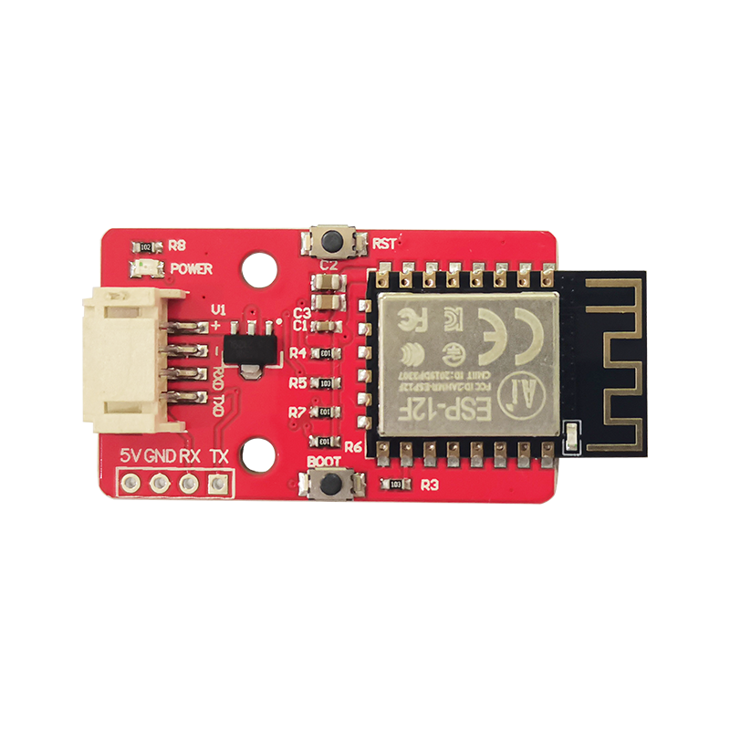
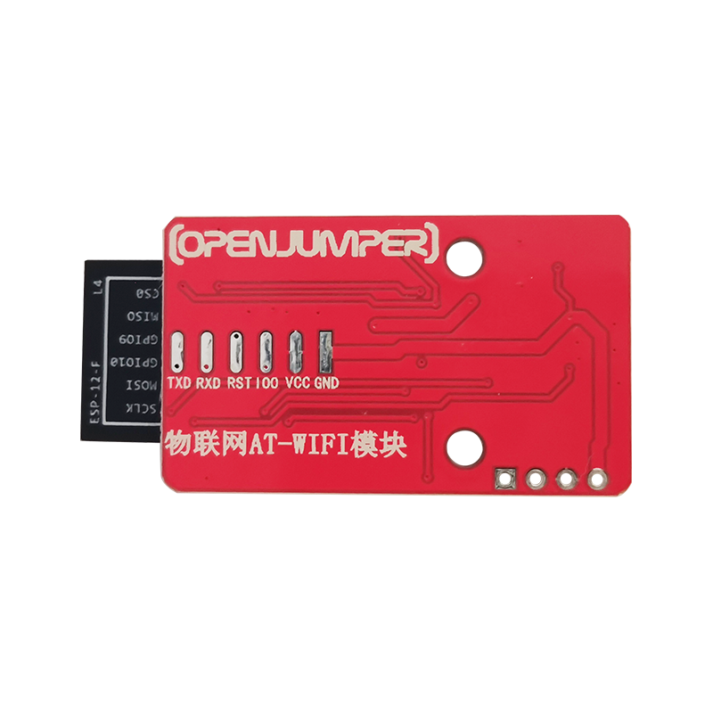
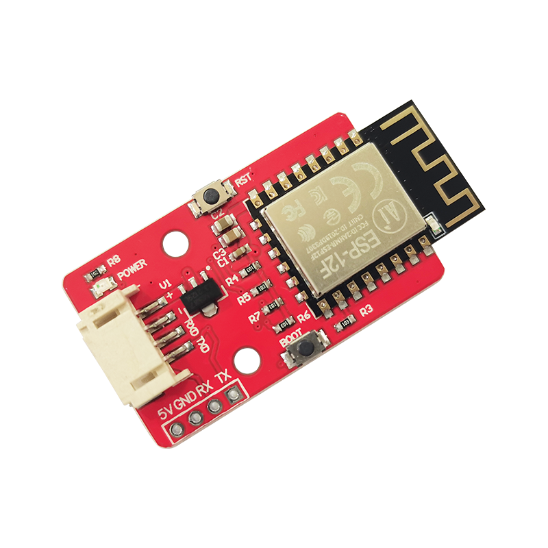

# OJFFX1 WIFI串口模块

## 简介

物联网WIFI模块是用于将Arduino UNO等连入网络的模块。它通过串口AT指令与Arduino UNO进行通讯。该模块在出厂时已经写好了基于Blinker的AT固件。使用时需要对Arduino UNO进行编程，使其与物联网模块进行通讯即可。推荐基于Blinker库函数编程，由于Blinker库对AT指令进行了一定的封装，其代码编写方式与使用Blinker库直接为以ESP8266为核心的模块编程基本一致。这样可以避开繁琐的AT指令，让代码变得更加简洁、具有可读性。具有复位按键与下载按键。方便用户在使用时对模块进行复位。

<table border="1">

<tr>
  <td align="center"></td>
  <td align="center"></td>
  <td align="center"></td>
</tr>
<tr>
  <td style="background-color:rgb(232,232,232,0.5) "colspan="3" align="center"> <a href="https://item.taobao.com/item.htm?id=681012073064"><font style="font-size:16px"> WIFI串口模块 </font></a> </td>
</tr>
</table>

## 参数

+ 核心模组：ESP-12F

+ 通讯方式：串口（AT指令）

+ 接口类型：PH2.0卧式贴片端子4Pin

+ 电源：5V（板载一颗5V转3.3V芯片）

+ 固定孔：间距16mm，标准乐高孔

+ 按键：复位按键 * 1 ； 下载按键 * 1

+ PCB尺寸：39.8mm*23.8mm（不包括WIFI模块超出的天线部分）


## 板型概述

物联网WIFI模块板外形在留有余量的情况下长宽均为8的倍数，能够作为标准的乐高积木使用。且模块固定孔也是两个标准的乐高固定孔，可以很轻松地与乐高积木进行拼接。

## 连接方式

### 示例一：手机控制点灯

#### 操作步骤

+ 在blinker APP中添加设备

+ 更改程序中的密钥值，WiFi名称和密码

+ 将程序上传到板子中

+ 在APP中 打开添加的设备，点击载入示例

+ 在界面上 点击“点我开关灯”观察板子的LED是否正常亮灭


#### ardunio 程序

```C++
#define BLINKER_WIFI

#include <Blinker.h>

char auth[] = "ae9f0f3df292";//"d48954e7f5b5";
char ssid[] = "HUAWEI P30 PRO";//"mosfun24";
char pswd[] = "Zx1234567890";//"cd85586651";

// 新建组件对象
BlinkerButton Button1("btn-abc");
BlinkerNumber Number1("num-abc");

int counter = 0;
int analogData;

// 按下按键即会执行该函数
void button1_callback(const String & state)
{
    BLINKER_LOG("get button state: ", state);
    digitalWrite(LED_BUILTIN, !digitalRead(LED_BUILTIN));
    Number1.print(analogData);
}

// 如果未绑定的组件被触发，则会执行其中内容
void dataRead(const String & data)
{
    BLINKER_LOG("Blinker readString: ", data);
    counter++;
    Number1.print(analogData);
}

void setup()
{
    // 初始化串口
    Serial.begin(115200);
    BLINKER_DEBUG.stream(Serial);
    BLINKER_DEBUG.debugAll();

    // 初始化有LED的IO
    pinMode(LED_BUILTIN, OUTPUT);
    digitalWrite(LED_BUILTIN, HIGH);
    // 初始化blinker
    Blinker.begin(auth, ssid, pswd,0,1);
    Blinker.attachData(dataRead);

    Button1.attach(button1_callback);
}

void loop() {
    Blinker.run();
    analogData = analogRead(A0);
}
```

### 示例二： 上传传感器数据到手机

#### ardunio 程序
```C++

#define BLINKER_WIFI

#include <Blinker.h>

char auth[] = "Your Device Secret Key";
char ssid[] = "Your WiFi network SSID or name";
char pswd[] = "Your WiFi network WPA password or WEP key";

#define Number_1 "NUMKey"

BlinkerNumber Number1(Number_1);

void dataRead(const String & data)
{
    BLINKER_LOG("Blinker readString: ", data);

    Blinker.vibrate();
    
    uint32_t BlinkerTime = millis();
    
    Blinker.print("millis", BlinkerTime);

    Number1.icon("icon_1");
    Number1.color("#FFFFFF");
    Number1.unit("ms");
    Number1.print(BlinkerTime);

    digitalWrite(LED_BUILTIN, !digitalRead(LED_BUILTIN));
}

void setup()
{
    Serial.begin(115200);
    BLINKER_DEBUG.stream(Serial);

    pinMode(LED_BUILTIN, OUTPUT);
    digitalWrite(LED_BUILTIN, LOW);

    Blinker.begin(auth, ssid, pswd);
    Blinker.attachData(dataRead);
}

void loop()
{
    Blinker.run();
}
```


## 库文件及扩展包下载

[Arduino Blinker库下载](https://github.com/blinker-iot/blinker-library/archive/master.zip)

[esp8266扩展包下载](https://share.weiyun.com/5CGEKJO)

[wifi模块固件下载](http://download.openjumper.cn/wifi%E6%A8%A1%E5%9D%97%E5%9B%BA%E4%BB%B6%E4%B8%8B%E8%BD%BD.rar)

[简易使用教程](http://download.openjumper.cn/%E7%89%A9%E8%81%94%E7%BD%91WIFI%E6%A8%A1%E5%9D%97%E4%BD%BF%E7%94%A8%E6%8C%87%E5%8D%97.docx)