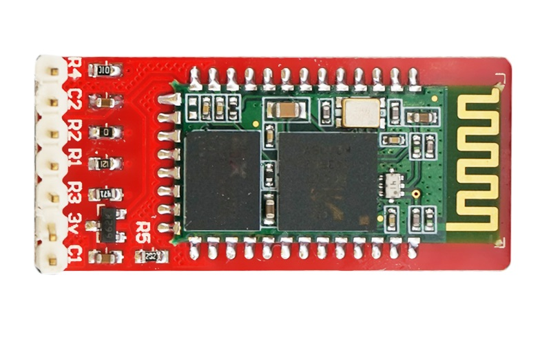
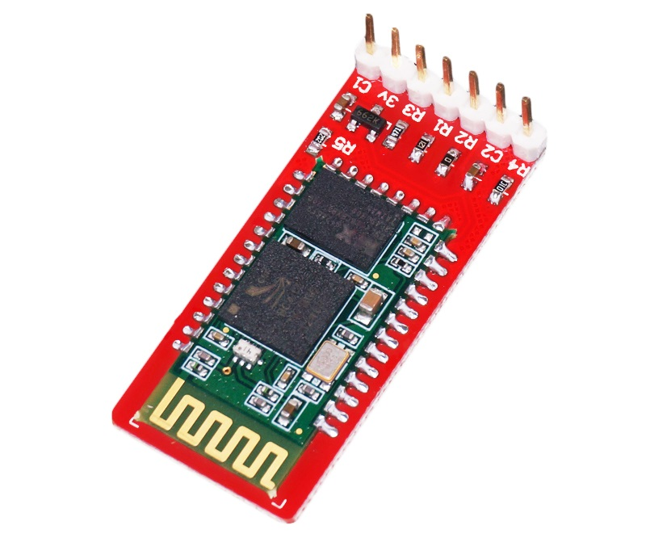

# OJ蓝牙模块v2.0

## 概述

OPENJUMPER蓝牙模块v2.0是主从一体的蓝牙串口通信模块HC-05，可通过AT模式改写其各参数。适用于Arduino与PC、手机等设备的无线连接。

<table border="1">

<tr>
  <td align="center"></td>
  <td align="center"></td>
  <td align="center"></td>
</tr>
<tr>
  <td style="background-color:rgb(232,232,232,0.5) "colspan="3" align="center"><a href="https://item.taobao.com/item.htm?id=537608297402"><font style="font-size:16px">OJ蓝牙模块v2.0 </font></a> </td>
</tr>
</table>

## 产品参数

+ 通信方式：标准串口

+ 通信距离：30M（空旷处）

+ 无线频段：2.4G

+ 波特率：默认9600  
　　　　可调4800~1382400

+ 输入电压：VCC供电  4V~6V  
 　　　　　3V3供电   3.3V

+ 工作温度：-20°C~+70°C

+ 模块规格：44mm\*20mm*14mm

+ 其他特性：内置天线  
　　　　　主从一体

## 引脚说明

|序号|标识|说明|连接端口|
|:--|:--|:--|:--|
|1|GND|地|GND|
|2|3V3|3.3V供电输入端|3V3|
|3|TXD|UART接收端|RXD|
|4|RXD|UART发送端|TXD|
|5|AT|AT模式控制端|D2|
|6|VCC|4-6V供电输入端|5V|
|7|GND|地|GND|

## 指示灯

**State：状态指示灯**

快闪：进入AT模式1

慢闪：进入AT模式2

双闪：配对成功，可以通信

**Link：连接指示灯**

常亮：配对成功，可以通信

## 使用Arduino配置模块AT模式

可直接连接Arduino，通过Arduino使模块进入AT模式，并改写模块设置。如有OPENJUMPER传感器扩展板，你只需先将以下程序上传至你的Arduino，再将OPENJUMPER蓝牙模块插到扩展板蓝牙接口上，点击复位，即可完成AT配置。 1秒钟后，配置即可完成。
 
## 示例代码

```C++
/*
OPENJUMPER-BLUETOOTH
*/
#define AT 2
#define LED 13
void setup()
{
       pinMode(LED,OUTPUT);
       pinMode(AT,OUTPUT);
       digitalWrite(AT,HIGH);
       Serial.begin(9600);//这里应该和你的模块通信波特率一致
       delay(100);
       Serial.println("AT");
       delay(100);
       Serial.println("AT+NAME=OPENJUMPER-Bluetooth");//命名模块名
       delay(100);
       Serial.println("AT+ROLE=0");//设置主从模式：0从机，1主机
       delay(100);
       Serial.println("AT+PSWD=1234");//设置配对密码，如1234
       delay(100);
       Serial.println("AT+UART=9600,0,0");//设置波特率9600，停止位1，校验位无
       delay(100);
       Serial.println("AT+RMAAD");//清空配对列表
}
void loop()
{
       digitalWrite(LED, HIGH);
       delay(500);
       digitalWrite(LED, LOW);
       delay(500);
}
```

## 其他资料

[蓝牙模块V2.0](http://openjumper.cn/wp-content/uploads/2012/08/%E8%93%9D%E7%89%99%E6%A8%A1%E5%9D%97V2.0.pdf)

蓝牙配置工具：[蓝牙配置工具](http://www.openjumper.cn/wp-content/uploads/2014/06/%E8%93%9D%E7%89%99%E9%85%8D%E7%BD%AE%E5%B7%A5%E5%85%B7.rar)