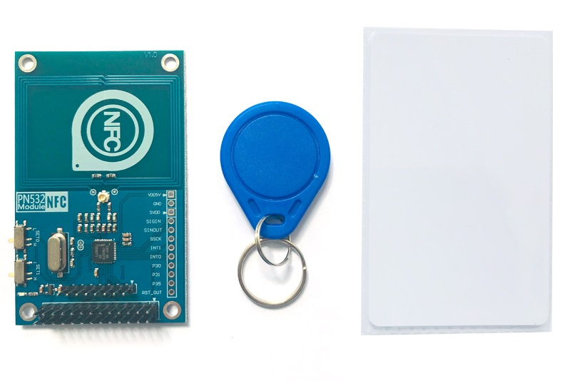

# PN532 NFC/RFID模块
## 产品概述

ITEAD PN532 NFC模块，是一款基于PN532芯片，用于13.56MHz近场通讯功能的模块。该模块配备板载天线，无需外接天线线圈。模块兼容 SPI，IIC 和 UART 接口通讯。加上提供的Arduino和树莓派的NFC库支持，可以非常方便的用于NFC功能产品开发。

[点我购买](https://item.taobao.com/item.htm?id=628374545976)

## 特点

+ 最长的有效通讯距离为5厘米。

+ 支持SPI, IIC, UART接口切换。

+ 可用于13.56M的非接触式通信。

+ 兼容ISO14443 TYPE A和B类标准。

## 产品参数

+ 芯片：NXP PN532

+ 工作电压：3.3V

+ 电源电压：3.3~5.5V

+ 最大电源电流：150mA

+ 工作电流(待机模式)：100mA

+ 工作电流(写模式)：120mA

+ 工作电流(读模式)：120mA

+ 指针：PWR

+ 接口：Raspberry Pi的20pins接口，标准SPI接口

+ 板子尺寸：长79mm\*宽48.3mm*高11.3mm 

## 模式选择
 
有两个在板上的滑动开关选择接口方式

|接口|SET0| SET1|
|:--|:--|:--|
|UART|L|L|
|SPI|L|H|
|IIC|H|L|

## 应用

+ 非接触式支付系统

+ 门禁系统

+ 分享联系人、照片和视屏等社交分享功能

+ 智能手机的NFC应用

## 其他资料下载

链接: <https://pan.baidu.com/s/1USUj2Sc5YvIxhwzjki9C2g?pwd=zriv>
提取码: zriv