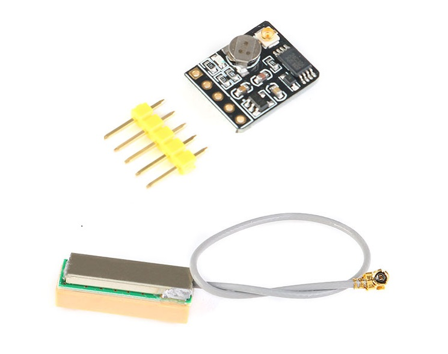
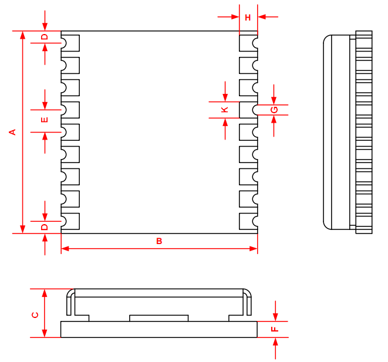
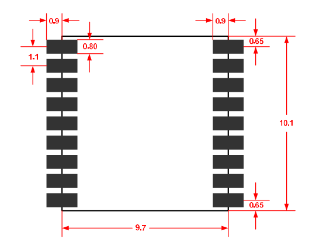
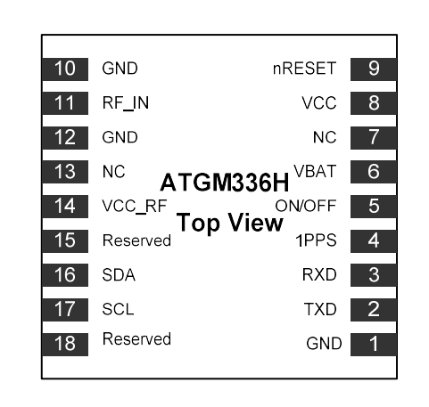

# GPS/BDS卫星定位导航模块

## 产品介绍

ATGM336H-5N系列模块是一款可以实时了解当前所在位置的小尺寸（9.7 * 10.1） 定位导航模块。该系列模块产品是基于中科微第四代低功耗 GNSS SOC 单芯片—AT6558，支持多种卫星导航系统，包括中国的 BDS（北斗卫星导航系统），美国的 GPS，俄罗斯的 GLONASS，欧盟的 GALILEO，日本的 QZSS 以及卫星增强系统 SBAS（WAAS，EGNOS，GAGAN，MSAS）。AT6558 是一款真正意义的六合一多模卫星导航定位芯片，包含 32 个跟踪通道，可以同时接收六个卫星导航系统的 GNSS 信号，并且实现联合定位、导航与授时。



[点我购买](https://item.taobao.com/item.htm?id=678848292930)

## 产品特点

ATGM336H-5N 系列模块具有高灵敏度、低功耗、低成本等优势，且兼容性强，串口输出模式可兼容各类配置了串口输出的主板，arduino、树莓派、STM32 的各类主板均能使用。定位精度误差实测为 3m 左右，和各类智能手机定位基本一致；功耗低至 0.1W，搭配一个小电源就能长时间持续稳定工作。ATGM336H-5N 系列模块支持有源天线与无源天线。

## 应用领域

+ 车载定位与导航

+ 手机、平板电脑、手持设备

+ 嵌入式定位设备

+ 可穿戴设备

## 技术参数

+ 工作电压：3.3-5V

+ 可用卫星: GPS和BDS北斗双模

+ 具备 SMA 天线接口和 IPEX 天线接口

+ 板载 E2PROM 可设置保存波特率等信息

+ 板载 XH414 充电电子，加速热启动搜星

+ 支持 A-GNSS

+ 冷启动捕获灵敏度：-148dBm

+ 跟踪灵敏度：-162dBm

+ 定位精度：2.5 米（CEP50）

+ 首次定位时间：32 秒（也有可能是几分钟，要看具体环境而定）

+ 低功耗：连续运行<25mA

+ 内置天线检测及天线短路保护功能

+ 尺寸：13.1mm x 15.7mm

## 引脚说明

|名称|说明|
|--|--|
|VCC| 电源输入（5V）|
|GND|地线|
|TX |串口发射|
|RX| 串口接收|
|PPS|秒脉冲输出|


## 模块描述

### 外观尺寸(单位 mm)



|Symbol|Min.(mm)| Typ.(mm)| Max.(mm)|
|--|--|--|--|
|A|10.0 |10.1 |10.7|
|B|9.6 |9.7 |9.8|
|C|2.2 |2.4| 2.6|
|D|0.55| 0.65 |0.95|
|E|1.0 |1.1| 1.2|
|F||0.8||
|G|0.4| 0.5| 0.6|
|H|0.8 |0.9| 1.0|
|K|0.7 |0.8| 0.9|

### PCB布局


### PIN 排列图



### 管脚定义
|引脚编号|名称|I/O |描述 |电气特性|
|--|--|--|--|--|
|1 |GND| I| 地||
|2| TXD| O |导航数据输出| NMEA0183 协议|
|3 |RXD| I |交互命令输入 |配置命令输入|
|4| 1PPS| O| 秒脉冲输出 ||
|5 |ON/OFF| I| 模块关断控制，低电平有效||
|6| VBAT |I |RTC 及 SRAM 后备电源 |提供 1.5~3.6V 电源以保证模块热启动| 
|7| NC ||||
|8 |VCC |I |模块电源输入| 直流 3.3V±10％ ,100mA |
|9 |nRESET| I |模块复位输入，低电平有效 |不用时悬空|
|10| GND |I |地||
|11 |RF_IN| I| 天线信号输入||
|12 |GND |I| 地||
|13 |NC ||||
|14 |VCC_RF |O| 输出电源| +3.3V，可给天线供电 |
|15| 保留 |||悬空|
|16| SDA| I/O |I2C 数据接口| 悬空|
|17 |SCL| O| I2C 时钟接口| 悬空|
|18 |保留 |||悬空|


### 电气参数

**极限参数**

|参数|符号|最小值| 最大值| 单位|
|--|--|--|--|--|
 |模块供电电压(VCC)  |Vcc  |-0.3 | 3.6  |V |
 |备份电池电压(VBAT) | Vbat | -0.3  |3.6  |V| 
 |数字输入引脚电压  |Vin  |-0.3  |Vcc+0.2  |V| 
 |最大可承受ESD水平  |VESD(HBM)   ||2000  |V|

**运行条件**

|参数| 符号| 最小值| 典型值| 最大值| 单位|
|--|--|--|--|--|--|
供电电压| Vcc| 2.7 |3.3| 3.6 |V |
|Vcc峰值电流(不包括天线)| Ipeak|| |100| mA |
|备份电源| Vbat |1.5 |3.0| 3.6 |V |
|备份电源(Vbat)电流| Ibat ||10| |uA| 
|输入引脚|Vil |||0.2*Vcc |V |
|输入引脚|Vih |0.7*Vcc||| V |
|输出引脚|Vol Io=-12mA|0.4|||V |
|输出引脚|Voh Io=12mA |Vcc-0.5| ||V |
|有源天线输出电压 |VCC_RF ||3.3 ||V |
|天线短路保护电流 电源来自VCC_RF (=3.3V) |Iant short ||50 ||mA |
|天线开路电流 电源来自VCC_RF (=3.3V) |Iant open ||3|| mA |
|天线增益 |Gant| 15 ||30 |dB|

###  技术规范

|指标 |技术参数|
|--|--|
|信号接收| BDS/GPS/GLONASS/GALILEO/QZSS/SBAS |
|射频通道数目 |三通道射频，支持全星座 BDS、GPS 和 GLONASS 同时接收|
|冷启动 TTFF| ≤35s |
|热启动 TTFF| ≤1s |
|重捕获 TTFF |≤1s |
|冷启动捕获灵敏度| -148dBm |
|热启动捕获灵敏度| -156dBm |
|重捕获灵敏度 |-160dBm |
|跟踪灵敏度|-162dBm |
|定位精度| <2m（1σ）|
|测速精度 |<0.1m/s（1σ）|
|授时精度 |<30ns（1σ）|
|定位更新率 |1Hz（默认），最大 10Hz |
|串口特性 |波特率范围：4800 bps ~115200 bps,默认 9600bps, 8个数据位,无校验,1 个停止位|
|协议| NMEA0183| 
|最大高度 |18000m |
|最大速度|515m/s |
|最大加速度| 4g |
|后备电池| 1.5V ~ 3.6V |
|电源供电 |2.7V ~ 3.6V |
|GPS&BD |典型功耗 <25mA @3.3V |
|工作温度 |-40 到+85 ℃|
|存储温度 |-45~+125℃|
|尺寸 |10.1mm×9.7mm×2.4mm |
|重量 |0.6g|

## Arduino测试程序

### 程序说明

本示例仅仅是把GPS输出的原始数据从Arduino uno串口RX读取出来，然后经过串口TX再发送给电脑,显示GPS原始帧数据。  

本例程用于测试arduino和GPS接线是否正确，或者给没有USB-TTL模块的用户做用Arduino直接测试使用。

### 接线说明

|GPS模块|Arduino|
|--|--|
|VCC|5V|
|GND|GND|
|TXD|数字IO 0|
|RXD||
|PPS||

**注意：请先下载程序然后再接线，否则接上GPS后会形象UNO板子下载程序！！！**

**其中GPS的天线记得要接，并且要室外放置，因为GPS模块是室外定位的，室内没有卫星信号。首次定位需要下载卫星数据。**

```C++
//此处为了兼容其他的多串口Arduino板子
#define GPSSerial  Serial
#define DEBUGSerial Serial


void setup()	//初始化内容
{
  GPSSerial.begin(9600);			//定义波特率9600，和我们店铺的GPS模块输出的波特率一致
  DEBUGSerial.begin(9600);  
  DEBUGSerial.println("openjumper.com");
  DEBUGSerial.println("Wating...");
}

void loop()		//主循环
{
  while (GPSSerial.available()) {   
     DEBUGSerial.write(GPSSerial.read());//收到GPS数据则通过Serial输出
  }
 
}
```

## 其他资料

[原理图和使用手册下载](https://pan.baidu.com/s/1mzTetHwK4LoLrmd19HgH4w)  提取码: 7ybx