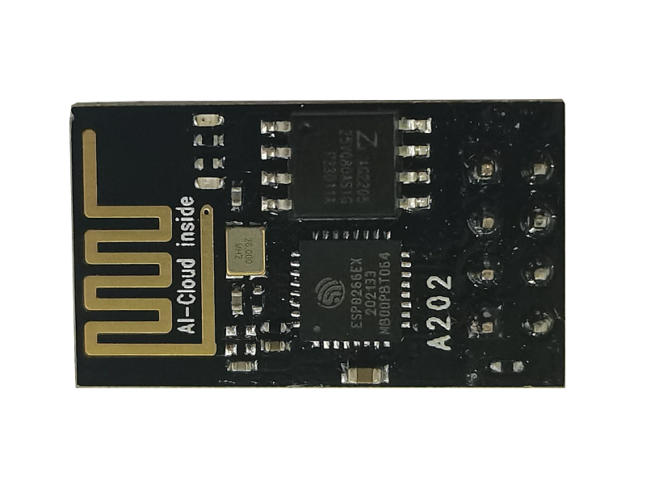

# ESP8266串口WIFI模块

## 产品概述

ESP-01 WiFi模块是由安信可科技开发的,该模块核心处理器ESP8266 在较小尺寸封装中集成了
业界领先的Tensilica L106超低功耗32位微型MCU ,带有16位精简模式,主频支持80 MHz和
160 MHz ,支持RTOS ,集成Wi-Fi MAC/ BB/RF/PA/LNA ,板载天线。

该模块支持标准的IEEE802.11 b/g/n 协议,完整的TCP/IP 协议栈。用户可以使用该模块为现有
的设备添加联网功能,也可以构建独立的网络控制器。

ESP8266是高性能无线SOC ,以最低成本提供最大实用性,为WiFi 功能嵌入其他系统提供无限:
可能。

[点我购买](https://item.taobao.com/item.htm?id=538024664215)

## 产品优势

+ 体积最小做到11* 10毫米左右，指甲盖大小。方便嵌入到任何产品

+ 功能强大内部跑LWIP协议

+ 支持三种模式: AP、STA、AP+STA共存模式

+ 完善简洁高效的AT指令，让你开发更简单

## 技术参数

+ 工作电压: 3.0V-3.6V（建议3.3V）

+ 工作电流: 平均电流80MA

+ 工作温度: -40℃~125℃

+ WIFI模式: STATION/API/STATION+AP

+ 通信距离: 100M

+ 天线: PCB板载天线

+ 无线标准: 802.11 b/g/n

+ 加密类型: WEP/TKIP/AE

+ 发射功率: 20dm

+ CPU: ETNSILCAL 106 32位微控制器

+ 数据接口: UART/HSPI/I2C/I2S/IR遥控、 CPIO/PWM

+ 用户配置: AT+指令集，云端服务器, Androind/iOS APP

+ 软件开发:支持客户自定义服务器;   提供SDK给客户二次开发

+ 波频率: 24G

+ 网络协议: IPV4、 TCP/UDP/OTA(通过网络)

+ 安全机制: WPAM/WPA2

+ 尺寸:长14.3mm 宽24.8mm 高3mm 

+ Pin脚间距:2.54mm

## 引脚说明

ESP-01共接出8个接口

### 引脚功能定义

|Pin脚名称| 功能说明|
|--|--|
|GND|GND|
|GPIO2 |通用IO，内部已上拉|
|GPIO0 |悬空: Flash Boot ,工作模式|
| |下拉: UART DownLoad ,下载模式|
|RXD |串口0数据接收端RXD|
|VCC| 3.3V ,模块供电|
|RST |1)外部复位管脚,低电平复位|
||2)可以悬空或者接外部MCU|
|CH_PD |芯片使能,高电平使能，低电平失能|
|TXD |串口0数据发送端TXD|

### 引脚模式

|模式|GPIO0|GPIO2|
|--|--|--|
|UART下载模式|低|高|
|Flash Boot模式|高|高|

### 接收灵敏度

|参数|最小值|典型值|最大值|单位|
|--|--|--|--|--|
|输入频率|2412||2484|MHz|
|输入电阻||50||Ω|
|输入反射|||-10|dB|
|72.2 Mbps下, PA的输出功率|14|15|16|dBm|
|11b模式下, PA的输出功率|17.5|18.5|19.5|dBm|
|灵敏度||||
|DSSS, 1 Mbps||-98||dBm|
|CCK, 11 Mbps||-91||dBm|
|6 Mbps (1/2 BPSK)||-93||dBm
|54 Mbps (3/4 64-QAM)||-75||dBm|
|HT20, MCS7 (65 Mbps, 72.2 Mbps)||-72||dBm|
|邻频抑制||||
|OFDM, 6 Mbps||37||dB|
|OFDM, 54 Mbps||21||dB|
|HT20, MCSO||37||dB|
|HT20, MCS7||20||dB|