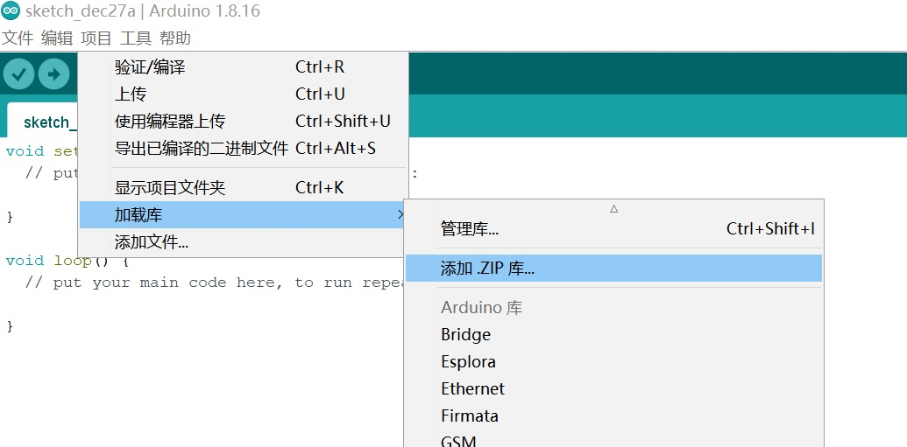
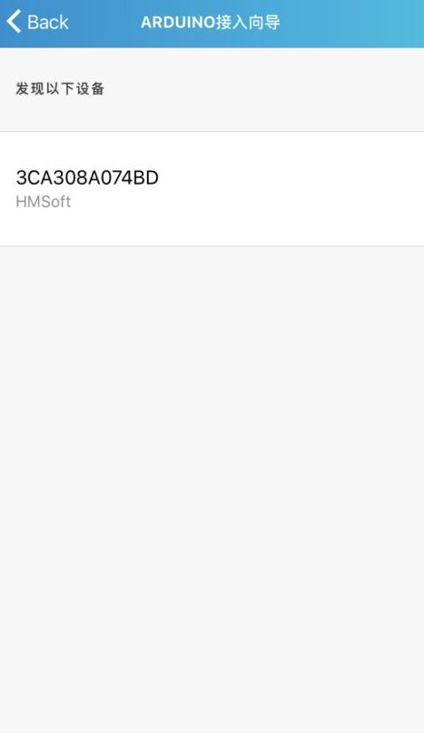
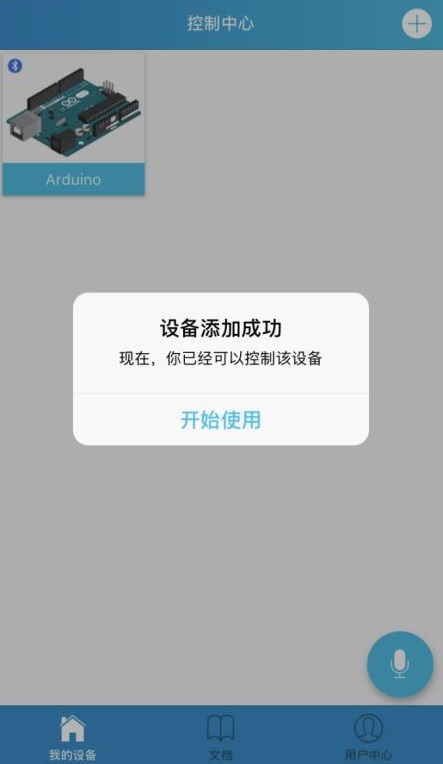

# JDY-10蓝牙模块

## 产品简介

JDY-10透传模块是基于蓝牙4.0协议标准，工作频段为2.4GHZ范围，调制方式为GFSK，最大发射功率为8db，最大发射距离80米，**模块为蓝牙4.0从机**，具有功耗低、尺寸小、信号强、数据传输稳定等特性。

**注意：主板连接蓝牙无法上传程序，需要拔掉蓝牙**

<table border="1">

<tr>
  <td align="center"></td>
  <td align="center"></td>
  <td align="center"></td>
</tr>
<tr>
  <td style="background-color:rgb(232,232,232,0.5) "colspan="3" align="center"> <a href="https://item.taobao.com/item.htm?id=681630387342"><font style="font-size:16px"> JDY-10蓝牙模块 </font></a> </td>
</tr>
</table>

## 产品特征

+ 支持Android、IOS手机数据透

+ 支持低功耗（待机电流可达到几uA）

+ 支持GPIO与UART外设接口

+ 支持AT指令操作

+ 可通过FCC/CE等标准认证

+ 微信透传功能（用户使用 JDY-10 模块后，产品将同时支持 APP 与微信透传）

## 产品应用范围

+ 蓝牙LED灯光照明

+ 电机调整等产品

+ 防丢报警等产品

+ 运动健康医疗

+ 小家电

+ 汽车电子

## 技术参数

+ 型号：JDY-10蓝牙4.0从机模块

+ **模块为：蓝牙4.0从机**（从机只能手机或平板等蓝牙设备连接模块，不能用两个同样的模块互相连接）

+ 天线：PCB板载天线

+ 工作电压：1.9 – 3.6V

+ 工作温度：-40 - 85°C

+ 最大发射功率：+8dbm

+ 内核：M0

+ 通信接口：串口

+ 通信距离：100米


+ 接收灵敏度：-92dbm

+ 平均电流: 
   + 唤醒模式：90uA
   + Suspen模式：14 uA
   + Deep Sleep模式：1uA


## 出厂默认配置

服务UUID：FFE0

特征UUID：FFE1

串口波特率：115200bps

上电为唤醒状态，需要进入睡眠后，通 AT+SLEEP 进入睡眠，在连接的状态需要发 AT 指令
可以通过将 B0 引脚拉低、进入 AT 模式进行 AT 指令发送、但透传时一定要将 B0 引脚拉高
电平、在断开连接下、B0 引脚任意电平均可发送 AT 指令（唤醒状态）

PWRC 为多功能复用引脚，具体请看引脚功能 （ 不需要低功耗可以将 PWRC
引脚一直拉低电平）

此模块为串口透传模块（可开发定制 5 路 PWM 输出、多路 IO 输入输出)

## 操作步骤

### 第一步 下载blinker

使用蓝牙我们首先需要下载蓝牙控制APP，在这里使用IOS平台作为演示，登陆APP store，搜索blinker。

或者直接在安卓应用市场搜索blinker。或者在点灯官网进行下载

[点灯科技 (diandeng.tech)](https://diandeng.tech/)


### 第二步 下载并安装blinker Arduino库

[点击下载](https://diandeng.tech/dev)

</br>

**加载Blinker-library**

</br>


</br>


**将其放在 我的文档—Arduino—libraries 下面，如图所示：**


</br>

**通过Arduino IDE 菜单>项目>加载库>添加.ZIP库 导入到库，如图：**



</br>

### 第三步 

**打开blinker APP，首先添加需要接入的硬件，点击右上方的+号，选择独立设备**

　　　 

</br>

**添加之后选择蓝牙接入**


</br>

**此时APP会开始搜索附近的蓝牙设备，搜索到之后点击连接**

　

</br>

**点击编辑按钮，来设计我们的设备界面**

　 

    测试本文档案列时，在blinker界面点击载入示例进行测试。

## arduino连线图 

|序号|标识|说明|连接端口|
|:--|:--|:--|:--|
|1|GND|地|GND|
|2|3V3|3.3V供电输入端||
|3|TXD|UART接收端|RXD|
|4|RXD|UART发送端|TXD|
|6|VCC|4-6V供电输入端|5V|
|7|GND|地|GND|


## 手机蓝牙控制arduino点灯例程
```C++
#define BLINKER_BLE
#include <Blinker.h>

BlinkerButton Button1("btn-abc");

void Button1_callback(const String & blmc) {
  if (blmc == BLINKER_CMD_BUTTON_TAP) {
    digitalWrite(13,(!digitalRead(13)));

  }
}

void setup(){
  Blinker.begin(0,1,115200);

  pinMode(13, OUTPUT);
  Button1.attach(Button1_callback);
}

void loop(){
  Blinker.run();

}

```


# 扩展阅读

## AT指令集

用户可以通过串口和 蓝牙芯片进行通信，串口使用 Tx,Rx 两根信号线，波特率支
持 1200,2400,4800,9600,14400,19200,38400,57600,115200。串口默认波特率:115200bps。

### 指令集详细说明 

（注：发 AT 指令时必须回车换行， AT 指令只能在模块未连接状态下才能生效，一旦蓝
牙模块与设备连接上，蓝牙模块即进入数据透传模式）

指令详细说明

（AT 指令区分大小写，均以回车、换行字符结尾：\r\n）
 
**1、查询-版本号**

|指令| 响应| 参数|
|--|--|--|
|AT+VER| +\<Param>| Param：版本; 默认：+JDY-10-V2.3|

**2、软复位**

|指令| 响应| 参数|
|--|--|--|
|AT+RESET |模块重启|

**3、查询-蓝牙 MAC 地址**

|指令| 响应| 参数|
|--|--|--|
|AT+MAC| +MAC: \<Param> |Param：MAC 地址|


**4、设置/查询-蓝牙名**

|指令| 响应| 参数|
|--|--|--|
|AT+NAME\<Param> |OK |Param：蓝牙名 ;默认名称：JDY-10 ;最长 18 字节|


**5、设置/查询-发射功率**

|指令| 响应| 参数|
|--|--|--|
|AT+POWE\<Param> |OK |Param：（0-5） 0：8db|
|AT+POWE| +POWE: \<Param>|1：5db|
|||2：0db |
|||3：-5db|
|||4：-10db|
|||5：-13db|

**6、设置/查询-串口波特率**

|指令| 响应| 参数|
|--|--|--|
|AT+BAUD\<Param>| OK| Param：（0-7） 0：115200 bps|
|AT+BAUD|+BAUD：\<Param>|1：57600 bps|
|||2：38400 bps|
|||3：19200 bps|
|||4：14400 bps|
|||5：9600 bps|
|||6：4800 bps|
|||7：2400 bps|
|||8：1200 bps|

**7、设置/查询-广播间隔**

|指令| 响应| 参数|
|--|--|--|
|AT+ADVINT\<Param> |OK |Param：（0-6） 0：100ms|
|AT+ADVINT|+ADVINT：\<Param>|1：100ms|
|||2：250ms |
|||3：500ms|
|||4：1600ms|
|||5：3200ms|
|||6：4800ms|

**8、设置/查询-透传服务 UUID（默认 UUID：0XFFE0）**

|指令| 响应| 参数|
|--|--|--|
|AT+SVRUUID\<Param>| OK| Param：（0000-FFFF）|
|AT+SVRUUID |+SVRUUID：\<Param>||

**9、设置/查询-透传特征 UUID（默认 UUID：0XFFE1）**

|指令| 响应| 参数|
|--|--|--|
|AT+CHRUUID\<Param>| OK |Param：（0000-FFFF）|
|AT+CHRUUID|+CHRUUID：\<Param> |

**10、设置-恢复出厂配置**

|指令| 响应| 参数|
|--|--|--|
|AT+DEFAULT |OK||

**11、设置-进入睡眠**

|指令| 响应| 参数|
|--|--|--|
|AT+SLEEP|OK|Param：（1 - 2）|
|AT+SLEEP\<Param>|OK|1:表示浅睡（有广播）|
|||2：深度睡眠（不广播）|

在唤醒未连接状态下发送 AT+SLEEP 进入睡眠模式

**12、设置/查询-设备类型**

|指令| 响应| 参数|
|--|--|--|
|AT+CLSS|OK|Param：（00 - FF）|
|AT+CLSS\<Param>|OK|A0：透传模式|
||OK|B1：LED 灯模式|
||OK|默认：A0 透传模式|

**13、设置/查询--开机睡眠或唤醒**

|指令| 响应| 参数|
|--|--|--|
|AT+STARTEN\<Param> |OK| Param：(0-1)|
|AT+STARTEN| +STARTEN:\<Param>|0:开机睡眠|
|||1：天机唤醒
|||默认：1 开机唤醒