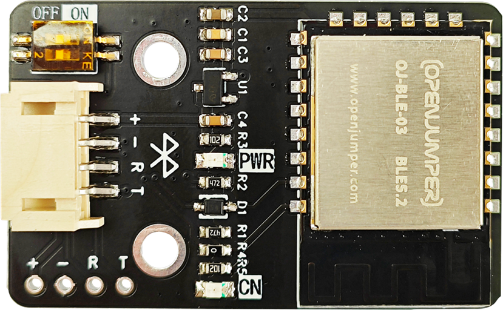
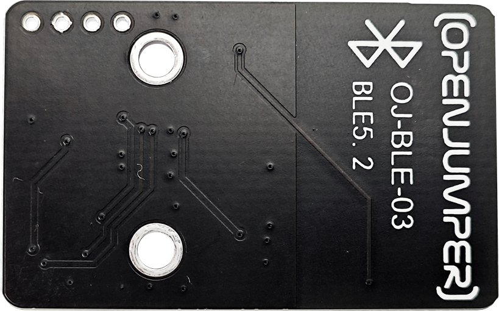
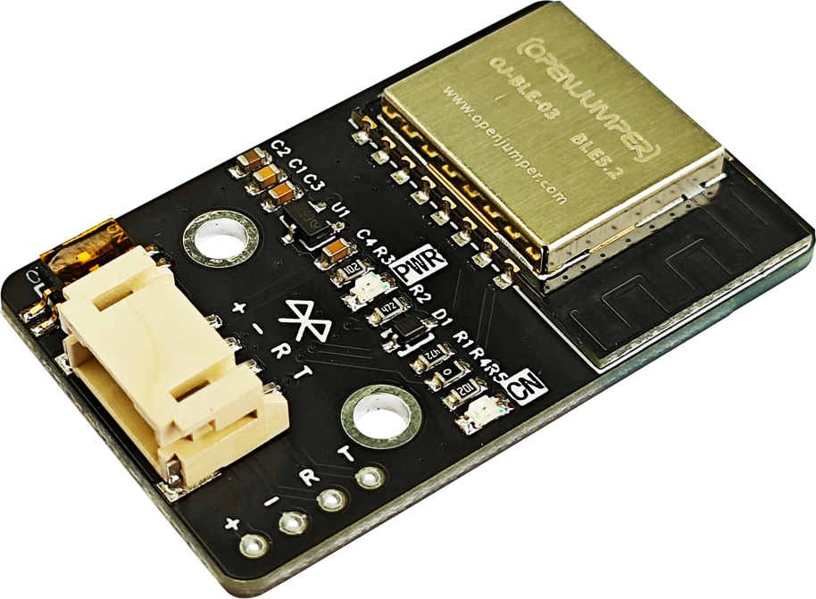
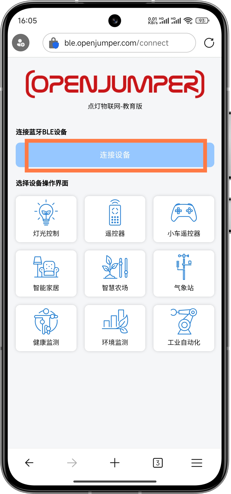

# 蓝牙5.2模块

## 产品概述
OJ-BLE-03是由openjumper自主研发的蓝牙5.2模块，该模块核心处理器芯片是一款高集成度的低功耗蓝牙系统级芯片,专为物联网、移动设备、可穿戴电子设备、智能家居等各种应用而设计。这是一款高性能、低功耗的蓝牙模块。蓝牙速率支持: 125Kbps,500Kbps，1Mbps, 2Mbps。支持广播扩展，多广播，信道选择。具有处理速度快，功耗低，性能稳定可靠等特点。

**注意：R3系列主板连接蓝牙无法上传程序，可拨动蓝牙模块上的开关**

<table border="1">

<tr>
  <td align="center"></td>
  <td align="center"></td>
  <td align="center"></td>
</tr>
<tr>
  <td style="background-color:rgb(232,232,232,0.5) "colspan="3" align="center"> <a href="https://item.taobao.com/item.htm?id=804878391224"> 蓝牙5.2模块 </a> </td>
</tr>
</table>

## 模块特性

+ 支持BLE5.2,速率支持: 125Kbps， 500Kbps，1Mbps, 2Mbps

+ 支持多种休眠模式，深度睡眠电流小于1uA

+ 拥有64 KB SRAM，256KB flash, 96 KB ROM，256bit efuse

+ 支持串口本地升级和远程固件升级(FOTA)

+ 通用 AT 指令可快速上手

+ 支持二次开发，集成了 Windows 开发环境

+ 支持 UART/GPIO/ADC/PWMA2C/SPIPDM/DMA 接口

## 技术参数

+ 电源电压：5V（大于200mA）

+ 串口电平：3.3V

+ 通信方式：标准串口

+ 波特率：默认115200bps

+ 工作温度：-40°C~85°C

+ 模块尺寸：2.6cm*4.2cm

+ 天线：PCB板载天线

+ 固定孔：标准乐高孔

+ 固定孔中心间距：16mm（两个乐高单位）

+ PWR：电源指示灯

+ CN：连接指示灯，连接成功点亮

+ 速率支持：125Kbps 500Kbps 1Mbps 2Mbps

+ 串口连接方式：PH2.0\*4P或XH2.54\*4P（两个同一个串口不同连接方式）

## 端口说明
+ +：VCC

+ -：GND

+ RX：接收端

+ TX ：发送端
 
## 使用方法

控制界面网址：https://ble.openjumper.com/connect

推荐使用edge或者谷歌浏览器

将程序上传到主板后，连接上蓝牙5.2模块使，用有蓝牙的设备用浏览器打开控制页面,点击连接设备

然后选择蓝牙设备，点击配对

显示已连接oj-ble-03表示连接成功

## 常见AT指令

常见AT指令下载链接：http://download.openjumper.cn/oj%E5%B8%B8%E8%A7%81AT%E6%8C%87%E4%BB%A4.docx