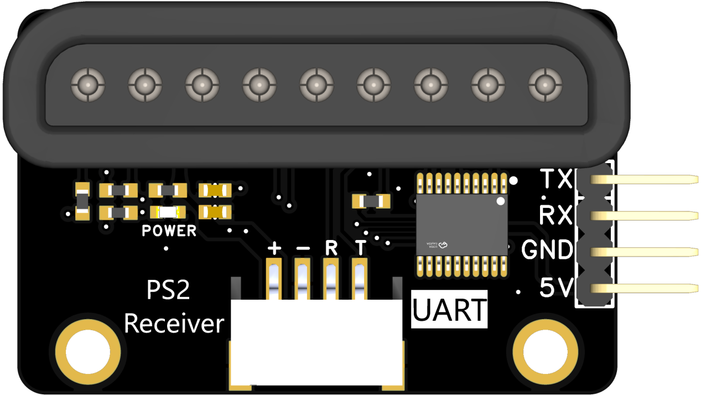
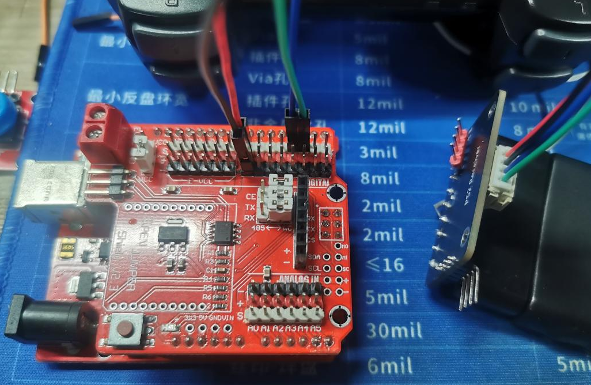
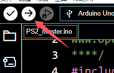
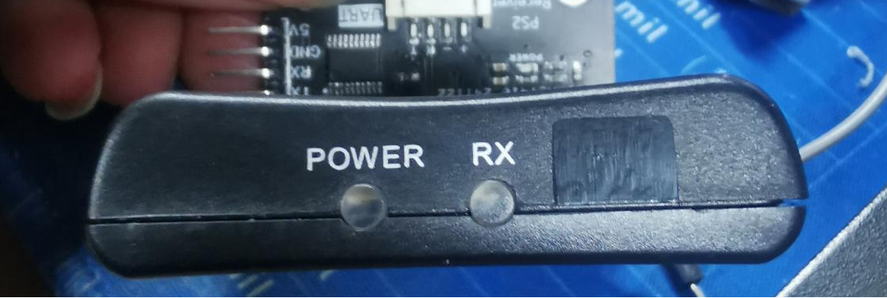
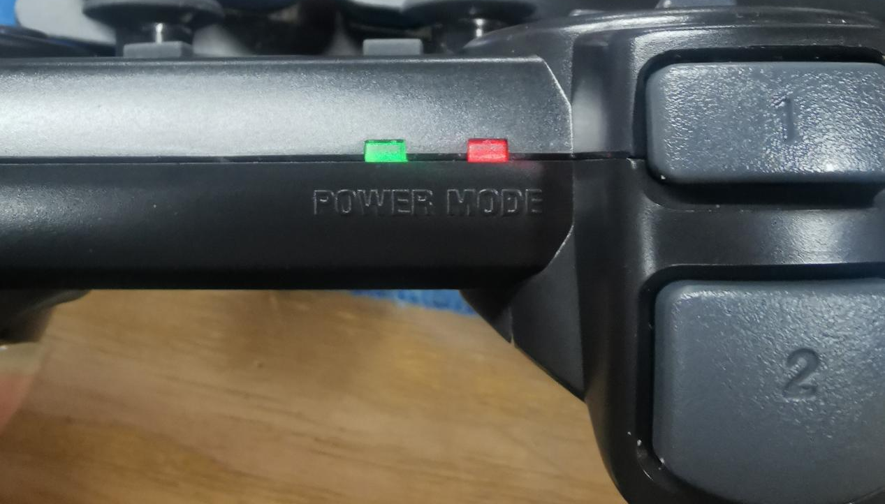
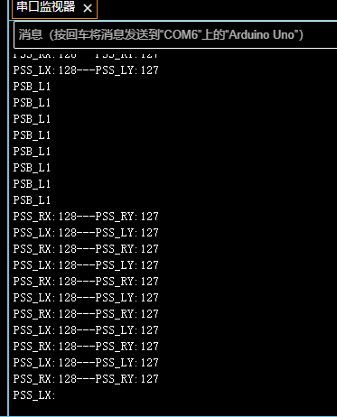

# PS2摇杆模块

## 模块基本参数      

1.电源电压：5V

2.串口电平：5V

3.模块尺寸：42X27（mm）

4.固定孔：M3间距32mm

5.POWER：电源指示灯

## 手柄的使用

1、连接好UNO与PS2手柄模块

2、找到PS2遥控器转接程序->PS2_master->PS2_master.ino并打开。

3、使用UNO并连接到电脑，点击上传程序。

此时接收器POWER（电源）灯常亮，RX灯闪烁，表示处于未连接状态；

同样，当手柄打开电源时，POWER灯和MODE灯常亮表示未连接。

连接好PS2接收模块，并打开手柄电源，手柄会自动建立连接。此时指示灯保持常亮。

4、打开串口监视器，可以看到输出的数据

这里默认输出的就是摇杆的数据。当你按下按键时，会输出对应的按键名。具体请参考PS2手柄模块->PS2遥控器转接板多按键->PS2遥控按键键名.png
