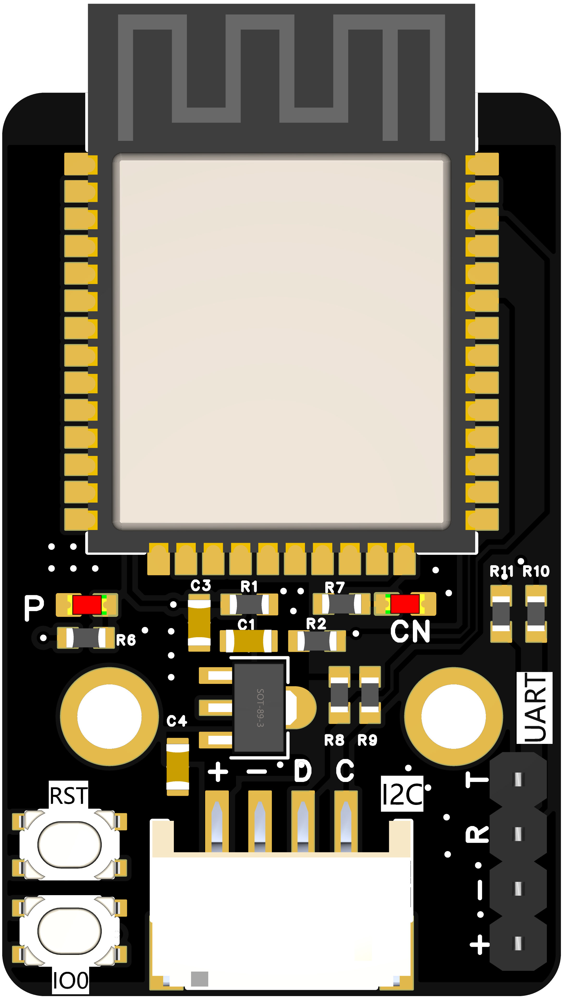
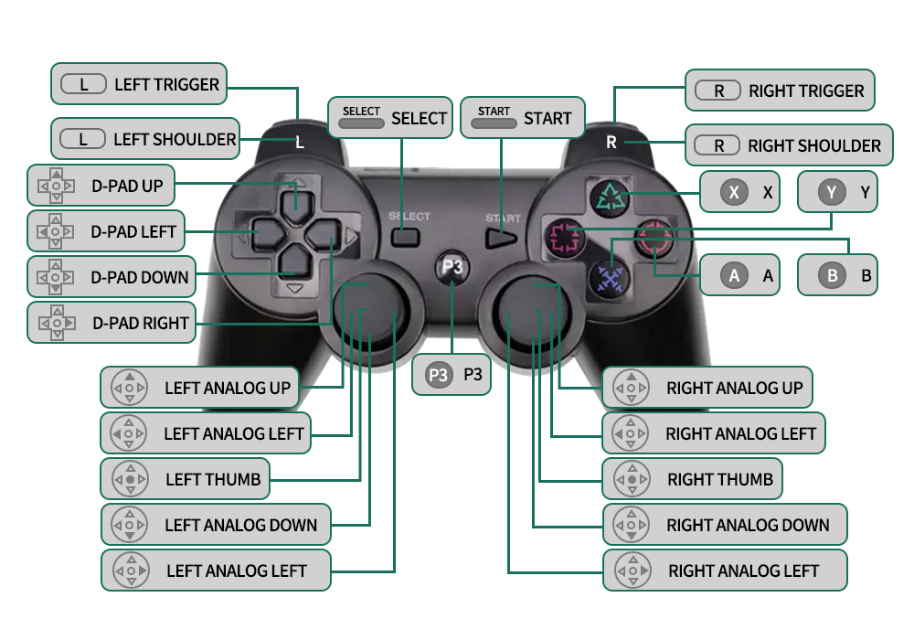
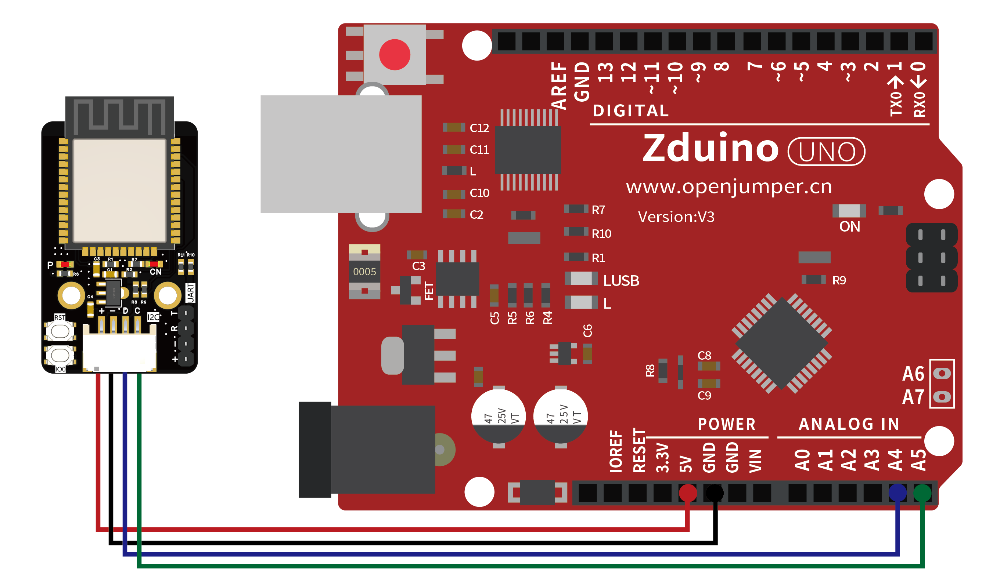
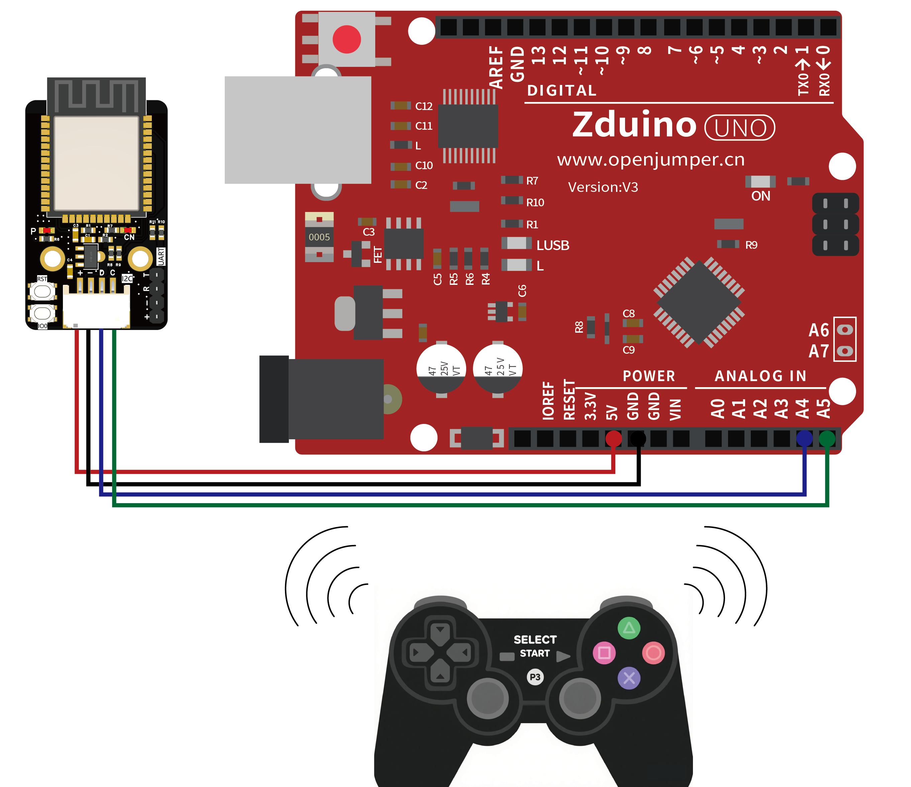
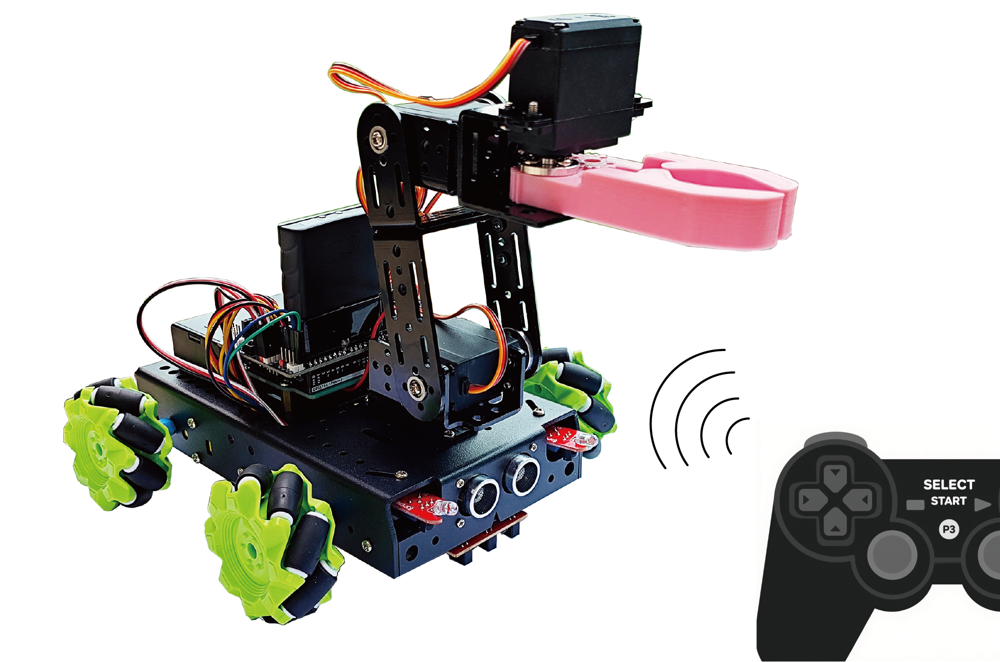
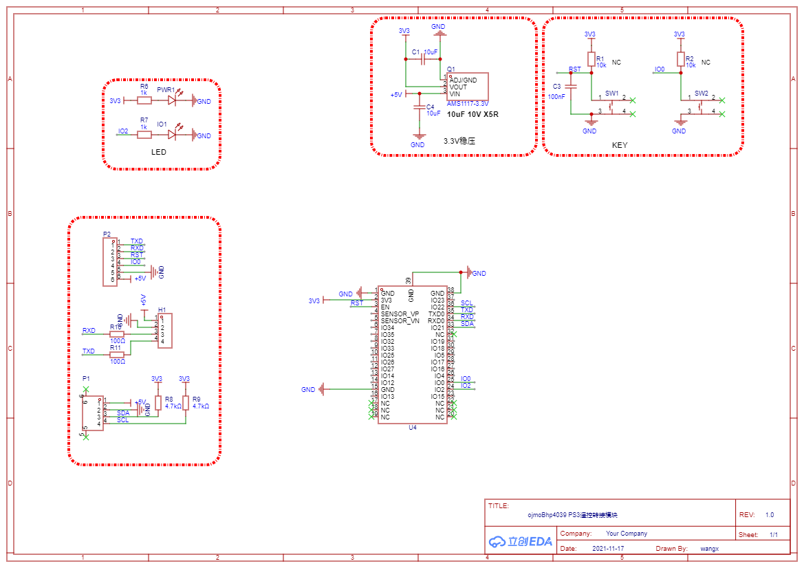

# PS3无线遥控接收器

## 产品简介

Openjumper PS3无线遥控接收器是基于ESP32-WROOM专门为了无线遥控而设计的通信模块。该模块支持与Arduino、Raspberry Pi等主流开发板通过UART/I2C接口通信，实现以下功能：  
- 无线设备控制（机械臂、智能车等）  
- 多节点传感器网络  
- 低延迟遥控系统（<50ms）  

配合PS3无线遥控器，可以实现在同一个环境中多台设备同时控制并且互不干扰。




## 产品参数

| 参数项           | 参数值               |
|------------------|----------------------|
| 核心芯片         | ESP32-WROOM-32E      |
| 无线协议         | Bluetooth 4.2        |
| 接口类型         | I2C/UART             |
| 供电电压         | 5V DC ±10%           |
| 最大传输距离     | 蓝牙5~10米           |
| 天线类型         | PCB板载天线          |
| 工作温度         | -20℃ ~ 65℃          |
| 板子尺寸         | 46.1*26(mm)          |
| 固定孔尺寸       | M3*16(mm)            |


## 硬件连接

I2C接口 （用于跟主板通信）

| Arduino引脚 | 接收器引脚 |
|------------|------------|
| D          | SDA        |
| C          | SCL        |
| GND        | GND        |
| 5V         | VCC        |


UART接口（用于升级固件）

| Arduino引脚 | 接收器引脚 |
|------------|------------|
| RX          | T         |
| TX          | R         |
| GNG         | -         |
| VCC         | +         |


## 使用教程

### PS3遥控器的使用
1. 开机  
PS3遥控器中内置电池，在按下P3按键后，可以观察到手柄前方指示灯开始闪烁，等待连接。匹配的遥控接收模块在匹配到手柄的MAC地址后，会自动进行连接，连接成功后，指示灯变成常亮。
2. 充电口  
在手柄的摇杆底部中间，有一个miniUSB口，需在手柄电量不足的时候可能对遥控的通信造成影响，这时候需要通过miniUSB数据线给手柄进行充电，
3. 按键和摇杆对应功能  



### 硬件连接




### Arduino例程
- 接收PS3摇杆信号并串口输出数据  

```C++
#include <Wire.h>  
char receive_Buff[9]; // 数据接收区  
uint8_t flag = 0;  

void setup() {  
    receive_Buff[8] = '\0'; // 确保最后一个字节为0  
    delay(2000);  
    Wire.begin();  
    Serial.begin(115200);  
    Serial.print("uart1 is normal\r\n");  // 调试串口1  
}

void loop() {  
    Wire.requestFrom(2, 8); // 请求从机发送8个字节  
    delay(20);
    if (Wire.available()) { // 检查是否有可用字节 
      //Serial.println(Wire.available());  
        char *p = receive_Buff; // 重置指针  
        while (Wire.available() > 0 && p < &receive_Buff[8]) { // 读取可用字节同时检查指针是否超出范围  
            *p = Wire.read(); // 读取一个字节到缓冲区  
            p++;   
        }  
        // 确保缓冲区最后一个字节为'\0'  
        if (p == &receive_Buff[8]) {  
            *p = '\0'; // 确保最后一个字节为结束符  
            // Serial.print(receive_Buff);   
            // Serial.println(); // 打印收到的数据  
        }  
    }  
    //delay(100); // 控制循环频率
    for(int a=0;a<8;a++){
      if(a!=7){
        Serial.print(byte(receive_Buff[a]),DEC);
        Serial.print(":");
      }else{
        Serial.println(byte(receive_Buff[a]),DEC);
      }
      
    }
}  

```


### Mind+例程


http://download.openjumper.cn/PS3%E6%89%8B%E6%9F%84%E6%B5%8B%E8%AF%95.mp


### AilyBlockly例程
+ 读取无线遥控器的按键并用于控制arduinoUNO的板载LED



+ 获取无线遥控器的按键及摇杆值，控制arduino麦克纳姆轮智能小车（可前、后、左、右）行走，以及机械臂抓取。



## 其他资料
- PS3遥控接收固件

- PS3遥控接收原理图  



[ESP32固件下载工具](https://www.espressif.com.cn/zh-hans/support/download/other-tools)  

- PS3mind+库文件

http://download.openjumper.cn/openjumper-openjumper_iic_ps3-thirdex-V0.0.1.rar


## FAQ
**遥控接收器固件丢失下载方法：**  
遥控接收器固件丢失下载方法：
1获取PS3遥控器的MAC值
2给遥控接收器重新下载固件
  使用USB转串口模块，将遥控接收器与电脑USB口连接
  USB转串口模块与遥控接收器模块的接线

  | 接收器 | 串口模块 |
|------------|------------|
| R          | T         |
| T          | R         |
| -         | -         |
| +        | +         |


3 修改固件代码中的MAC值（与配套PS3遥控器的MAC匹配）
4 上传代码（记住下载时候操作：按住接收器的boot键——接收器供电——下载代码）