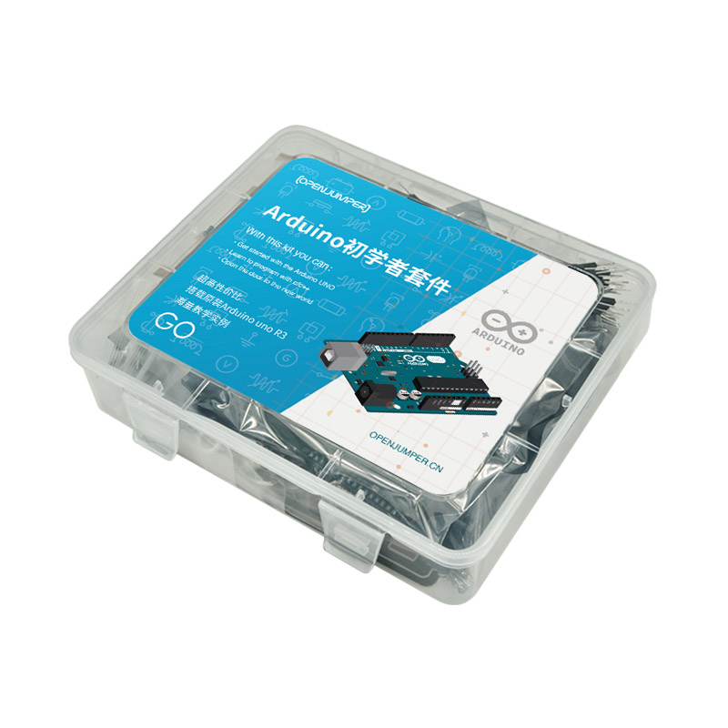

# 初学者GO套件

[点我购买](https://item.taobao.com/item.htm?id=585091448121)

## 套件清单

arduino UNO R3 * 1

内胆收纳盒 * 1

8*8点阵显示器 * 1

面包板 * 1

超声波模块 * 1

薄膜矩阵键盘 * 1

9V电池 * 1

红外遥控器 * 1

ULN2004步进电机驱动 * 1

1602液晶显示器 * 1

28BYj-48步进电机 * 1

人体红外传感器 * 1

直流电机 * 1

风扇 * 1

9g舵机 * 1

舵机舵 * 1

面包板线 * 1

直插DHT11 * 1

74H595 * 1

74HC138 * 1 

74HC164 * 1

DS1302 * 1

直插按钮 * 4

无源蜂鸣器 * 1

直插旋钮电位器 * 1

电阻220欧姆/1K/10K一排 * 1

直插麦克风 * 1

USB 数据线 * 1

9V电磁扣 * 1

倾斜开关(元件) * 1

1位共阳数码管 * 1

4位共阴数码管 * 1

10p杜邦线 * 1

直插LED(RGB) * 1 

5mm直插LED红黄蓝绿 * 5

火焰传感器 * 1

红外发送 * 1

热敏电阻 * 1

震动开关 * 1

红外接收 * 1

霍尔传感器 * 1

光敏电阻 * 1

## 基础教程

[Arduino 入门教程GO_序章 初识Arduino](https://www.openjumper.com/doc/go00)

[Arduino 入门教程GO_第一章 趣味跑马灯控制](https://www.openjumper.com/doc/go01)

[Arduino 入门教程GO_第二章 按钮控制LED的显示](https://www.openjumper.com/doc/go02)

[Arduino 入门教程GO_第三章 会呼吸的LED](https://www.openjumper.com/doc/go03)

[Arduino 入门教程GO_第四章 Arduino的声音](https://www.openjumper.com/doc/go04)

[Arduino 入门教程GO_第五章 制作自己的温度计](https://www.openjumper.com/doc/go05)

[Arduino 入门教程GO_第六章 一位数码管的应用](https://www.openjumper.com/doc/go06)

[Arduino 入门教程GO_第七章 四位数码管的应用](https://www.openjumper.com/doc/go07)

[Arduino 入门教程GO_第八章 用显示屏写出自己的名字](https://www.openjumper.com/doc/go08)

[Arduino 入门教程GO_第九章 8*8LED点阵的显示](https://www.openjumper.com/doc/go09)

[Arduino 入门教程GO_第十章74HC595芯片的应用](https://www.openjumper.com/doc/go10)

[Arduino 入门教程GO_第十一章 矩阵键盘的应用](https://www.openjumper.com/doc/go11)

[Arduino 入门教程GO_第十二章 可以调速的小电扇](https://www.openjumper.com/doc/go12)

[Arduino 入门教程GO_第十三章 控制步进电机的角度](https://www.openjumper.com/doc/go13)

[Arduino 入门教程GO_第十四章 舵机控制实验](https://www.openjumper.com/doc/go14)

[Arduino 入门教程GO_第十五章 光敏电阻与热敏电阻的应用](https://www.openjumper.com/doc/go15)

[Arduino 入门教程GO_第十六章 DHT11数字温湿度传感器的应用](https://www.openjumper.com/doc/go16)

[Arduino 入门教程GO_第十七章 人体红外传感器的应用](https://www.openjumper.com/doc/go17)

[Arduino 入门教程GO_第十八章 趣味超声波测距](https://www.openjumper.com/doc/go18)