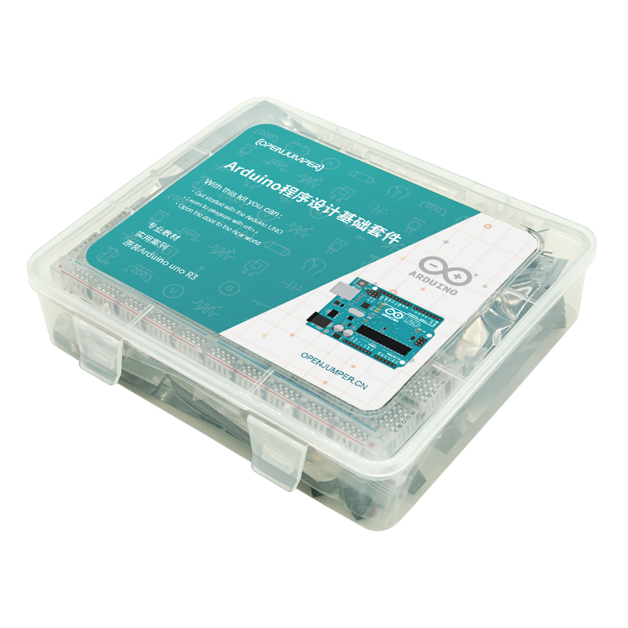

# 程序设计基础套件

[点我购买](https://item.taobao.com/item.htm?id=585091512971)

## 套件简介

本套件是将Arduino程序设计基础提到的元器件及其传感器整理出，形成的一套完整的Arduino学习套件，为学习者提供一个更清晰的学习思路、更快速的学习方法、以及更方便、专业的学习工具。该套件包含Arduino程序设计基础中前5章所用到的控制器及基础传感器模块和元件。本套件是您提升Arduino学习的理想选择。

## 套件清单

Arduino程序设计基础第2版  纸质教程* 1 （选购）

Arduino Uno R3意大利英文版  * 1

传感器扩展板  * 1

USB数据线  * 1 

继电器模块  * 1

蜂鸣器模块  * 1

RGB LED模块  * 1

触摸模块 * 1

声音传感器 * 1

MQ2气体传感器 * 1

红外遥控器 * 1

红外发射模块 * 1

红外接收模块 * 1

超声波传感器 * 1

红外避障传感器 * 1

人体红外模块 * 1

74HC595 * 1

10K单联电位器 * 1

无源蜂鸣器 * 1

光敏电阻5537 * 1

LM35DZ * 1

LED * 8

按键 * 6

38K一体化红外接收头 * 1

电阻 220欧 * 10

电阻1K * 10

电阻10K * 10

电容 100nf  * 10

3P杜邦线 * 6

母对母杜邦线 * 20

面包线 * 1捆（约65根）

面包板 * 1

风扇叶 * 1

直流小电机（已焊接电机线） * 1

9G舵机*1

塑料收纳盒*1

## Arduino程序设计基础介绍

**第1章 初识Arduino**

1.1什么是Arduino

1.2 Arduino的由来

1.3为什么使用Arduino作为开发平台

1.4 Arduino硬件——选择一款适合自己的Arduino控制器

1.4.1认识不同型号的Arduino控制器

1.4.2众多的Arduino外围模块

1.4.3从ArduinoUNO开始

1.5 Arduino软件

1.5.1下载配置Arduino开发环境

1.5.2认识ArduinoIDE

1.5.3安装Arduino驱动程序

1.6 Blink——Arduino的HellloWorld!

 

**第2章 基础篇**

2.1 Arduino语言及程序结构

2.1.1 Arduino语言

2.1.2 Arduino程序结构

2.2 C/C++语言基础

2.2.1数据类型

2.2.2运算符

2.2.3表达式

2.2.4数组

2.2.5字符串

2.2.6注释

2.2.7用流程图表示程序

2.2.8顺序结构

2.2.9选择结构

2.2.10循环结构

2.3电子元件和Arduino扩展模块

2.4传感器扩展板的使用

2.5 ArduinoI/O的简单控制

2.5.1数字I/O的使用

2.5.2项目:人体感应灯(继电器模块与数字传感器)

2.5.3模拟I/O的使用

2.5.4项目:电子温度计

2.5.5数字传感器与模拟传感器的使用

2.6与计算机交流——串口的使用

2.6.1串口输出

2.6.2串口输入

2.6.3实验:串口控制开关灯

2.7时间控制函数

2.7.1运行时间函数

2.7.2延时函数

 

**第3章 I/O口高级应用**

3.1调声函数

3.2项目

3.3脉冲宽度测量函数及超声波测距

3.3.1脉冲宽度测量函数

3.3.2超声波测距

3.4设置ADC参考电压

3.5外部中断

3.5.1外部中断的使用

3.5.2实验:外部中断触发蜂鸣器报警

 

**第4章 使用和编写类库**

4.1编写并使用函数,提高程序的可读性

4.2使用Arduino类库

4.3编写Arduino类库

4.3.1编写头文件

4.3.2预处理命令

4.3.3宏定义

4.3.4文件包含

4.3.5条件编译

4.3.6版本兼容

4.3.7编写.cpp文件

4.3.8关键字高亮显示

4.3.9建立示例程序

4.4类库优化与发布

 

**第5章 通信篇**

5.1硬件串口通信——HardwareSerial类库的使用

5.1.1 HardwareSerial类库成员函数

5.1.2 print()和 write()输出方式的差异

5.1.3 read()和peeek()输入方式的差异

5.1.4串口读取字符串

5.1.5串口事件

5.1.6实验:串口控制RGBLED调光

5.1.7更好的串口监视器——串口调试助手

5.2软件模拟串口通信——SoftwareSerial类库的使用

5.2.1 SoftwareSerial类库的局限性

5.2.2 SoftwareSerial类库成员函数

5.2.3建立一个软串口通信

5.2.4实验:Arduino间的串口通信

5.2.5同时使用多个软串口

5.3 IIC总线的使用——Wire类库的使用

5.3.1 IIC主机、从机与引脚

5.3.2 Wire类库成员函数

5.3.3 IIC连接方法

5.3.4主机写数据,从机接收数据

5.3.5从机发送数据,主机读取数据

5.4 SPI总线的使用——SPI类库的使用

5.4.1 SPI引脚

5.4.2 SPI总线上的从设备选择

5.4.3 SPI类库成员函数

5.4.4 SPI总线上的数据发送与接收

5.4.5实验:使用数字电位器AD5206

5.4.6软件模拟SPI通信

5.4.7实验:使用74HC595扩展I/O口

 

**第6章 存储篇**

6.1断电也能保存数据——EEPROM类库的使用

6.1.1 EEPROM类库成员函数

6.1.2写入操作

6.1.3读取操作

6.1.4清除操作

6.1.5使用共用体存储各类型数据到EEPROM

6.2保存大量数据——SD卡类库的使用

6.2.1格式化SD卡

6.2.2 SD卡类库成员函数

6.2.3使用 SD卡读/写模块

6.2.4创建文件

6.2.5删除文件

6.2.6写文件

6.2.7读文件

6.3项目:SD卡环境数据记录器

6.3.1 DHT11温湿度检测模块的使用

6.3.2硬件连接方法

6.3.3温湿度记录器

6.3.4在Excel中分析数据

 

**第7章 无线通信篇——红外遥控**

7.1 IRremote类库成员函数

7.2红外接收

7.3红外发射

7.4实验:遥控家电设备

 

**第8章 LCD显示篇**

8.1 1602LCD的使用——LiquidCrystal类库的使用

8.1.1将1602LCD与Arduino连接

8.1.2 4位数据线接法

8.1.3 1602LCD相关参数

8.1.4 LiquidCrystal类库成员函数

8.1.5实验:“helllo,world!”

8.1.6实验:将串口输入数据显示到1602LCD上

8.1.7实验:显示滚动效果

8.1.8实验:显示自定义字符

8.2项目:制作电子时钟

8.2.1 DS1307时钟模块的使用

**8.2.2电子时钟**

8.3图形显示器的使用——u8glib类库的使用

8.3.1选择LCD并连接到Arduino

8.3.2连接到Arduino并建立u8g对象

8.3.3 u8glib程序结构

8.3.4纯文本显示

8.3.5数据显示

8.3.6实验:绘制图形

8.3.7实验:显示图片——位图取模

 

**第9章 USB类库的使用**

9.1 USB设备模拟相关函数

9.1.1 USB鼠标类的成员函数

9.1.2 USB键盘类的成员函数

9.2模拟键盘输入信息

9.2.1 Arduino Leonardo在模拟USB设备后,无法正常下载程序

9.2.2模拟键盘组合按键

9.3实验:使用摇杆模块控制计算机鼠标

9.4项目:PPT播放遥控器

 

**第10章 Ethernet类库的使用**

10.1 Ethernet相关硬件介绍

10.2 Ethernet类库

10.2.1 Ethernet类

10.2.2 IPAddress类

10.2.3 EthernetServer类

10.2.4 EthernetClient类

10.3 Ethernet的初始化

10.3.1自定义IP地址

10.3.2 DHCP获取IP地址

10.4通过Telnet建立简易聊天室

10.4.1建立Arduino Telnet聊天服务器

10.4.2 Windows Telnet客户端的使用

10.5 Ethernet与Web应用

10.5.1 HTTP协议简介

10.5.2 HTTP响应

10.5.3网页客户端

10.5.4网页服务器

10.6 UDP通信

10.6.1 EthernetUDP类

10.6.2使用UDP收/发数据

10.7项目:网页控制Arduino