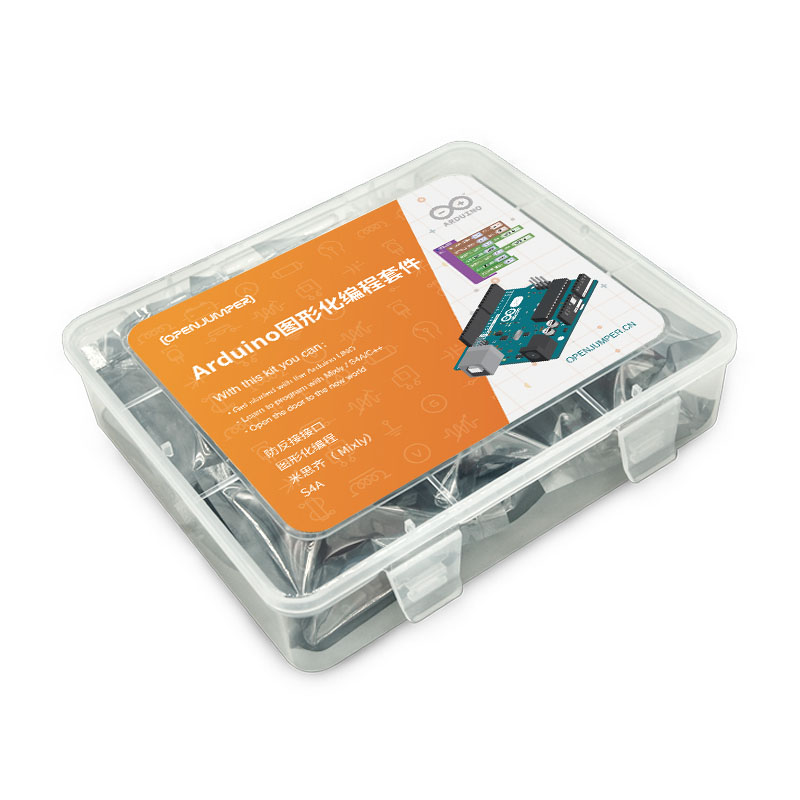

# Arduino防反接套件

[点我购买](https://item.taobao.com/item.htm?id=568753707693)

***

[第一章 初识Arduino](https://arduino.me/a/1621)

[第二章 Mixly编程初体验](https://arduino.me/a/1622)

[第三章 多彩灯](https://arduino.me/a/1623)

[第四章 按键](https://arduino.me/a/1624)

[第五章 入侵检测](https://arduino.me/a/1625)

[第六章 可调灯](https://arduino.me/a/1626)

[第七章 楼道声控灯](https://arduino.me/a/1627)

[第八章 数字温度计](https://arduino.me/a/1628)

[第九章 生日快乐歌](https://arduino.me/a/1629)

[第十章 噪音检测仪](https://arduino.me/a/1630)

[第十一章 遥控灯](https://arduino.me/a/1631)

[第十二章 超声波](https://arduino.me/a/1632)

[第十三章 燃气报警](https://arduino.me/a/1633)

[第十四章 消防安全系统](https://arduino.me/a/1634)

[第十五章 花园管家](https://arduino.me/a/1635)

[第十六章 别摸我](https://arduino.me/a/1636)