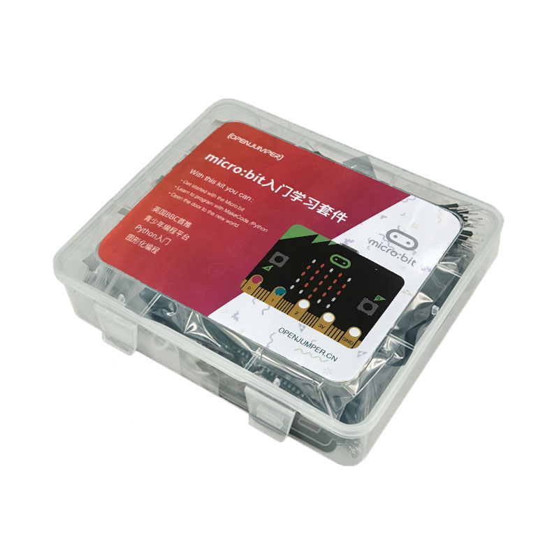

## Microbit教程

[点我购买](https://item.taobao.com/item.htm?id=572488436869)

***
[第一章 初识Microbit](https://openjumper.cn/mic01/)

[第二章 快速使用microbit](https://openjumper.cn/mic02/)

[第三章 基础模块](https://openjumper.cn/mic03/)

[第四章 输入模块](https://openjumper.cn/mic04/)

[第五章 音乐模块](https://openjumper.cn/mic05/)

[第六章 LED屏幕](https://openjumper.cn/mic06/)

[第七章 无线电](https://openjumper.cn/mic07/)

[第八章 游戏](https://openjumper.cn/mic08/)

[第九章 图片](https://openjumper.cn/mic09/)

[第十章 引脚](https://openjumper.cn/mic10/)

[第十一章 I2C](https://openjumper.cn/mic11/)

[第十二章 SPI](https://openjumper.cn/mic12/)

[第十三章 串口通讯Serial](https://openjumper.cn/mic13/)

[第十四章 控制](https://openjumper.cn/mic14/)

[第十五章 蓝牙](https://openjumper.cn/mic15/)

[第十六章 设备](https://openjumper.cn/mic16/)