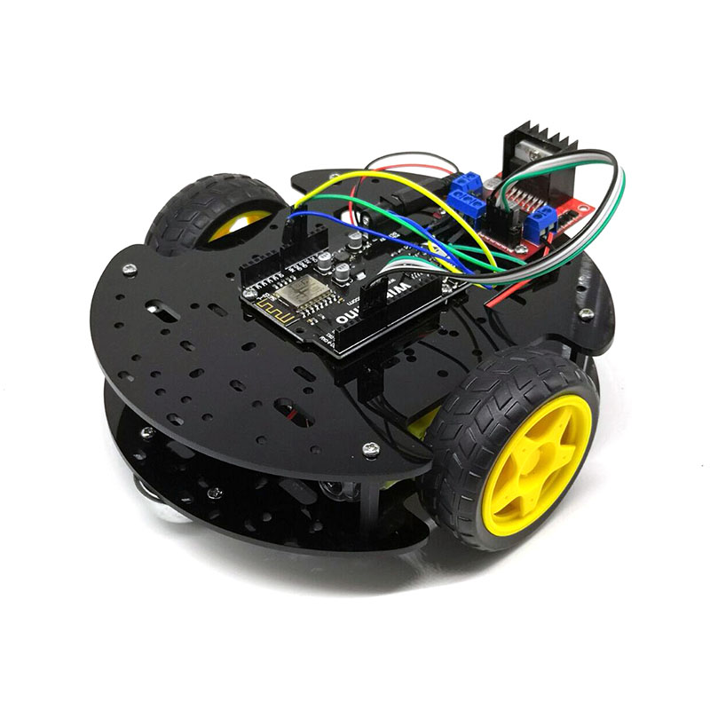

# WiFiduino智能小车套件

[点我购买](https://item.taobao.com/item.htm?id=592030973220)

## 硬件准备

1、wifiduino

2、小车车体

3、电机驱动模块

4、杜邦线若干（公对公）

5、6~9V电池（给wifiduino主板DC口供电）

## 软件准备
 
### 1、下载并安装Arduino IDE

[点击去下载](https://arduino.me/download)
### 2、下载并安装esp8266扩展 

[点击去下载](https://arduino.me/a/esp8266)  

如果安装过其他版本的esp8266sdk，请先删除，再使用本安装包

双击下载的.exe 安装esp8266扩展库

解压完成后，再打开Arduino IDE，即可在 菜单栏>工具>开发板 中找到你使用的wifiduino开发板

### 3、下载并加载Blinker-library

下载地址：<https://github.com/blinker-iot/blinker-library>

将其放在  我的文档—Arduino—libraries 下面，如图所示：

### 4、下载并安装blinker APP 

android下载：[点击下载](https://github.com/blinker-iot/app-release/releases)  

IOS下载：app store中搜索“blinker”下载  

## 添加设备  
 
1. 确保开发板连接的网络能连接外网  
   
2. 在blinker app中，点击右上角的“+”进入添加设备页面  

3. 点击选择==Arduino== > ==wifi接入== > ==阿里云==  
 
4. 获取到==SecretKey==，并填写到程序中  （记住这个SecretKey编号，待会程序中会用到）
   

## 连接wifiduino
 
将wifiduino通过microusb线连接至电脑，在第一次使用wifiduino时，电脑会自动给wifiduino安装驱动（使用的驱动芯片为ch340）。安装完成后再设备管理器中查看驱动是否安装成功。安装成功后会有显示驱动对应通信串口号，如下图，串口号位COM13

当然有时候驱动会安装不上，如下图所示：

这时候就需要手动安装驱动。从 <https://arduino.me/download>  下载驱动程序，解压之后以管理员身份运行SETUP.EXE文件即可。然后重新拔插下wifiduino，直到在设备管理器中成功看到对应的CH340的驱动已经后面的COM口。

## 给wifiduino下载程序
***
打开例程4WD_wifi_key_control.ino

修改程序中的 auth[]值和要连接的wifi的ssid及密码

记住程序中定义的几个按键的键值，待会app中会用到

点击下载，将程序下载至wifiduino主板中。

## wifiduino连接小车及驱动模块
 

1、Wifiduino与电机驱动板L298N模块的连线

|Wifiduino|L298N电机驱动板|
|:--:|:--:|
|7|IN4|
|6|IN3|
|4|IN1|
|5|IN2|
|VIN|+12V|
|GND|GND|

+ 左边电机接L298N电机驱动模块的 OUT1 OUT2  右边电机接OUT3 OUT4
  
+ 将wifiduino供电头与电池盒进行焊接

4、电池7.4V（2节锂电池）输入给wifiduino DC口供电

## 编辑界面 
 
1.点击进入设备界面，点击右上角编辑键，切换到界面编辑模式  

2.添加一个开关组件，点击按键组件，  

举例：添加一个 “上键”的按键

选择按键样式，可以选择按键的图标大小。点击“显示图标”可以修改“上键”的图标为一个向上的箭头

随后修改 数据键名、显示文本如图所示：

同时添加布置“下键”“左键”“右键”“中键”

分别修改其键值为“btn-x” “btn-z”“btn-z”“btn-t”

点击右上角解锁，即可完成编辑。

随后操作手机app的按键，观察小车运动情况。
