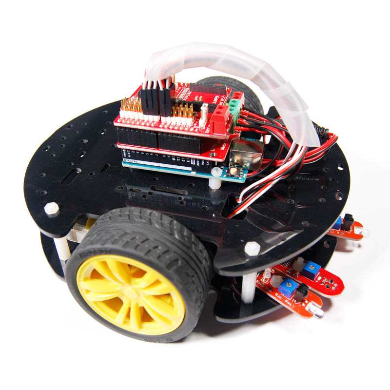
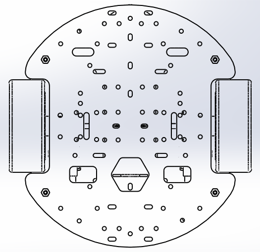
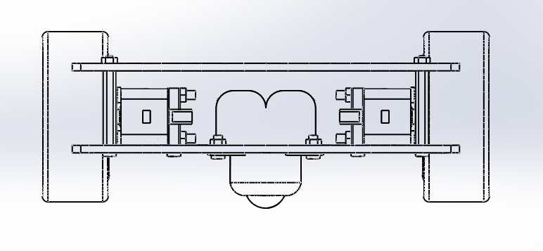
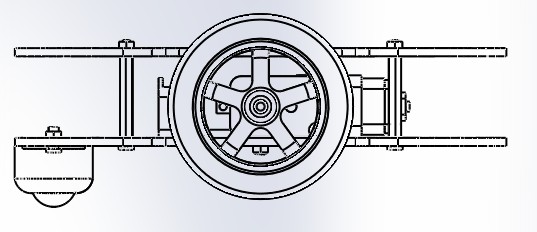

# Arduino两驱循迹避障智能小车套件

[点我购买](https://item.taobao.com/item.htm?id=537118397795)

## 概述

OJ智能小车是基于小车上平台，延伸开发的入门智能小车套件，简单的外观及硬件，可以实现巡线、避障、无线遥控等功能，是初学者学习必备的智能小车。通过学习制作自己的小车，不仅增加爱好者的兴趣，更增添对于电子及机器人的爱好。我们还提供基础参考源码，其中包括小车拼装说明，循迹小车制作，避障小车制作，无线遥控小车制作。让您快速上手学习制作Arduino智能小车。

## 其他文档

<https://pan.baidu.com/s/1dFCSU0D>

主板电机连接组装教程：[主板电机连接组装教程](http://openjumper.cn/wp-content/uploads/2013/07/%E4%B8%BB%E6%9D%BF%E7%94%B5%E6%9C%BA%E8%BF%9E%E6%8E%A5%E7%BB%84%E8%A3%85%E6%95%99%E7%A8%8B.pdf)

