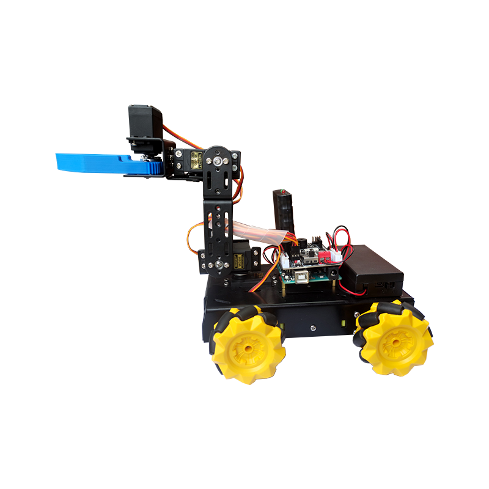
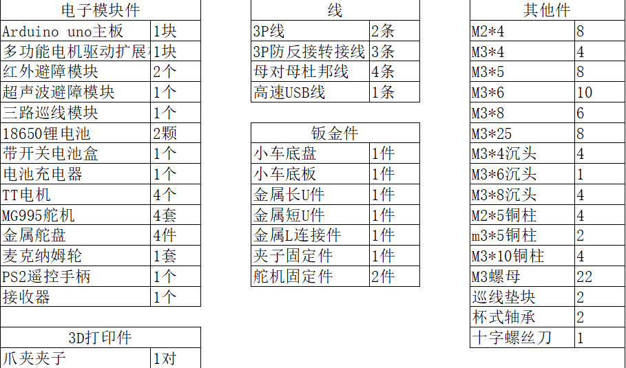

# 多功能智能wifi小车套件

[点我购买](https://item.taobao.com/item.htm?id=643400454215)

## 产品参数

+ 开发板：wifiduino/arduino

+ 供电电压：6-12V

+ 驱动板：IIC-电机/舵机驱动模块

+ 电机：TT直流减速电机

+ 车身材质：铝合金

+ 扩展板：防反接传感器扩展板

+ 车轮类型：麦克纳姆轮

+ 编程语言：Arduino C

+ 编程环境：Arduino IDE

+ 车身尺寸：185\*171\*152mm (长\*宽*高)

+ 伸展后尺寸：312\*152mm (长*高)

+ 底盘尺寸：185\*108mm (长*宽)

+ 夹子离地距离：12mm

+ 供电电池：18650可充电锂电池

## 功能介绍

+ 全向移动

+ 超声波跟随

+ 红外巡线

+ 红外避障

+ 智能抓取

+ 手机遥控

## 套件清单

## 资料链接

<https://pan.baidu.com/s/1dezhVCFBXXHMuv9E9pBTBg>