# 金属机械臂

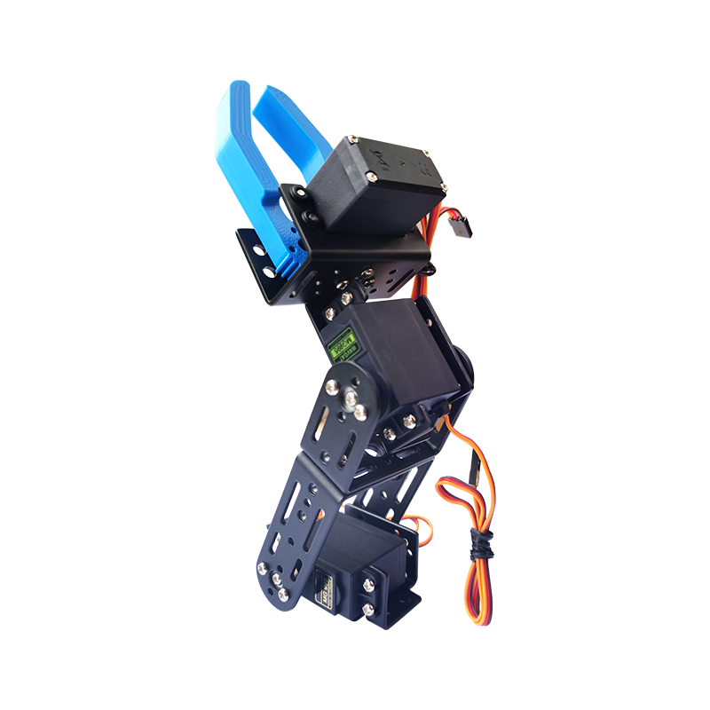

[点我购买](https://item.taobao.com/item.htm?id=671727610691)

## 清单

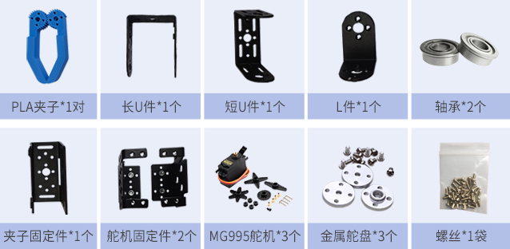

## 组装教程

### 一、组装连接件

1、将**长U件**和**短U件**用2颗螺丝组装好，注意两颗螺母不在同一侧

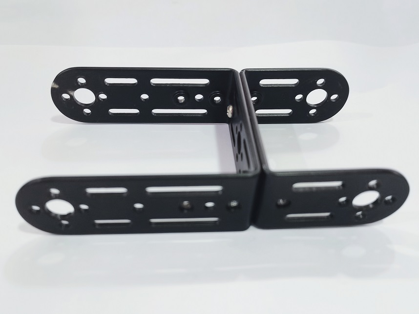

2、再把**L件**较短的一边和**夹子固定件**用4颗螺丝组装好

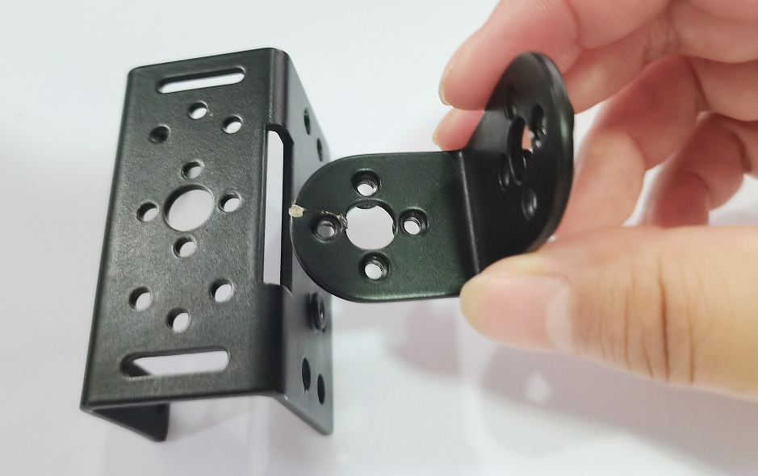 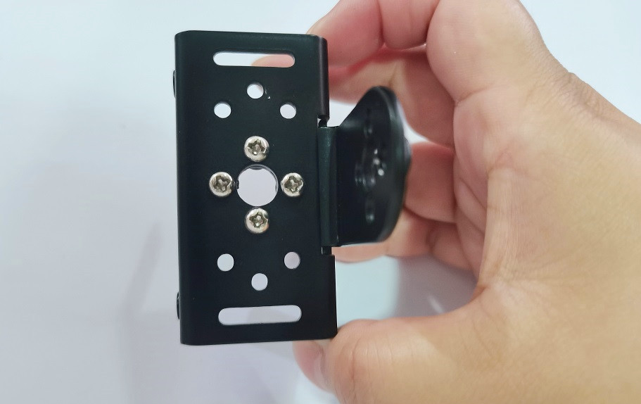

3、再用4颗螺丝把其中一个**舵机固定件**和**L件**较长的一边固定好

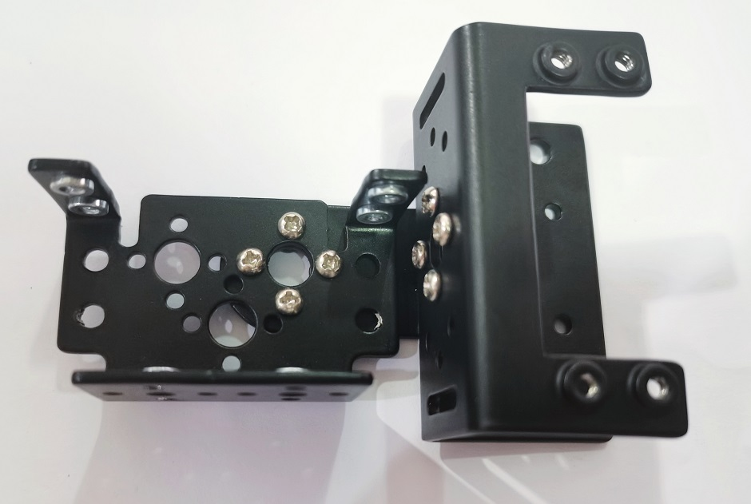

### 二、安装舵机

1、用4颗螺丝将一个**MG995舵机**安装在的**舵机固定件**上，并安装好**舵盘**（先不装螺丝）

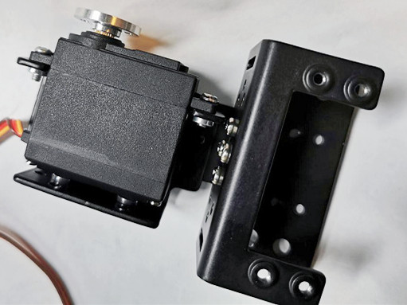 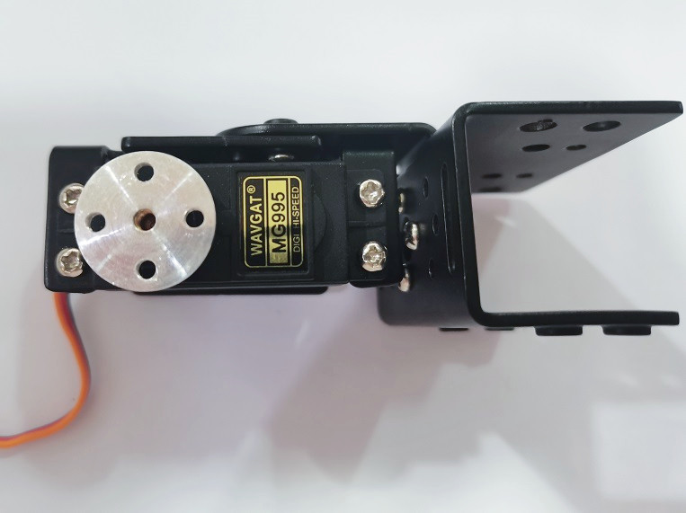

2、在将舵机的**舵盘**与装好的**短U件**用5颗螺丝固定（注意安装的位置，使舵机可以在较大范围内转动）

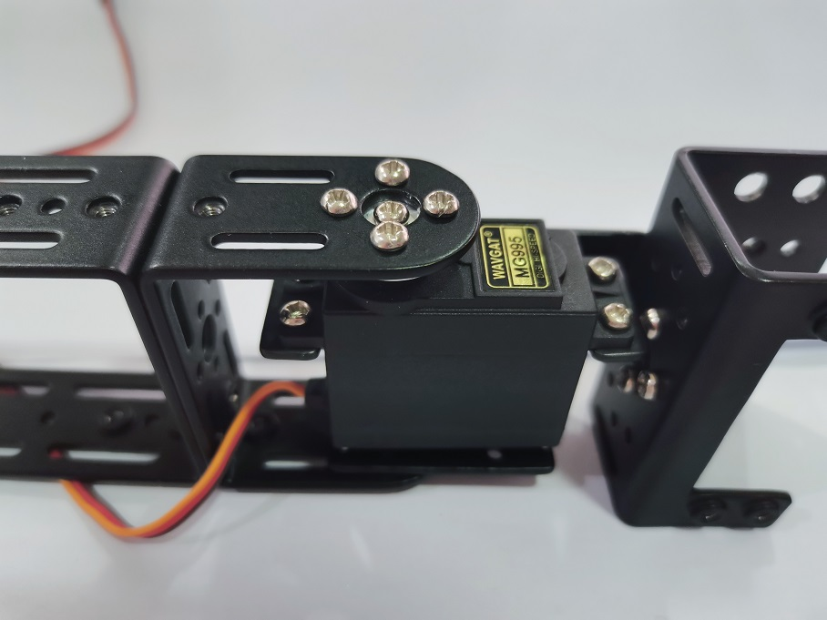

3、然后在**短U件**另一侧安装**杯式轴承**，用1颗螺丝固定

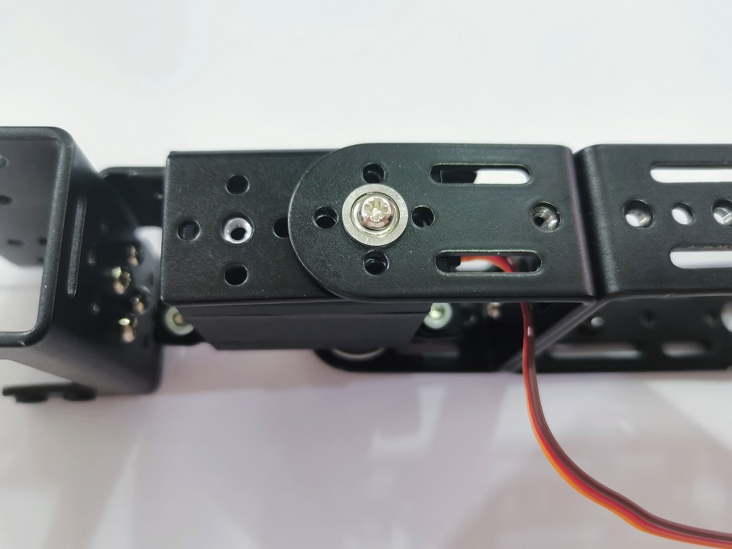

4、再将另1个**MG995舵机**和**舵机固定件**用4颗螺丝组装好，顺便安装好舵盘（先不装螺丝）

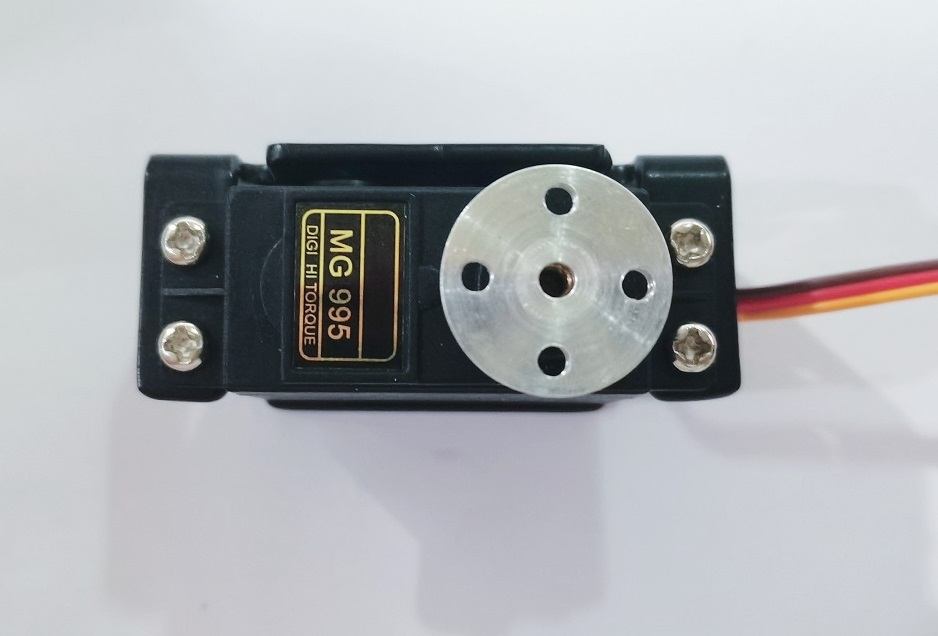

5、将这个舵机的**舵盘**与装好的**长U件**用5颗螺丝固定（注意安装的位置，使舵机可以在较大范围内转动）

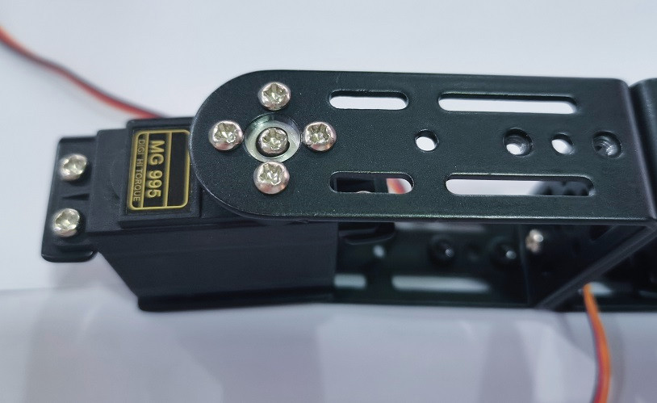

6、然后在**长U件**另一侧安装**杯式轴承**，用1颗螺丝固定

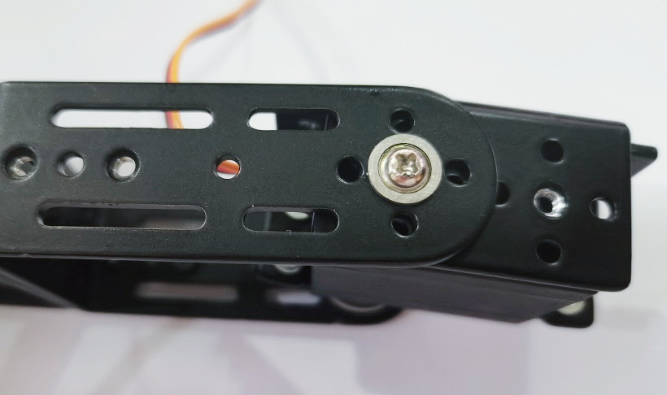

### 三、安装夹子和舵机

1、用4颗螺丝将**舵盘**固定到**右侧夹子**上

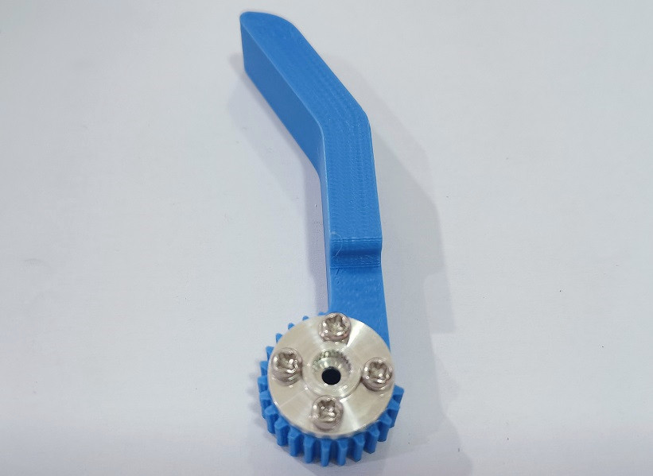

2、再从**夹子背面**用1颗螺丝把**舵盘**安装到**舵机**上，注意安装的位置，使夹子可以大幅度转动

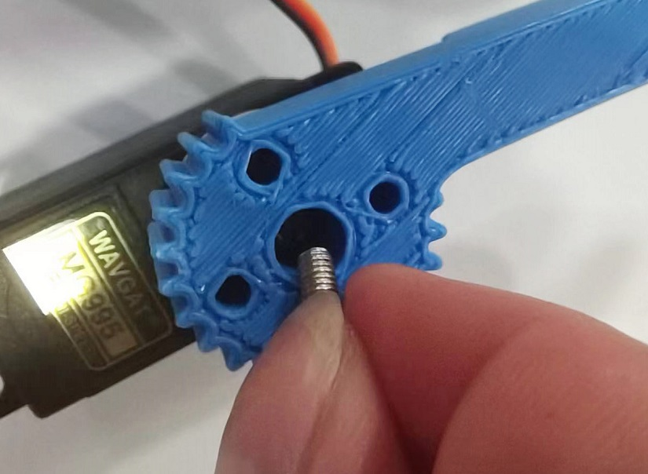

3、用1颗螺丝将**另一个夹子**固定到**夹子固定件**上（注意螺丝不能扭紧，否则夹指将无法转动）；

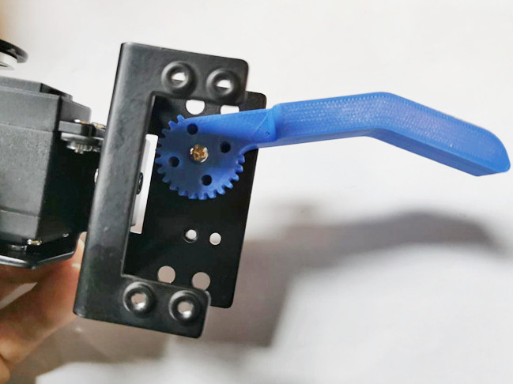

4、最后使用4颗螺丝将**舵机**安装到**夹子固定件**上方，使两个夹子处于**中间位置**

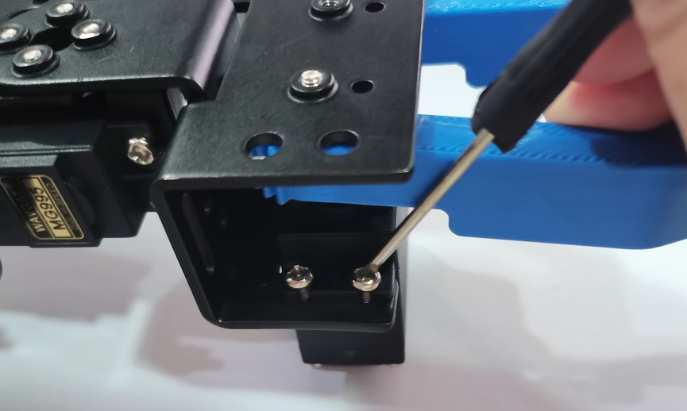 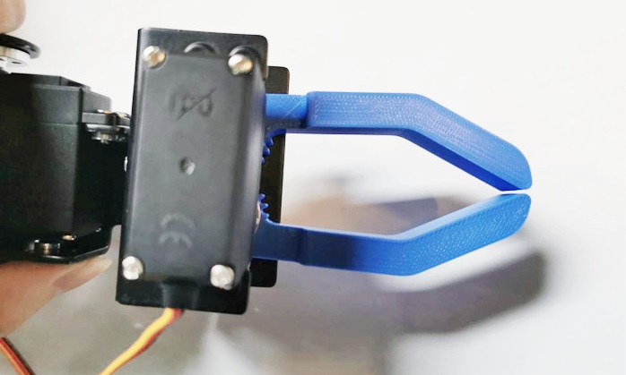

