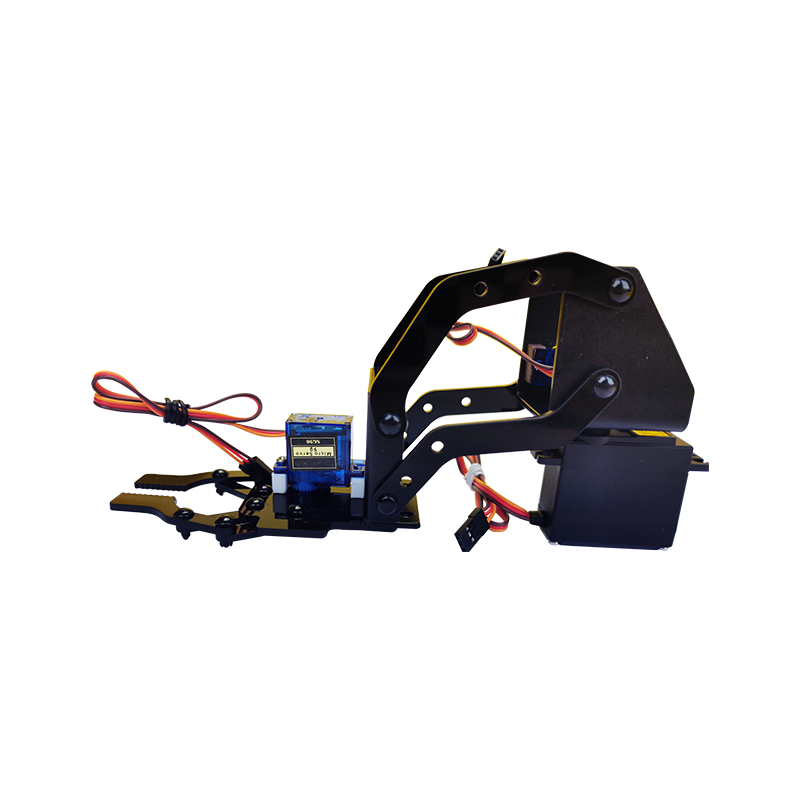
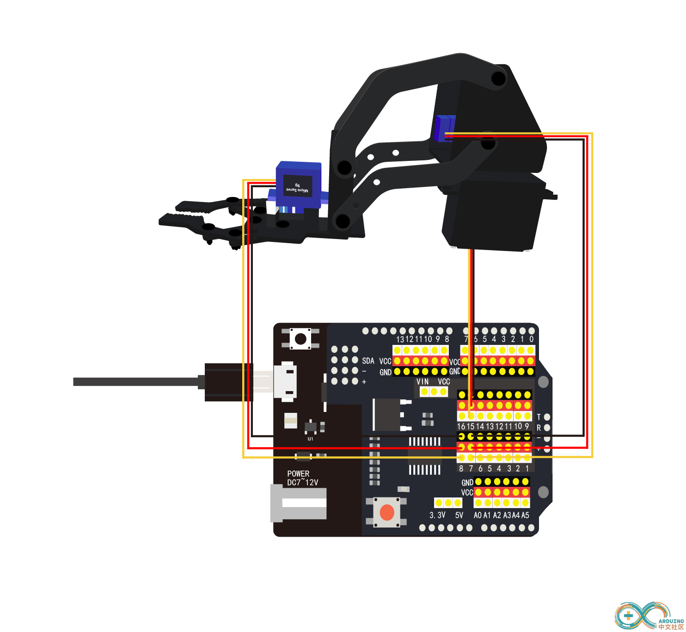
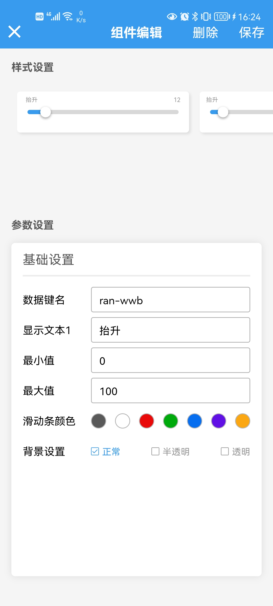
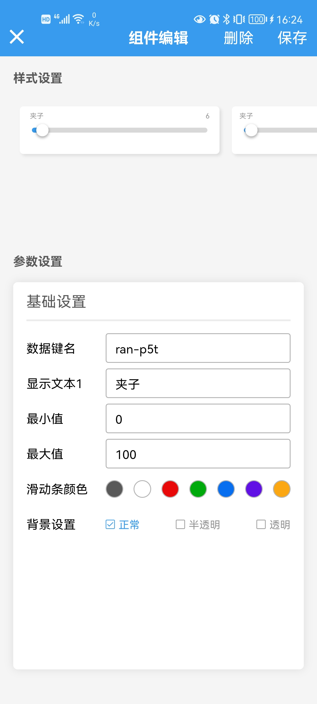
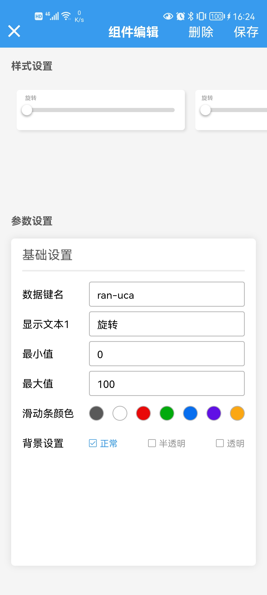
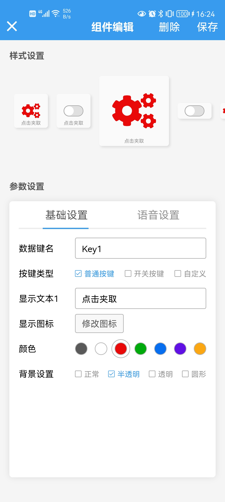
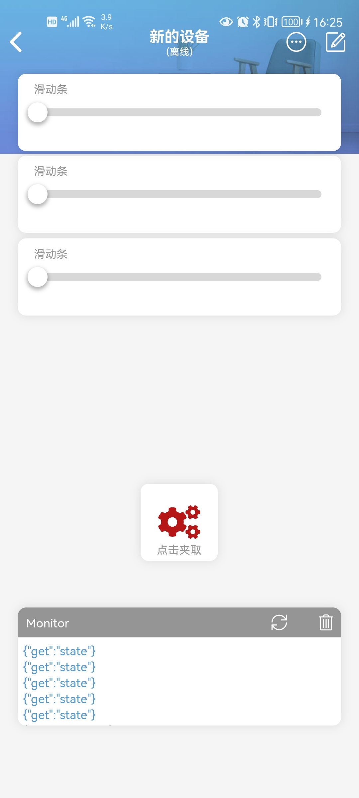

# 亚克力机械臂

机械臂是目前在机械人技术领域中得到最广泛实际应用的自动化机械装置，在工业制造、医学治疗、娱乐服务、军事以及太空探索等领域都能见到它的身影。比如码垛机械臂、自动焊接机械臂等等~~而在实际应用中，机械臂的形态各有不同，但它们能够接受指令，精确地定位到三维（或二维）空间上的某一点进行作业。



[点我购买](https://item.taobao.com/item.htm?id=671727610691)

## 产品参数

+ 机械臂材质：亚克力

+ 夹子材质：亚克力

+ 舵机：2个9G舵机+ 1个MG995舵机

## 示例程序

### 硬件清单

+ wifiduino主控板*1张

+ wifiduino扩展板*1张

+ 机械臂*1套    

+ microusb数据线*1根

### 硬件连线



### 示例程序

```
/*S1 >> 7
 *S2 >> 8
 *S3 >> 15
 *S4 >> 16
 */

#define BLINKER_WIFI
#include <Wire.h>
#include <Openjumper_IICMotorDriver.h>

#include <Blinker.h>

char auth[] = "exxxxxxxxxx4";  //手机端的设备密钥
char ssid[] = "opzzzzzzzzzz6";       //无线wifi名称
char pswd[] = "izzzzzzzzzz5";    //wifi密码

bool result;//机械臂联网状态
                                       
// called this way, it uses the default address 0x40
//Openjumper_IICMotorDriver pwm = Openjumper_IICMotorDriver();
// you can also call it with a different address you want
Openjumper_IICMotorDriver pwm = Openjumper_IICMotorDriver(0x41);//扩展板芯片地址

// Depending on your servo make, the pulse width min and max may vary, you
// want these to be as small/large as possible without hitting the hard stop
// for max range. You'll have to tweak them as necessary to match the servos you
// have!
#define SERVOMIN 100 // this is the 'minimum' pulse length count (out of 4096)
#define SERVOMAX 400 // this is the 'maximum' pulse length count (out of 4096)

// our servo # counter
//uint8_t servonum = 0;

/**
舵机角度0-180度对应脉冲角度在0.5到2.5ms，一个脉冲宽度20ms
**/

#define LiftingPin  1//抬升舵机
#define TongsPin    2//夹子舵机
#define SwingPin    3//转向舵机
#define StEngDelTim 1300//抬升动作间距时间


#define LSEUP 360//抬升舵机角度，最高位置
#define LSEDW 160//最低位置

#define TSEMI 130//夹子舵机角度，闭合角度
#define TSEMA 310//张开角度

#define SSERE 330//转向舵机角度，左边
#define SSEME 260//中间位置
#define SSELE 190//右边

#define BUTTON_1 "Key1"

#define Slider_1 "ran-wwb"
#define Slider_2 "ran-p5t"
#define Slider_3 "ran-uca"

BlinkerButton Button1(BUTTON_1);
BlinkerSlider Slider1(Slider_1);//抬升舵机位置控制滑块
BlinkerSlider Slider2(Slider_2);//夹子舵机位置控制滑块
BlinkerSlider Slider3(Slider_3);//转向舵机位置控制滑块

void slider1_callback(int32_t value)//抬升舵机控制
{
    value = map(value,0,100,LSEDW,LSEUP);
    pwm.setServoPulse(LiftingPin,value);
    BLINKER_LOG("get slider value: ", value);
}

void slider2_callback(int32_t value)//夹子舵机控制
{
    value = map(value,0,100,TSEMI,TSEMA);
    pwm.setServoPulse(TongsPin, value);
    BLINKER_LOG("get slider value: ", value);
}

void slider3_callback(int32_t value)//转向舵机控制
{
    value = map(value,0,100,SSERE,SSELE);
    pwm.setServoPulse(SwingPin, value);
    BLINKER_LOG("get slider value: ", value);
}

void button1_callback(const String & state)//夹取物品
{
    //BLINKER_LOG("get button state: ", state);

    if (state == BLINKER_CMD_BUTTON_TAP) {
        BLINKER_LOG("夹取物品");
        ServoGroup();
    }    
}

void ServoGroup(){
  pwm.setServoPulse(LiftingPin, LSEUP);//各舵机初始化
  pwm.setServoPulse(TongsPin, TSEMA);
  pwm.setServoPulse(SwingPin, SSEME);
  Blinker.delay(StEngDelTim);
  pwm.setServoPulse(LiftingPin, LSEDW);
  Blinker.delay(StEngDelTim);
  pwm.setServoPulse(TongsPin, TSEMI);
  Blinker.delay(StEngDelTim);
  pwm.setServoPulse(LiftingPin, LSEUP);
  Blinker.delay(StEngDelTim);
  } 
  
void setup()
{
  Serial.begin(115200);

  pwm.begin();
  //pwm.motorConfig(DIRP,DIRP,DIRP,DIRP);//DIRN

    BLINKER_DEBUG.stream(Serial);

    pinMode(LED_BUILTIN, OUTPUT);//8266模块灯
    digitalWrite(LED_BUILTIN, LOW);

    Blinker.begin(auth, ssid, pswd);

    Button1.attach(button1_callback);
    Slider1.attach(slider1_callback);
    Slider2.attach(slider2_callback);
    Slider3.attach(slider3_callback);
}

void loop()
{
    Blinker.run(); 

    result = Blinker.connected();//检测小车网络连接状态
    if(result){
      digitalWrite(LED_BUILTIN, HIGH);//若连接成功，则关闭LED
      }
    else{
      digitalWrite(LED_BUILTIN, LOW);
      } 
}
```

### 手机控制界面制作

添加三个滑块组件，将键名分别改为程序里定义的“ran-wwb”、“ran-p5t”、“ran-uca”，显示文本内容对应改为抬升、夹子、旋转。

  

再添加一个按键组件 ，数据键名改为程序中定义的“Key1”，显示文本内容改成“点击夹取”，可以修改按键图标和颜色。

 

再添加一个调试组件，完成编辑，点右上角保存。


## 效果展示 

可以通过滑动滑块和按键控制机械臂的旋转、抬升和夹取。




## 其他资料

[程序下载](https://pan.baidu.com/s/1Zj0u_r5DjER5BpK8_ESFCw?pwd=ch9v) 提取码: ch9v