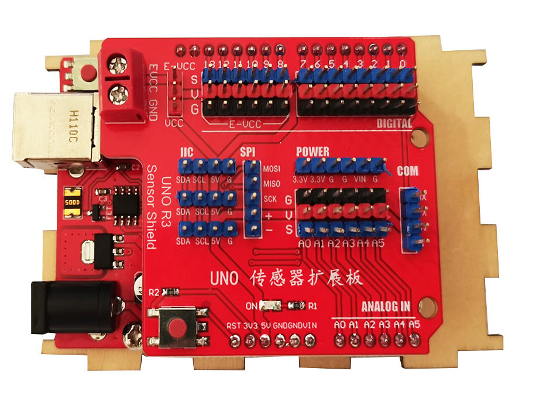
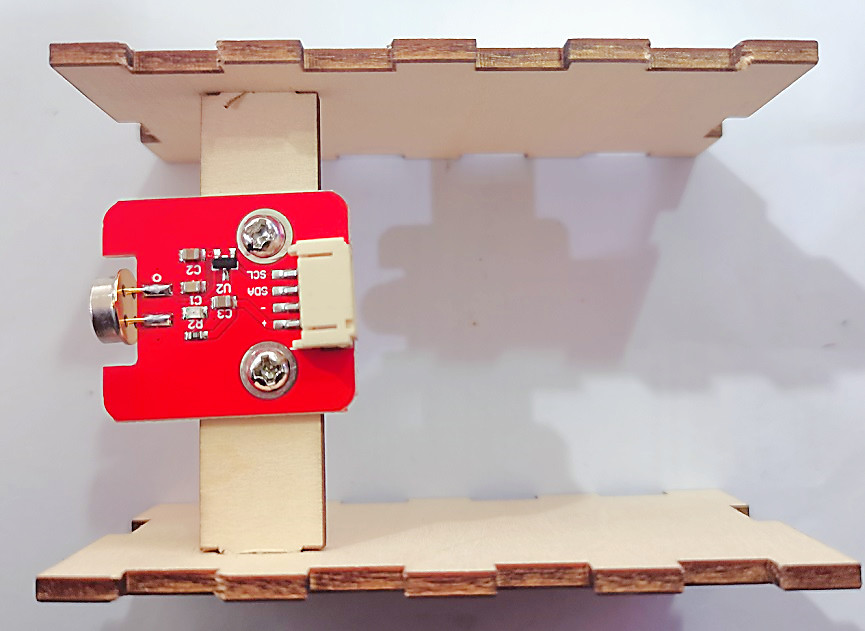
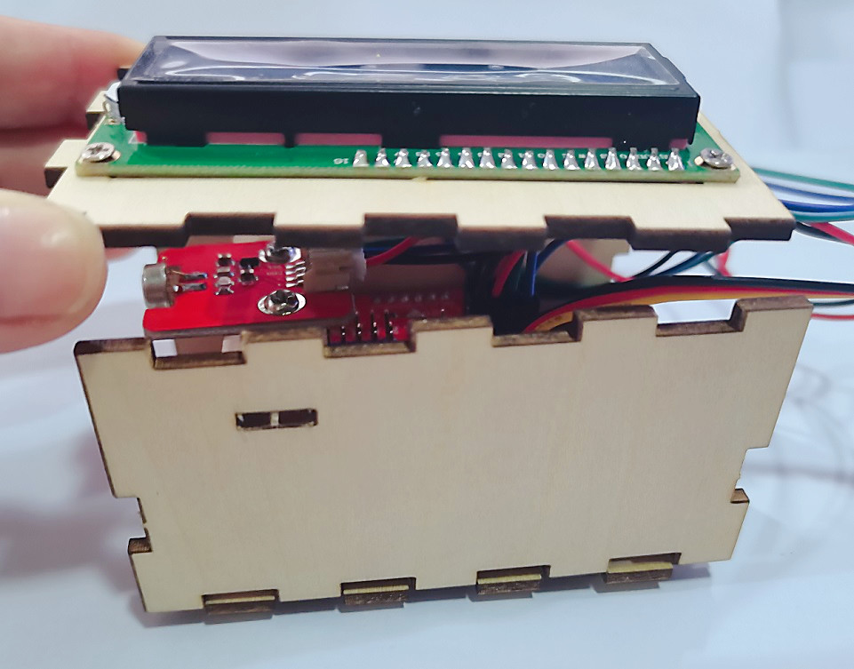

# 红外测温枪

## 产品简介 
 
arduino非接触式红外测温枪，采用openjumper红外测温模块、LCD1602液晶显示屏、按键模块组成，通过组装拼接可搭建出产品，可以提升逻辑思维能力，动手创新能力。

[点我购买](https://item.taobao.com/item.htm?id=671382053326)

## 产品参数

+ 产品名称：红外测温枪

+ 测温范围：-40~+125˚C

+ 测温精度：±0.5˚C

+ 产品尺寸: 16×6×13cm

+ 主要材质：环保木材

+ 适合年龄: 7岁以上

## 适用对象

+ 创客爱好者

+ 用作培训机构教材

+ 电子爱好者

+ 教师和学生

+ 喜爱编程者

## 套件清单

Zduino主板 * 1个

Zduino传感器扩展板 * 1个

1602液晶显示屏 * 1个

按键模块 * 1个

红外测温模块 * 1个

4p转接线 * 2条

3p转接线 * 1条

木板拼接件 * 2块

M3*6螺丝 * 6颗 

M3*6自攻螺丝 * 4颗

M3*10螺丝 * 4颗

M3螺母 * 12颗

USB下载线 * 1条

## 组装教程

如下图，我们已将木板标注序号，查看安装教程时根据此序号查看

模块名称标注

步骤一，拿出1号木板、4颗M3*10的螺丝和M3螺母，将Zduino UNO主板安装在1号木板上

步骤二，将扩展板插在主板上

步骤三，拿出4号木板，4颗M3*6的自攻螺丝，将LCD1602液晶显示屏安装在4号木板上

步骤四，拿出6号木板，2颗M3*6的螺丝和M3螺母，将红外温度测量模块安装在6号木板上

步骤五，拿出10号木板，4颗M3*6的螺丝和M3螺母，将按键模块安装在10号木板上，安装时，先把3p转接线接在按键上，然后把按键帽取下来再安装，安装完成后，将按键帽安回模块上

 

步骤六，现在将各模块的线接到扩展板上，LCD1602液晶屏用4P转接线接在扩展板的IIC接口，红外温度测量模块也用4P转接线接在扩展板的另一个IIC接口，按键模块接在D13接口

步骤七，将6号木板卡在2，3号木板上的缺口上，注意板子朝向

然后将这个整体卡在1号木板两侧，注意板子朝向，红外温度测量模块背朝主板接口方向

步骤八，将4号木板卡在2，3号木板上面

步骤九，将5号木板，卡在1，4号木板上

步骤十，将9，10号木板卡在1，4号木板后边

步骤十一，将7号木板卡在9，10号木板的凹槽处

步骤十二，最后将8号木板卡在9，10号木板的缺口处

最后，组装好的测温枪如下图所示

## 图形化程序

程序中按键模块所接引脚可根据硬件实际接线更改

## 其他资料

+ 红外测温模块库文件：<https://pan.baidu.com/s/1FwFds6xd65wgjrdHS3q1Ig?pwd=hb79> 提取码: hb79 

+ LCD1602显示屏模块库文件：<https://pan.baidu.com/s/1xaJ7WKnDSNJy3l1LdXcmMg?pwd=p8u7>提取码: p8u7 

+ arduino程序：<https://pan.baidu.com/s/1jGc-uOOgRudYTj0pkb7mXA?pwd=24jv> 提取码: 24jv

+ 图形化程序：<https://pan.baidu.com/s/1jxeUTGaA6HTIxDgqLrrnnw?pwd=a99f> 提取码: a99f

+ 外壳图纸下载：<https://pan.baidu.com/s/1G78b9DMqE3Rhj1HB0YgTwg?pwd=fqfw> 提取码: fqfw 