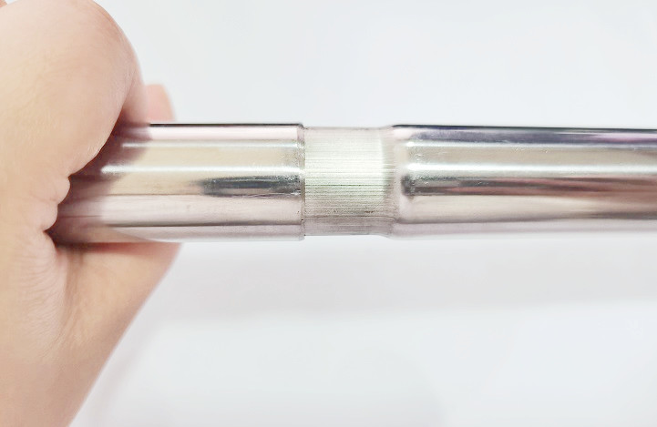
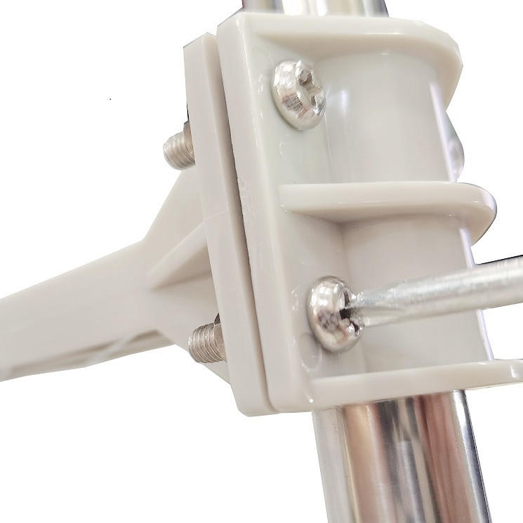

# 小型气象站组装教程

## 产品介绍
 
小型气象站需要使用专门的传感器来测量风速、风向、雨量、温湿度等天气数据，现openjumper推出一个小型气象站套件。使用 RJ-11接口连接这些传感器，能够轻松测量风速、风向、雨量和温湿度。套件中的所有传感器都是无源元件。

有太阳能充电功能，请使用1.5V AA 可充电电池。

*注意：冬天，室外气温低，碱性电池不工作。建议在冬天使用锂电池。*

备注：此配件（室外用）是专门为气象仪器设计的，我们不保证它适用连接其它的气象仪器。在您购买之前，请对该配件有详细的了解。此配件一经售出，不接受退货。

[点我购买](https://item.taobao.com/item.htm?id=678468169932)

## 产品清单

收到货后，请拆开所有零件包装，检查零件是否齐全。

+ 2根金属管

+ 1个雨量传感器

+ 1个风速传感器

+ 1个风向传感器

+ 1个温湿度传感器

+ 1个太阳能充电板

+ 2个不锈钢喉箍

+ 1个双侧传感器固定架

+ 2个单侧传感器固定架

+ 1个袋螺丝/螺母

+ 1包自锁式尼龙扎带

### 雨量传感器

雨量传感器可以测量降雨量，该传感器是一个漏斗式的雨水收集器。对于落在传感器中的每0.011英寸（0.2794毫米）的雨水，水桶就会倾斜，将水倒出来并关闭瞬时开关。可以使用中断引脚或数字计数器测量瞬时开关的闭合。RJ-11 连接器的中间导线连接到仪表开关。

### 风速传感器

风速传感器测量风速，风会带动风速传感器上的杯子，而风速传感器又会带动封闭的磁铁。磁铁在每次旋转时关闭一个簧片开关，在输出上会显示开关状态。您可以使用微控制器上的数字计数器或中断引脚在 RJ-11 连接器的两根内部导线（引脚 2 和 3）上测量此值。要将其转换为实际风速，请使用1.492 mph = 1开关闭合/秒的转换。也就是2.4公里/小时。

### 风向传感器

风向传感器指示风吹的方向。

风向传感器的叶片内部有八个开关，每个开关都有自己唯一的电阻器。

八个开关及其各自的电阻器位于风向传感器内部。

当风向传感器旋转时，磁铁会关闭簧片开关，由于它们彼此靠近，因此一次可以关闭两个。通过使用外部电阻器，建一个分压器。使用微控制器上的模数转换器测量电压输出，可以确定风向传感器指向的方向。

由于电压输出将取决于所用外部电阻的值，因此没有一个常见的转换功能。

由于风向传感器输出的值是基于度数的，因此从理论上讲，您可以让任何值表示任何方向。但是，为了便于使用，我们建议将度数为 0 的值表示北方。

在风向传感器的四个侧面上也都有非常小方向指示器。如果选择不同的值来指示方向，则需要相应地进行标记。安装和定位气象计时，请确保所有方向的标记都指向正确的方向。

**请注意，风向传感器“指向”风吹向的方向**

## 安装说明

气象计是一个易于组装的套件，只需要进行机械连接。

### 一、安装固定架

首先，找到两根金属管，并将它们连接在一起。

接下来，将双侧固定架安装到金属管的顶部。确保将固定架上的凸块与金属管中的凹口对齐。

使用螺钉和螺母将其固定牢。

### 二、风速传感器

接下来，我们将风速传感器安装在双侧固定架的一侧。

风速传感器上有一个与固定架中的凹口相匹配的凹凸。这将有助于固定风速传感器，并且只允许传感器朝一个方向上安装。

使用螺钉和螺母将传感器固定好（确保它们很紧）。

### 三、风向传感器

安装风向传感器与安装风速传感器的过程相同。将传感器和固定架的凸出对齐，并将风向传感器推入到位。

同样使用螺钉和螺母将传感器固定好。

### 四、 雨量传感器

为了使雨量传感器远离其他传感器，保证它可以获得准确的测量结果，拿出一个单侧固定架安装雨量传感器。如果雨量传感器安装在风向传感器或风速传感器下方，它们会阻止雨进入雨量传感器。从而引起测量数据出错。

使用螺钉和螺母将雨量传感器固定架安装到金属管上。当你将其装在远离风速传感器和风向传感器的位置，请将它拧紧。

雨量传感器有凹口，以确保它紧贴在固定架上。

使用一个小螺钉，将雨量传感器固定稳。雨量传感器两侧都有孔。这可将传感器安装在不同的表面上，例如屋顶或围栏。

### 五、 温湿度传感器

安装温湿度传感器，同样先将另一个单侧固定架使用螺钉和螺母固定在金属管上。

先把太阳能板装在百叶箱上

然后将温湿度传感器装进百叶箱里，这个温湿度传感器带有无线发射器，发射频率为433Mhz

温湿度传感器有凹口，可以紧贴在固定架上，使用一个螺钉和螺母，将温湿度传感器固定稳。

全部安装完成后应该如下图所示

## 线束整理

风速传感器开关导体在风速传感器和风向标之间共享。您需要将风速传感器的电缆插入风向传感器下的接口上。

将其他的电线沿着金属管拉出，并使用附赠的塑料自锁扎带固定好，防止风将电线从电子设备中拉出。 