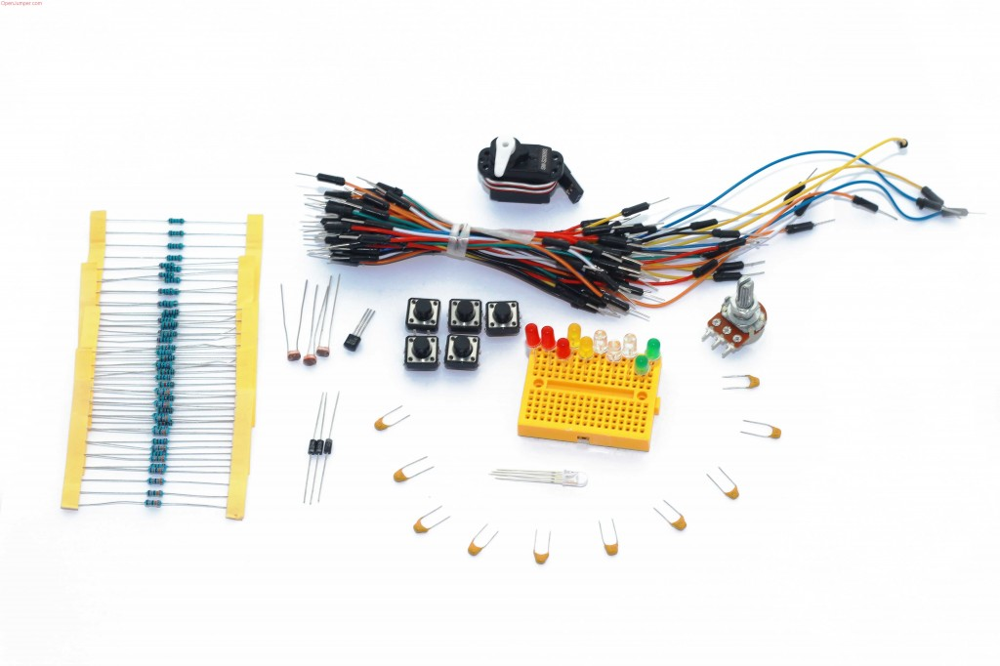
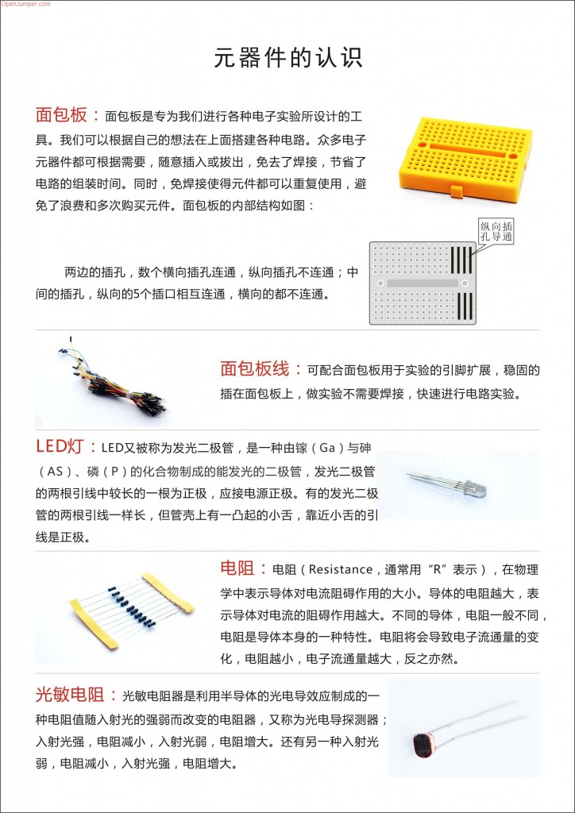
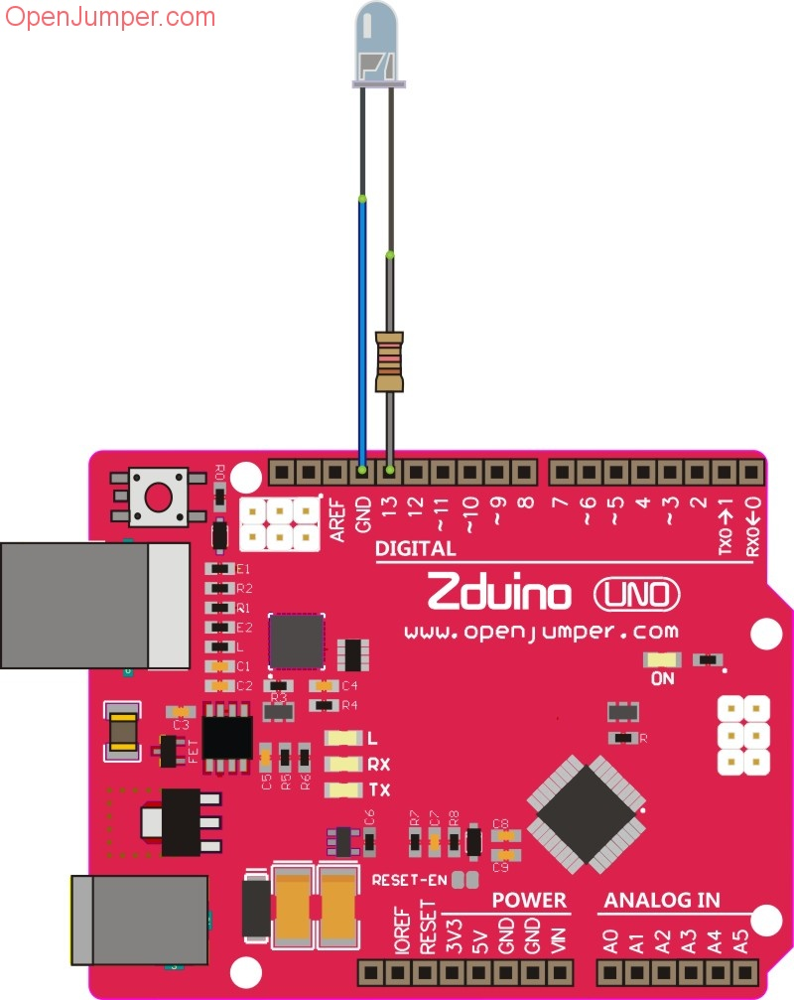
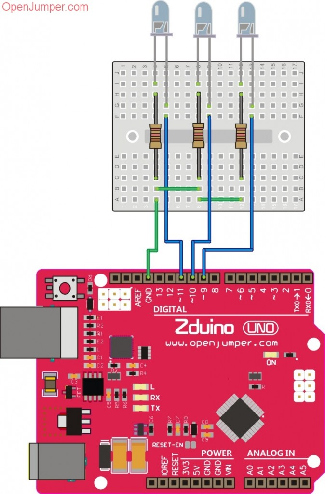
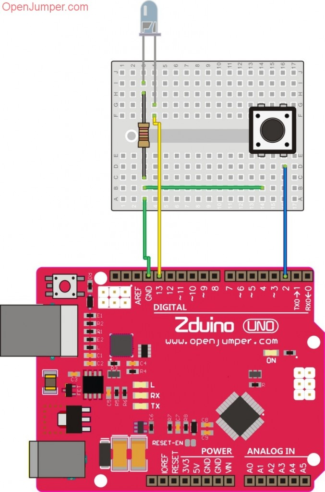
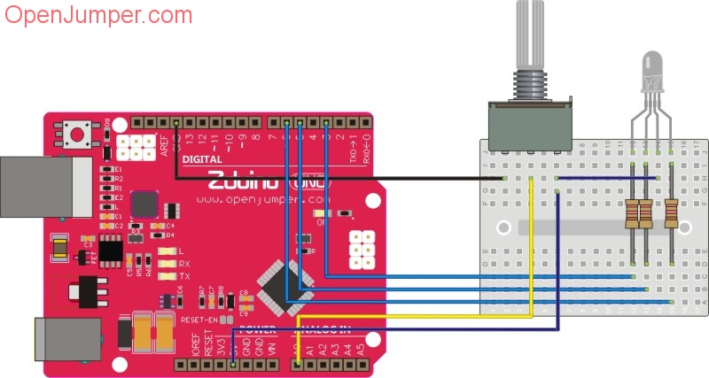
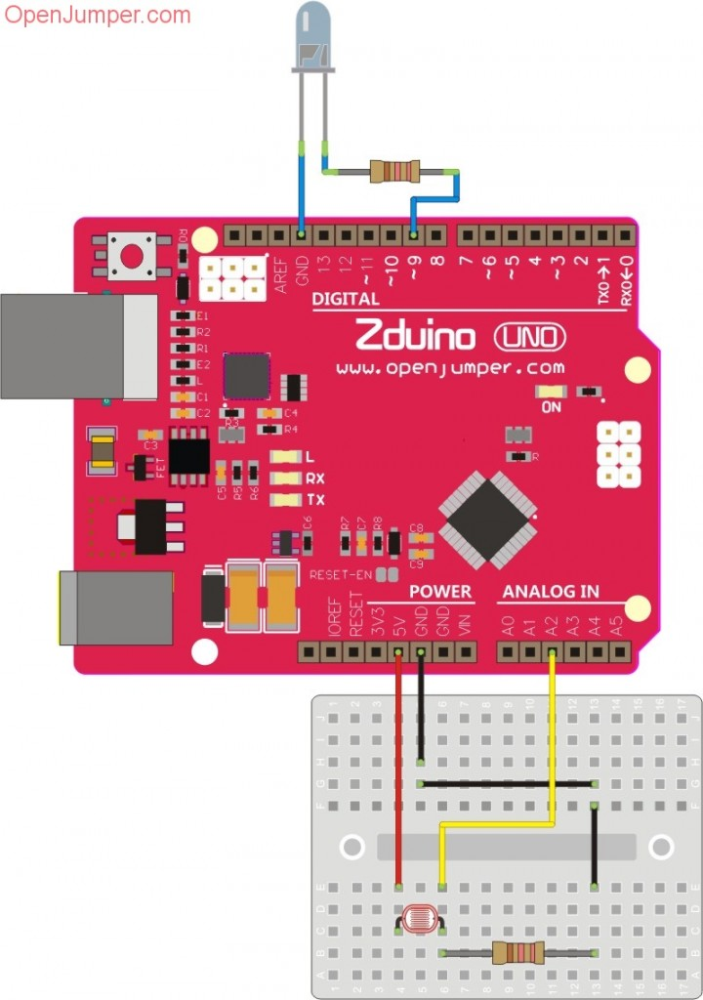
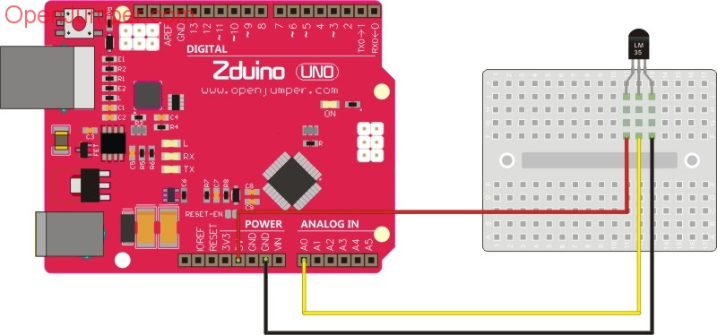
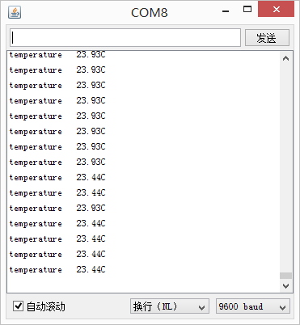
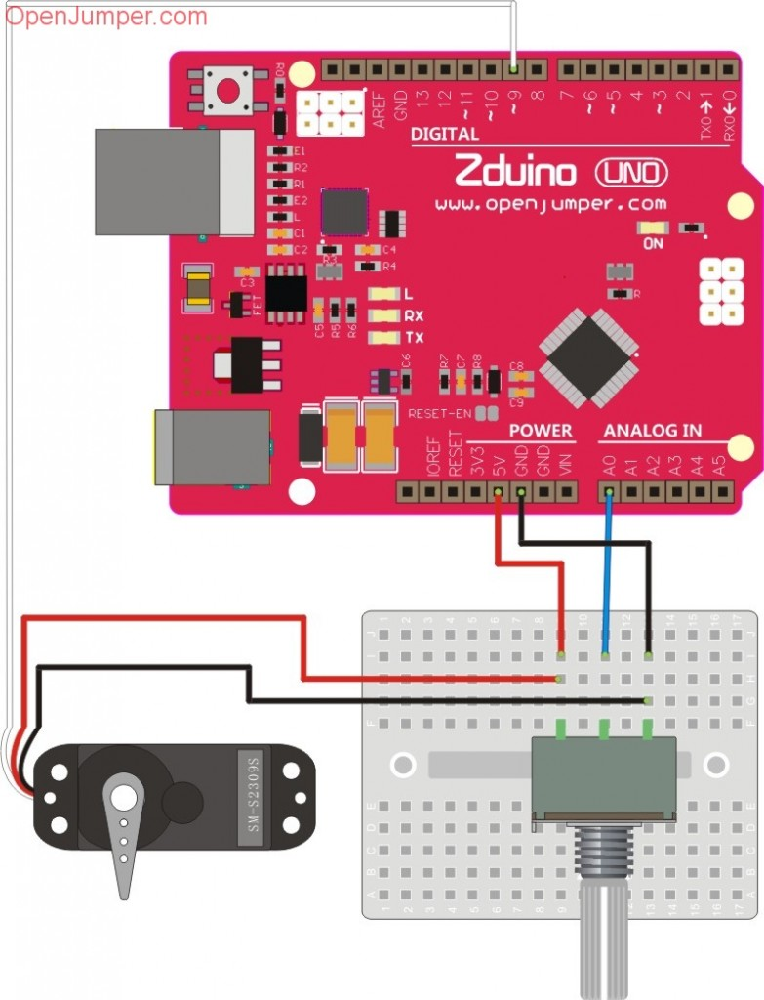

# kit套件

## 概述

OJ元件基础套件配合面包板基础元件，适合初学者入门学习，精美的配图和简单明了的实验及程序说明，带初学者更快速的进入Arduino的世界。套件包含各基础元器件，例如LED、按键、光敏电阻等，使用该套件，您还需要主控器（UNO，MEGA2560，Leonardo等）和连接主控器与电脑的数据线。


 
[点我购买](https://item.taobao.com/item.htm?id=538008420639)

## 套件元件清单


|元件名称|	数量|
|--|--|
|5mm蓝光LED（白色）|3|
|5mm红光LED	|3|
|5mm黄光LED	|2|
|5mm绿光LED	|2|
|电阻|220Ω×10,1KΩ×10,3.3KΩ×10,10KΩ×10,330KΩ×10|
|按键|5|
|10K电位器|1|
|光敏电阻5537|3|
|二极管1N4007|3|
|Mini面包板|1|
|面包线|1|
|9G舵机|1|
|LM35温度传感器|1|
|陶瓷电容|103（10nf）×5 , 104（100nf）×5|
|5mm全彩 |LED	×1|

## 元器件的认识



## 实验例程

### 点亮通往Arduino的第一颗明灯

#### 简介

Arduino的I/O口输出高低电平，电路中让点亮LED的I/O通过串联220欧姆电阻连接LED，我们就可实现LED灯的闪烁。

#### 实验清单

+ 主控器UNO+USB数据线	×1

+ 220Ω电阻	×1

+ LED	×1

+ 面包线	若干

#### 电路



#### 程序
```
/*********** www.openjumper.cn ************/
/***********LED test***********************/
int led = 13;

void setup() {                
  pinMode(led, OUTPUT);     
}

void loop() {
  digitalWrite(led, HIGH);   
  delay(1000);              
  digitalWrite(led, LOW);   
  delay(1000);              
}
```
**要点1：Arduino程序结构框架**

```
void setup() {
  // put your setup code here, to run once:
}

void loop() {
  // put your main code here, to run repeatedly: 

}
```

Arduino控制器通电或复位后会开始执行setup()函数中的程序，而且这部分程序只会执行一次。通常我们会在setup()函数中完成Arduino的初始化设置，如配置IO状态，初始化串口等操作。在setup()执行完后，接着会执行loop()中的程序，而且是不断重复循环的执行。通常我们会在loop()函数中完成程序的主要功能，如驱动各种模块，采集数据等。

**要点2：**

    pinMode(led, OUTPUT);

通过这样设置，就将led引脚（13号数字口）设置为输出模式。

与OUTPUT同样可以用在该函数的参数有，INPUT、INPUT_PULLUP，分别表示设置为输入模式，输入上拉模式。

**要点3：**

    digitalWrite(led, HIGH);

作用是设置led引脚输出高电平，通过该函数就可把LED点亮。

与HIGH类似的参数有LOW，表示将IO输出低电平。

### 流水灯

#### 简介

一组LED灯，在Arduino的控制下按照设定的顺序和时间来发亮和熄灭，这样就能形成一定的视觉效果，很多街上的店面和招牌上面就安了流水灯，看上去更美观。

#### 实验清单

+ 主控器UNO+USB数据线	×1

+ Mini面包板	×1

+ 220Ω电阻	×3

+ LED	×3

+ 面包线	若干

#### 电路



#### 程序

```
/***********Running LED display************/
/***********www.openjumper.cn***********/
int led1 = 9; 
int led2 = 10; 
int led3 = 11; 
void setup()   
{       
  // 设置引脚为输出模式 
  pinMode(led1, OUTPUT);      
  pinMode(led2, OUTPUT);      
  pinMode(led3, OUTPUT);      
}
void loop()                     
{
  digitalWrite(led1, LOW);   
  digitalWrite(led2, LOW);  
  digitalWrite(led3, HIGH);  
  delay(250);              // 等待250毫秒
  digitalWrite(led1, LOW);    
  digitalWrite(led2, HIGH);  
  digitalWrite(led3, LOW);  
  delay(250);              // 等待250毫秒
  digitalWrite(led1, HIGH);    
  digitalWrite(led2, LOW);  
  digitalWrite(led3, LOW);  
  delay(250);              // 等待250毫秒
}
```
**要点**

    delay(1000);

延时函数，单位为毫秒。delay(1000)表示延时1000毫秒（1秒）。在此程序中用来控制开关LED的间隔时间。

### 按键的使用

#### 简介

作为控制器的输入设备，按键是最常见的输入方式。我们常用到按键或者按键模块，常见的有2 脚按键和4 脚按键。当按下按键时，就会接通按键两端，放开时，两端会再次断开。首先我们实现按键输入检测实验，当按下按键，电亮LED灯。

#### 实验清单

+ 主控器UNO+USB数据线	×1

+ Mini面包板	×1

+ 220Ω电阻	×1

+ LED	×1

+ 面包线	若干

+ 按键	×1

#### 电路



#### 程序
```
/**************Button test*****************/
/***********www.openjumper.cn***********/
int Button = 2;
int LEDpin = 13;

void setup() {
 pinMode(Button, INPUT_PULLUP);  // 设置连接按键引脚为输入上拉状态  
 pinMode(LEDpin, OUTPUT);        //设置LED引脚为输出模式
}

void loop() {
  int ButtonState = digitalRead(Button);  //读取按键状态
  if(ButtonState==0)         // 如果按下
  {
  digitalWrite(LEDpin,HIGH);        
  }
  else
  {
  digitalWrite(LEDpin,LOW);      
  }   
}
```

**要点1：**

    pinMode(buttonPin,INPUT_PULLUP);

开启该引脚上的内部上拉电阻，等效于在该引脚到VCC 之间连接了一个阻值为20K～50K 的电阻。

**上拉电阻：**

同下拉电阻一样，可以稳定IO 口电平，不同的是电阻连接到VCC，将引脚稳定在高电位。这种电阻叫做上拉电阻。这里我们使用的是内部上拉电阻，你也可以使用外部下拉电阻替代。

稳定悬空引脚的电平所用电阻应该尽量选择较大的阻值，我们一般使用10K 电阻。

**要点2：**

    digitalRead(pin);

参数pin 为指定读取状态的引脚编号。

Arduino 在5V 供电时，会将范围在－0.5V～1.5V 的输入电压作为低电平识别，会将范围在3V～5.5V 的输入电压作为高电平识别。所以，即使你的输入电压不太准确，Arduino 也可以正常识别。注意，过高的输入电压会损坏arduino。

在Arduino 核心库中，OUTPUT 被定义等于1，INPUT 被定义等于0，HIGH 被定义等于1，LOW 被定义等于0。

### 炫彩灯

#### 简介

三原色光模式（英语：RGB color model），又称RGB颜色模型或红绿蓝颜色模型，是一种加色模型，将红（Red）、绿（Green）、蓝（Blue）三原色的色光以不同的比例相加，以产生多种多样的色光。利用RGB灯，调节其三种颜色的色光比例就可以做出炫彩的效果。

#### 实验清单

+ 主控器UNO+USB数据线	×1

+ Mini面包板	×1

+ 220Ω电阻	×3

+ 5mm全彩LED 	×1

+ 面包线	若干

+ 按键	×1

#### 电路



#### 程序
```
/****************RGB LED test**************/
/***********www.openjumper.cn***********/
#define R 3
#define G 5
#define B 6           //定义RGB数字连接IO口
void setup()
{
pinMode(R,OUTPUT);
pinMode(G,OUTPUT);
pinMode(B,OUTPUT);     //将连接LED灯的数字IO口置为输出状态
}
void loop()
{
  int value=analogRead(A0);    //定义一个参数存储A0口读到的模拟值，范围在0~1023
  if(value>=0 && value<256)         {          analogWrite(R,value);      //如果电位器输出值在0~256，则用PWM点亮RGB中的红色，同时熄灭绿色和蓝色              analogWrite(G,255);             analogWrite(B,255);        //由于RGBled模块是共阳极，所以PWM输出最高时，LED亮度就最低         }      else if(value>=256 && value<512)      {          analogWrite(G,value-256);  //调节绿光变化          analogWrite(R,255);           analogWrite(B,255);       }      else if(value>=512 && value<768)
  {
   analogWrite(B,value-512);  //调节蓝光变化
   analogWrite(R,255);
   analogWrite(G,255);
  }
  else
   {
    analogWrite(R,value-768);
    analogWrite(G,value-768);
    analogWrite(B,value-768);  //三光合成白光，同时进行亮度调节
   }
}
```

**要点1：**

analogWrite(PIN,VALUE) 输出PWM波形，也就是利用PWM技术改变输出不同的平均电压值，这里就可以调节灯光的亮暗程度。

这里输出的PWM默认频率为490HZ的一个方波。

PIN—只能为带有PWM输出的IO口，在UNO中只有 3 ，5, 6，9, 10, 11 这6个数字IO口带有PWM功能。

VALUE—PWM输出的值0—255

**要点2：**

由于RGBled模块是共阳极，它们的正极共同连接到VCC，当对于连接 R  G  B的IO口，需输出低电平时才会点亮该颜色的LED，若输出高电平则使LED熄灭。利用PWM调节IO口输出状态可以调灯亮度。 

### 光控灯

#### 简介

在日常生活中有很多光控的应用，例如一些楼道路灯，智能手机上有防止误触发模式，即是检测光线很暗，或挡住屏幕前方，就不会让屏幕解锁，这些都应用了光线检测控制。此实验中，我们利用光敏电阻的感光性来控制LED灯。

#### 实验清单

+ 主控器UNO+USB数据线	×1

+ Mini面包板	×1

+ 220Ω电阻	×1

+ 10KΩ电阻	×1

+ 光敏电阻	×1

+ 面包线	若干

+ 按键	×1

#### 电路

（220欧电阻与LED串联，光敏电阻旁加上10K下拉电阻）



#### 程序
```
 /***********Openjumper light control test***********/
/************www.openjumper.cn**************/
int photocellPin = 2; // 光敏电阻接口
int photocellVal = 0; // 光敏输出值初始化
int minLight = 200;   // 最小光线阀值
int ledPin = 9;   //LED引脚接口
int ledState = 0; 

void setup() {
  pinMode(ledPin, OUTPUT); 
  Serial.begin(9600);
}

void loop() {
  //串口输出读到的光敏输出模拟值
  photocellVal = analogRead(photocellPin);
  Serial.println(photocellVal);   

  // 光线不足时打开LED
  if (photocellVal < minLight && ledState == 0)     {       digitalWrite(ledPin, HIGH); // turn on LED          ledState = 1;      }    // 光线充足时关掉LED      if (photocellVal > minLight && ledState == 1)
  {
    digitalWrite(ledPin, LOW); // turn off LED
    ledState = 0;
   }  

  delay(100);       
}
```

**要点：**

    analogRead(pin)

参数pin 是指定要读取模拟值的引脚，被制定的引脚必须是模拟输入引脚。

如analogRead(A0)，即是读取A0 引脚上的模拟值0~1023。

### 温度计

#### 简介

随着科技的不断发展，日常生活中越来越多的采用高温高热的一些设备及装置，它在方便了人们生活的同时，也留下了安全隐患，因此做好高温预警工作是非常必要的。为了能实现防火、防灾的目的，就必须采取先进的自动检测和控制手段。本实验利用检测的温度传感器的阀值，超过该阀值就发出高温报警信号。

此次我们使用模拟温度传感器LM35检测温度，传感器将检测到的温度转化为一个线性变化且与温度成正比的电压值，我们采集传感器传出的电压进行换算便可得到当前检测的温度值。

#### 实验清单

+ 主控器UNO+USB数据线	×1

+ Mini面包板	×1

+ LM35DZ温度传感器	×1

+ 10KΩ电阻	×1

+ 面包线	若干

LM35 温度传感器有多种型号，这里我们使用的是LM35DZ，相关参数如下：

+ 工作电压	4～30V

+ 工作电流	133μA

+ 检测范围	0～100℃

+ 检测精度	0.5℃

+ 比例因数	线性+10.0mV/℃

#### 电路



#### 程序

```
/***********OpenJumper Temperature test************/
/*************www.openjumper.cn***************/
int LM35 = A0;
void setup()
{
// 初始化串口通信
Serial.begin(9600);
}
void loop()
{
// 读取传感器模拟值，并计算出当前温度
float temp = (5.0 * analogRead(LM35) * 100.0) / 1024;
// 将温度输出至串口显示
Serial.print("temperature " );
Serial.print(temp);
Serial.println("C");
delay(1000);
}
```

打开串口窗口观察测试温度数据。



**要点1：**

    Serial.begin(speed);

其中参数speed 是指串口通信波特率，这是设定串口通信速率的参数，通过该函数建立串口通信。

    Serial.print(val);

参数val 是你要输出的数据，各种类型的数据均可。

    Serial.println(val);

Serial.println(val)语句也是使用串口输出数据，不同的是println()函数会在输出完指定数据后，再输出一组回车换行符。

**要点2：**

将LM35 的OUT 脚连接到你任意模拟输入IO 口。示例程序中，我们使用A0 读取LM35模拟值。LM35 温度传感器生产制作时已经过校准，输出电压与摄氏温度成正比一一温度每上升一摄氏度，输出电压上升10mV。因此，我们可以使用Arduino 的模拟输入口读取LM35 温度传感器输出的模拟值，再使用以下公式将其换算为对应的摄氏温度：

    temp = (5.0×analogRead(LM35)×100.0) / 1024

**要点3：**

由于电源波动等原因，输出的数据可能也会受到一定的影响，例如波动较大等现象，这时你可以通过读取多次传感器数值，求平均数的方法，减小数据的波动。

### 舵机控制

#### 概述

舵机大部份是通过 PWM (Pulse Width Modulation脉冲宽度调节)来控制，Arduino 里建有 Servo Library，这让控制舵机变得简单，就算你对PWM 不熟，也可以很轻松的控制舵机。

#### 舵机控制原理

控制电路板接受来自信号线的控制信号，控制电机转动，电机带动一系列齿轮组，减速后传动至输出舵盘。舵机的输出轴和位置反馈电位计是相连的，舵盘转动的同时，带动位置反馈电位计，电位计将输出一个电压信号到控制电路板，进行反馈，然后控制电路板根据所在位置决定电机的转动方向和速度，从而达到目标停止。

#### 实验清单

+ 主控器UNO+USB数据线	×1

+ Mini面包板	×1

+ 10K电位器	×1

+ 舵机	×1

+ 面包线	若干

#### 电路



#### 程序
```
/*********** Openjumper servo test****************/
/***********www.openjumper.cn*****************/
#include <Servo.h>  //包含舵机库

Servo myservo; //创建一个舵机控制类
int pos = 0; //定义一个变量存储舵机转动角度

void setup()
{
myservo.attach(9); //连接舵机到9号数字口
}

void loop()
{
int value=analogRead(A0); //读取A0口输入的模拟值
pos=map(value,0,1023,0,180); //将读到的模拟值0~1023映射为0°~180°
myservo.write(pos); //舵机转动到相应角度
delay(100); //延时一段时间让舵机转动到对应位置
}
```

**要点1：**

servo类下成员函数

attach()—连接舵机至IO口

write()—角度控制 例如 myservo.write(180) 是控制 Servo 转到180 度，myservo.write(120) 是控制 Servo 转到120 度。

writeMicroseconds()—输入一个值单位为us,来控制舵机转动到相应角度，输入值为1000时舵机轴转动到逆时针最大位置。输入值为2000时舵机轴转动到顺时针最大位置。为1500时舵机轴在中间位置。

read()—读上一次舵机转动角度

attached()—连接舵机接口引脚

detach()—断开舵机连接

**要点2：**

0-1023的数值必须经过数值转换，按照比例转为0到180的数值，因为我们的舵机只能在0到180度之间旋转。所以程序中的map（）就是将0-1023值映射到0到179.