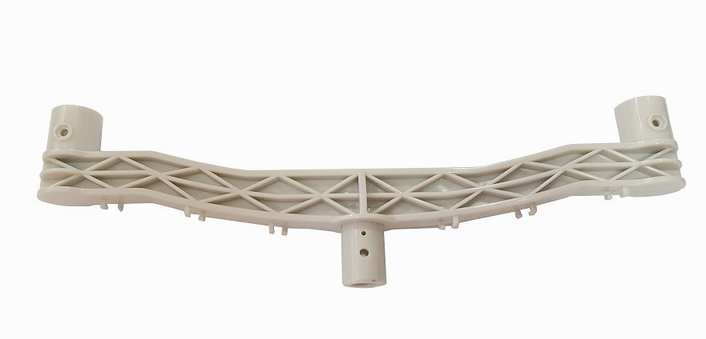
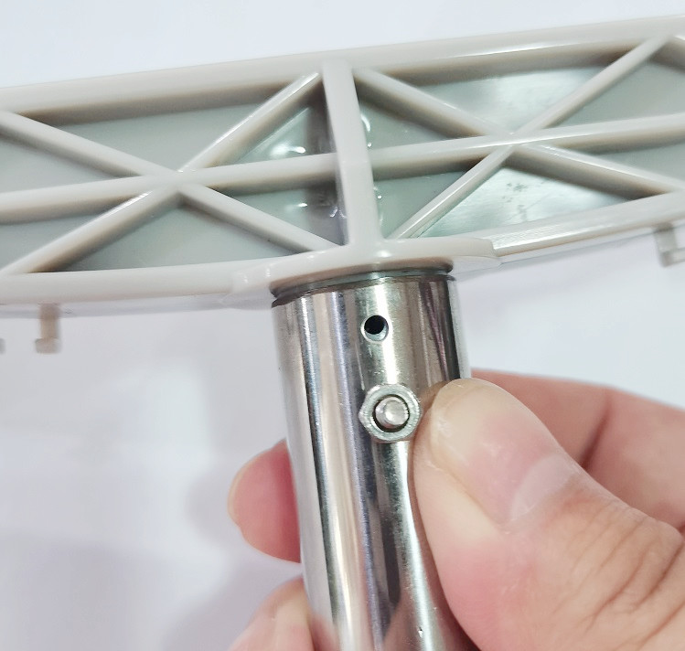
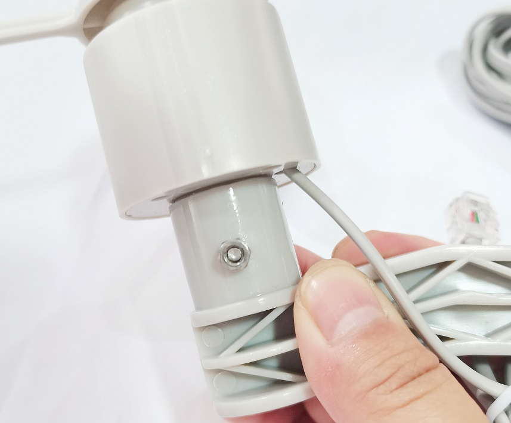
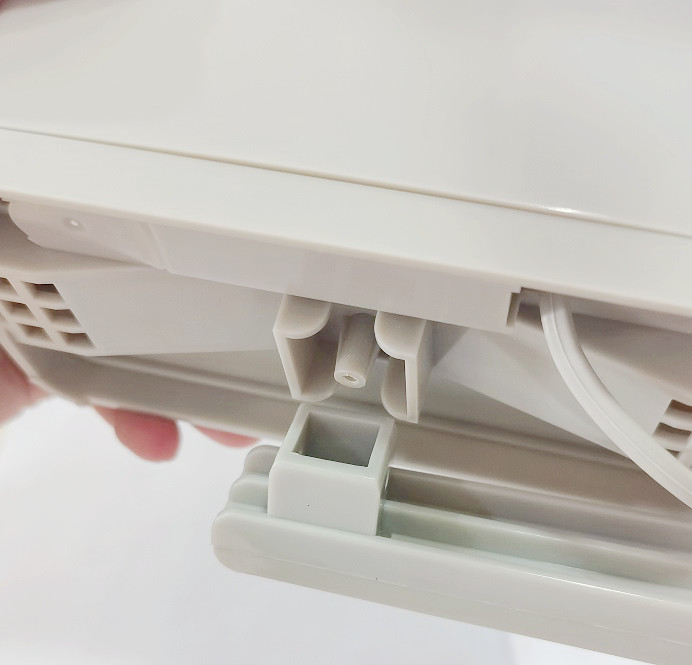
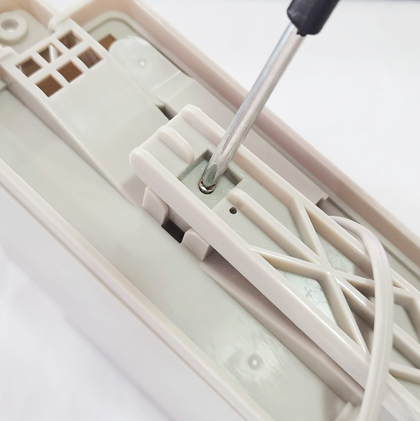
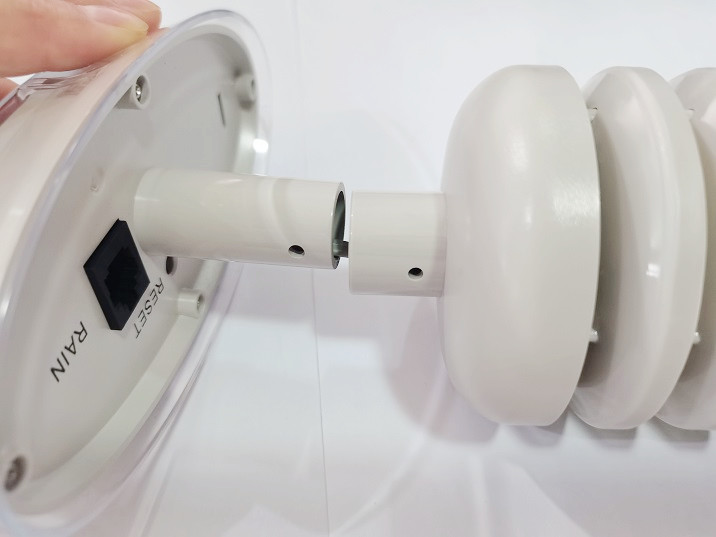
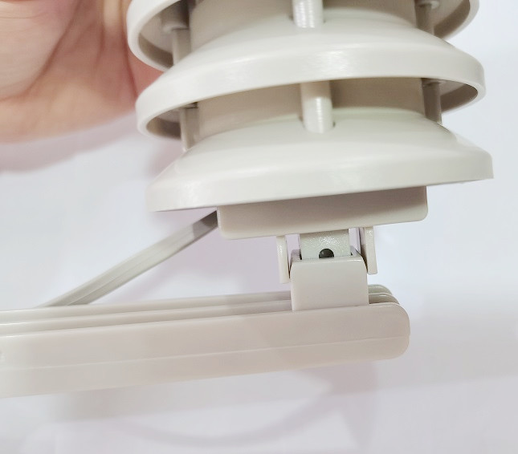
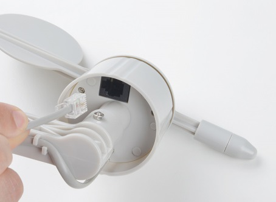
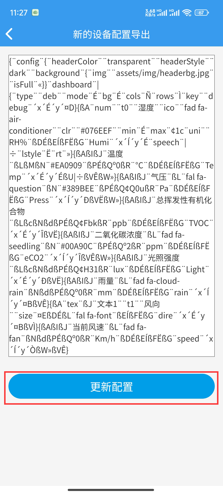

# 气象站物联网学习套件

## 产品介绍

这是openjumper最新推出的气象站物联网学习套件，它集齐了 **风速、风向、雨量、温湿度、气压、光照、空气质量**等多种天气数据，使用 RJ-11接口连接这些传感器，能够轻松测量想要的数据。


[点我购买](https://item.taobao.com/item.htm?id=678468169932)

## 套件清单

收到货后，请拆开所有零件包装，检查零件是否齐全。

+ 2根金属管

+ 1个雨量传感器

+ 1个风速传感器

+ 1个风向传感器

+ 1个主控制板

+ 1个百叶箱（温湿度，空气质量，气压传感器)

+ 2个不锈钢喉箍

+ 1个双侧传感器固定架

+ 2个单侧传感器固定架

+ 1个袋螺丝/螺母

+ 1包自锁式尼龙扎带

+ 2节14500锂电池

## 硬件及接口说明

整个气象站的主控板采用esp32作为主控芯片，上边包含了一个光照传感器。所有传感器数据都通过主控板传入Blinker中，你可以在Blinker界面中查看所采集的数据


百叶箱传感器部分集成了温湿度传感器、空气质量传感器、气压传感器。


## 硬件组装接线说明

这是一个易于组装的套件，只需要进行机械连接。

### 一、安装固定架

首先，找到两根金属管，并将它们连接在一起。


接下来，将双侧固定架安装到金属管的顶部。确保将固定架上的凸块与金属管中的凹口对齐。



使用螺钉和螺母将其固定牢。



### 二、风速传感器

接下来，我们将风速传感器安装在双侧固定架的一侧。

风速传感器上有一个与固定架中的凹口相匹配的凹凸。这将有助于固定风速传感器，并且只允许传感器朝一个方向上安装。


使用螺钉和螺母将传感器固定好（确保它们很紧）。



### 三、风向传感器

安装风向传感器与安装风速传感器的过程相同。将传感器和固定架的凸出对齐，并将风向传感器推入到位。


同样使用螺钉和螺母将传感器固定好。


### 四、 雨量传感器

为了使雨量传感器远离其他传感器，保证它可以获得准确的测量结果，拿出一个单侧固定架安装雨量传感器。如果雨量传感器安装在风向传感器或风速传感器下方，它们会阻止雨进入雨量传感器。从而引起测量数据出错。


使用螺钉和螺母将雨量传感器固定架安装到金属管上。当你将其装在远离风速传感器和风向传感器的位置，请将它拧紧。


雨量传感器有凹口，以确保它紧贴在固定架上。



使用一个小螺钉，将雨量计固定稳。雨量传感器两侧都有孔。这可将传感器安装在不同的表面上，例如屋顶或围栏。



### 五、主控器和百叶箱传感器

安装百叶箱里的传感器，同样先将另一个单侧固定架使用螺钉和螺母固定在金属管上。

先把主控板安装在百叶箱上



然后将百叶箱传感器部分装进百叶箱里


百叶箱传感器部分有凹口，可以紧贴在固定架上，使用一个螺钉和螺母，将它固定稳。




### 接线说明

风速传感器开关导体在风速传感器和风向传感器之间共享。您需要将风速传感器电缆插入风向传感器。



将其他的电线沿着金属管拉出，并使用附赠的塑料自锁扎带固定好，防止风将电线从电子设备中拉出。 

风向传感器的电缆接在主控板底部接口


主控板的电缆从百叶箱中拉出接在百叶箱的WIND接口

雨量传感器的电缆接在百叶箱的RAIN接口


全部安装完成后应该如下图所示


## 编程环境搭建

### 步骤一：下载并安装Arduino IDE（编程环境）

参考链接：<https://arduino.me/download>

### 步骤二：下载并安装esp32扩展库

参考链接：<https://arduino.me/a/esp32>

双击.exe文件 安装esp32扩展库

如果安装过其他版本的esp32sdk，请先删除，再使用本安装包,删除方法：文件管理器地址栏输入 %LOCALAPPDATA%/Arduino15/packages，回车进入，然后删除掉其中的esp32文件夹

解压完成后，再打开Arduino IDE，即可在 菜单栏>工具>开发板 中找到你使用的ESP32开发板


### 步骤三：下载并安装blinker库文件（用于blinker手机app连接通信）

下载地址：<https://github.com/blinker-iot/blinker-library>

Windows：将下载好的blinker库解压到 我的电脑>文档>Arduino>libraries 文件夹中

Mac OS：将下载好的blinker库解压到 文稿>Arduino>libraries 文件夹中

### 步骤四：手机下载blinker APP

android下载：[点击下载](https://github.com/blinker-iot/app-release/releases)

IOS下载：app store中搜索“blinker”下载。

下载完成后注册一个账号就可以使用blinker对外开放的功能。

### 步骤五：安装esp32硬件驱动

将主控板通过usb转串口模块连接至电脑，在第一次使用主控板时，电脑会自动给主控板安装驱动（使用的驱动芯片为ch340）。

安装完成后再设备管理器中查看驱动是否安装成功。安装成功后会有显示驱动对应通信串口号

备注：有时候驱动会安装不上（电脑原因）

这时候就需要手动安装驱动。驱动下载地址如下：
<http://download.openjumper.cn/CH340-drivers%281%29.zip>

下载完成后，解压，以管理员身份运行SETUP.EXE文件即可。然后重新拔插下usb串口模块，直到在设备管理器中成功看到对应的CH340的驱动已经后面的COM口。

## 测试例程

### 风速功能测试

```
/*气象站简易风速测试
 * 
 * 单位：千米/小时
 * PCB IO分配：
风速：IO35
*/

const byte WSPEED = 35;//风速

//Global Variables
long lastSecond; //The millis counter to see when a second rolls by

long lastWindCheck = 0;
volatile long lastWindIRQ = 0;
volatile byte windClicks = 0;

float windspeedmph = 0; // [mph instantaneous wind speed]

//Interrupt routines (these are called by the hardware interrupts, not by the main code)
// Activated by the magnet in the anemometer (2 ticks per rotation), attached to input 35
void wspeedIRQ()
{
    if (millis() - lastWindIRQ > 10) // Ignore switch-bounce glitches less than 10ms (142MPH max reading) after the reed switch closes消抖
    {
      lastWindIRQ = millis(); //Grab the current time
      windClicks++; //There is 1.492MPH for each click per second.
    }
}

void setup() {
    Serial.begin(115200);
    Serial.println("Weather Shield Example");

    pinMode(WSPEED, INPUT); // input from wind meters windspeed sensor风速计风速传感器上拉输入  INPUT_PULLUP

    lastSecond = millis();

    // attach external interrupt pins to IRQ functions
    attachInterrupt(digitalPinToInterrupt(WSPEED), wspeedIRQ, FALLING);

    // turn on interrupts
    interrupts();

    Serial.println("Weather Shield online!");
}

void loop() {
      //Keep track of which minute it is
  if(millis() - lastSecond >= 1000)
    {        
    lastSecond += 1000;

      //Calc the wind speed every second
      float currentSpeed = get_wind_speed();
      //windspeedmph = currentSpeed;//update global variable for windspeed when using the printWeather() function
      windspeedmph = currentSpeed * 1.609344;//原先的数据以  <<英里/小时>>  为单位，现在以  <<千米/小时>>  为单位，需要乘以1.609344

      //Report all readings every second每秒报告所有读数
      Serial.print("windspeed=");//
      Serial.print(windspeedmph, 1);//瞬时风速
      Serial.println("km/h");//
    }
}

//Returns the instataneous wind speed
float get_wind_speed()
{
    float deltaTime = millis() - lastWindCheck; //750ms
    deltaTime /= 1000.0; //Covert to seconds
    float windSpeed = (float)windClicks / deltaTime; //3 / 0.750s = 4
    windClicks = 0; //Reset and start watching for new wind
    lastWindCheck = millis();

    windSpeed *= 1.492; //4 * 1.492 = 5.968MPH

    /* Serial.println();
     Serial.print("Windspeed:");
     Serial.println(windSpeed);*/

    return(windSpeed);
}
```

### 风向功能测试

```
/*气象站风向测试
 * 
 * 返回数据：参考下图的角度值
 * PCB IO分配：
 *风向：IO34
 *方向：
 *                   90°
 *                    N
 *          NW        |        NE
 *             \      |      /                      
 *                \   |   /
 *                   \|/
 *180°W -------------------------------- E 0°
 *                   /|\
 *                /   |   \
 *             /      |      \
 *        SW          |         SE        
 *                    |
 *                    S
 *                   270°
 *备注：在风向标侧面有方向指示符号                   
 */
//硬件连接
const byte WDIR = 34;//A0;//风向
unsigned int adc_cp;

void setup() {
    Serial.begin(115200);
    Serial.println("Weather Shield Example");

    //pinMode(WDIR, INPUT);
}

void loop() {
  //Serial.print("adc:");
  //Serial.print(adc_cp);
  Serial.print("  dir:");
  Serial.println(get_wind_direction()); 
}

//读取风向传感器，以度为单位返回航向
int get_wind_direction()
{
    unsigned int adc;

    adc = analogRead(WDIR); // get the current reading from the sensor
    adc /=4;//示例为Arduino程序，此处ESP32ADC采样精度（12位）大于Arduino(10位)，则此处先除以4
    adc_cp = adc;

    if (adc < 85) return (0);
    if (adc < 154) return (315);
    if (adc < 264) return (270);
    if (adc < 481) return (45);
    if (adc < 615) return (225);
    if (adc < 782) return (90);
    if (adc < 902) return (135);
    if (adc < 1024) return (180);
    return (-1); // error, disconnected?
}
```

### 雨量功能测试

```
/*气象站雨量测试
 * 
 * 单位：mm
 * PCB IO分配：
雨量：IO32
*/

// Variables and constants used in tracking rainfall
#define S_IN_DAY   86400
#define S_IN_HR     3600
#define NO_RAIN_SAMPLES 2000
volatile long rainTickList[NO_RAIN_SAMPLES];
volatile int rainTickIndex = 0;
volatile int rainTicks = 0;
int rainLastDay = 0;
int rainLastHour = 0;
int rainLastHourStart = 0;
int rainLastDayStart = 0;
long secsClock = 0;

int rainTicks_last = 0;
int rainTicks_outvalue = 0;

//static unsigned long outLoopTimer = 0;
unsigned long outLoopTimer = 0;
volatile unsigned long rainTicks_last_time;

volatile long lastinterrupt = 0;
volatile int last_rainTicks_outvalue = 0;

#define RAIN_PIN     32

void setup() {
  Serial.begin(115200);

    // Rain sesnor setup. Rainfall is tracked by ticks per second, and timestamps of
    //  ticks are tracked so rainfall can be "aged" (i.e., rain per hour, per day, etc)
    pinMode(RAIN_PIN, INPUT);     // Rain sensor
    attachInterrupt(digitalPinToInterrupt(RAIN_PIN), rainTick, RISING);
    // Zero out the timestamp array.
    for (int i = 0; i < NO_RAIN_SAMPLES; i++) rainTickList[i] = 0;
}

void loop() {
  if((rainTicks_outvalue - last_rainTicks_outvalue) == 2){
    rainTicks_outvalue -= 1;
    last_rainTicks_outvalue = rainTicks_outvalue;
    }
  //static unsigned long outLoopTimer = 0;
  // This is a once-per-second timer that calculates and prints off various
  //  values from the sensors attached to the system.
  if (millis() - outLoopTimer >= 1000)
  {
    outLoopTimer = millis();
 
    // Calculate and display rainfall totals.
    Serial.print("Rainfall last hour: ");
    Serial.print(float(rainLastHour)*0.011, 3);
    Serial.print("\tRainfall last day: ");
    Serial.print(float(rainLastDay)*0.011, 3);
    Serial.print("\tRainfall to date: ");
    //Serial.print(float(rainTicks)*0.011, 3);
    //Serial.print(float(rainTicks_outvalue)*0.011, 3);//单位：英寸
    Serial.print(float(rainTicks_outvalue)*0.2794, 3);//单位：毫米
    Serial.println("mm");
    //Serial.print("\tRainfall:");
    //Serial.print(rainTicks);
    //Serial.print("\tval:");
    //Serial.println(rainTicks_outvalue);    

    // Calculate the amount of rain in the last day and hour.
    rainLastHour = 0;
    rainLastDay = 0;
    // If there are any captured rain sensor ticks...
    if (rainTicks > 0)
    {
      // Start at the end of the list. rainTickIndex will always be one greater
      //  than the number of captured samples.
      int i = rainTickIndex-1;

      // Iterate over the list and count up the number of samples that have been
      //  captured with time stamps in the last hour.
      while ((rainTickList[i] >= secsClock - S_IN_HR) && rainTickList[i] != 0)
      {
        i--;
        if (i < 0) i = NO_RAIN_SAMPLES-1;
        rainLastHour++;
      }

      // Repeat the process, this time over days.
      i = rainTickIndex-1;
      while ((rainTickList[i] >= secsClock - S_IN_DAY) && rainTickList[i] != 0)
      {
        i--;
        if (i < 0) i = NO_RAIN_SAMPLES-1;
        rainLastDay++;
      }
      rainLastDayStart = i;
    }
  }
}

// Capture timestamp of when the rain sensor got tripped.
void rainTick(void)
{
  if (millis() - lastinterrupt > 10) // Ignore switch-bounce glitches less than 10ms (142MPH max reading) after the reed switch closes
    {
        lastinterrupt = millis();
        rainTickList[rainTickIndex++] = secsClock;
        if (rainTickIndex == NO_RAIN_SAMPLES) rainTickIndex = 0;
        rainTicks_outvalue++;
    }
}
```

### 光照检测测试

```
/*

Advanced BH1750 library usage example

This example has some comments about advanced usage features.

Connections

  - VCC to 3V3 or 5V
  - GND to GND
  - SCL to SCL (A5 on Arduino Uno, Leonardo, etc or 21 on Mega and Due, on
    esp8266 free selectable)
  - SDA to SDA (A4 on Arduino Uno, Leonardo, etc or 20 on Mega and Due, on
    esp8266 free selectable)
  - ADD to (not connected) or GND

ADD pin is used to set sensor I2C address. If it has voltage greater or equal
to 0.7VCC voltage (e.g. you've connected it to VCC) the sensor address will be
0x5C. In other case (if ADD voltage less than 0.7 * VCC) the sensor address
will be 0x23 (by default).

*/

#include <BH1750.h>
#include <Wire.h>
#define BLINKER_WIFI

#include <Blinker.h>

/*
  BH1750 can be physically configured to use two I2C addresses:
    - 0x23 (most common) (if ADD pin had < 0.7VCC voltage)
    - 0x5C (if ADD pin had > 0.7VCC voltage)

  Library uses 0x23 address as default, but you can define any other address.
  If you had troubles with default value - try to change it to 0x5C.

*/
BH1750 lightMeter(0x23);
float lux;

char auth[] = "d48954e7f5b5";
char ssid[] = "HUAWEI P30 PRO";
char pswd[] = "Zx1234567890";

BlinkerNumber BH1750Light("Light");

bool result;//气象站联网状态

void heartbeat()
{
    BH1750Light.print(lux);
}

void setup() {
   // 初始化串口
  Serial.begin(115200);
  BLINKER_DEBUG.stream(Serial);
  BLINKER_DEBUG.debugAll();

    // 初始化有LED的IO
    pinMode(LED_BUILTIN, OUTPUT);
    digitalWrite(LED_BUILTIN, HIGH);
    // 初始化blinker
    Blinker.begin(auth, ssid, pswd);
    Blinker.attachHeartbeat(heartbeat);

  // Initialize the I2C bus (BH1750 library doesn't do this automatically)
  Wire.begin();
  // On esp8266 you can select SCL and SDA pins using Wire.begin(D4, D3);

  /*

    BH1750 has six different measurement modes. They are divided in two groups;
    continuous and one-time measurements. In continuous mode, sensor
    continuously measures lightness value. In one-time mode the sensor makes
    only one measurement and then goes into Power Down mode.

    Each mode, has three different precisions:

      - Low Resolution Mode - (4 lx precision, 16ms measurement time)
      - High Resolution Mode - (1 lx precision, 120ms measurement time)
      - High Resolution Mode 2 - (0.5 lx precision, 120ms measurement time)

    By default, the library uses Continuous High Resolution Mode, but you can
    set any other mode, by passing it to BH1750.begin() or BH1750.configure()
    functions.

    [!] Remember, if you use One-Time mode, your sensor will go to Power Down
    mode each time, when it completes a measurement and you've read it.

    Full mode list:

      BH1750_CONTINUOUS_LOW_RES_MODE
      BH1750_CONTINUOUS_HIGH_RES_MODE (default)
      BH1750_CONTINUOUS_HIGH_RES_MODE_2

      BH1750_ONE_TIME_LOW_RES_MODE
      BH1750_ONE_TIME_HIGH_RES_MODE
      BH1750_ONE_TIME_HIGH_RES_MODE_2

  */

  // begin returns a boolean that can be used to detect setup problems.
  if (lightMeter.begin(BH1750::CONTINUOUS_HIGH_RES_MODE)) {
    Serial.println(F("BH1750 Advanced begin"));
  } else {
    Serial.println(F("Error initialising BH1750"));
  }
}

void loop() {
  Blinker.run();
  
  if (lightMeter.measurementReady()) {
     lux = lightMeter.readLightLevel();
//    Serial.print("Light: ");
//    Serial.print(lux);
//    Serial.println(" lx");
  }
}
```

### 气压检测及海拔高度检测

```
#include <Wire.h>
#include <SPI.h>
#include <Adafruit_Sensor.h>
#include <Adafruit_BMP280.h>
#define SEALEVELPRESSURE_HPA (1013.25)

Adafruit_BMP280 bmp;

void setup(){
  Serial.begin(9600);
  unsigned status;
  status = bmp.begin(0x76);
}

void loop(){
  Serial.print(bmp.readTemperature());
  Serial.print("    ");
  Serial.print(bmp.readPressure());
  Serial.print("    ");
  Serial.println(bmp.readAltitude(SEALEVELPRESSURE_HPA));

}
```

### 空气质量检测（总挥发性有机物）及二氧化碳浓度检测

```
#include <Wire.h>
#include "Adafruit_SGP30.h"

Adafruit_SGP30 sgp;

/* return absolute humidity [mg/m^3] with approximation formula
* @param temperature [°C]
* @param humidity [%RH]
*/
uint32_t getAbsoluteHumidity(float temperature, float humidity) {
    // approximation formula from Sensirion SGP30 Driver Integration chapter 3.15
    const float absoluteHumidity = 216.7f * ((humidity / 100.0f) * 6.112f * exp((17.62f * temperature) / (243.12f + temperature)) / (273.15f + temperature)); // [g/m^3]
    const uint32_t absoluteHumidityScaled = static_cast<uint32_t>(1000.0f * absoluteHumidity); // [mg/m^3]
    return absoluteHumidityScaled;
}

void setup() {
  Serial.begin(115200);
  while (!Serial) { delay(10); } // Wait for serial console to open!

  Serial.println("SGP30 test");

  if (! sgp.begin()){
    Serial.println("Sensor not found :(");
    while (1);
  }
  Serial.print("Found SGP30 serial #");
  Serial.print(sgp.serialnumber[0], HEX);
  Serial.print(sgp.serialnumber[1], HEX);
  Serial.println(sgp.serialnumber[2], HEX);

  // If you have a baseline measurement from before you can assign it to start, to 'self-calibrate'
  //sgp.setIAQBaseline(0x8E68, 0x8F41);  // Will vary for each sensor!
}

int counter = 0;
void loop() {
  // If you have a temperature / humidity sensor, you can set the absolute humidity to enable the humditiy compensation for the air quality signals
  //float temperature = 22.1; // [°C]
  //float humidity = 45.2; // [%RH]
  //sgp.setHumidity(getAbsoluteHumidity(temperature, humidity));

  if (! sgp.IAQmeasure()) {
    Serial.println("Measurement failed");//测量失败
    return;
  }
  Serial.print("TVOC "); Serial.print(sgp.TVOC); Serial.print(" ppb\t");
  Serial.print("eCO2 "); Serial.print(sgp.eCO2); Serial.println(" ppm");

  if (! sgp.IAQmeasureRaw()) {
    Serial.println("Raw Measurement failed");//原始测量失败
    return;
  }
  Serial.print("Raw H2 "); Serial.print(sgp.rawH2); Serial.print(" \t");
  Serial.print("Raw Ethanol "); Serial.print(sgp.rawEthanol); Serial.println("");
 
  delay(1000);

  counter++;
  if (counter == 30) {
    counter = 0;

    uint16_t TVOC_base, eCO2_base;
    if (! sgp.getIAQBaseline(&eCO2_base, &TVOC_base)) {
      Serial.println("Failed to get baseline readings");//无法获取基线读数
      return;
    }
    Serial.print("****Baseline values: eCO2: 0x"); Serial.print(eCO2_base, HEX);
    Serial.print(" & TVOC: 0x"); Serial.println(TVOC_base, HEX);
  }
}
```

### 温湿度检测

```
#include "Adafruit_Si7021.h"

bool enableHeater = false;
uint8_t loopCnt = 0;

Adafruit_Si7021 sensor = Adafruit_Si7021();

void setup() {
  Serial.begin(115200);

  // wait for serial port to open
  while (!Serial) {
    delay(10);
  }

  Serial.println("Si7021 test!");
  
  if (!sensor.begin()) {
    Serial.println("Did not find Si7021 sensor!");
    while (true)
      ;
  }

  Serial.print("Found model ");
  switch(sensor.getModel()) {
    case SI_Engineering_Samples:
      Serial.print("SI engineering samples"); break;
    case SI_7013:
      Serial.print("Si7013"); break;
    case SI_7020:
      Serial.print("Si7020"); break;
    case SI_7021:
      Serial.print("Si7021"); break;
    case SI_UNKNOWN:
    default:
      Serial.print("Unknown");
  }
  Serial.print(" Rev(");
  Serial.print(sensor.getRevision());
  Serial.print(")");
  Serial.print(" Serial #"); Serial.print(sensor.sernum_a, HEX); Serial.println(sensor.sernum_b, HEX);
}

void loop() {
  Serial.print("Humidity:    ");
  Serial.print(sensor.readHumidity(), 2);
  Serial.print("\tTemperature: ");
  Serial.println(sensor.readTemperature(), 2);
  delay(1000);

  // Toggle heater enabled state every 30 seconds
  // An ~1.8 degC temperature increase can be noted when heater is enabled
  if (++loopCnt == 30) {
    enableHeater = !enableHeater;
    sensor.heater(enableHeater);
    Serial.print("Heater Enabled State: ");
    if (sensor.isHeaterEnabled())
      Serial.println("ENABLED");
    else
      Serial.println("DISABLED");
       
    loopCnt = 0;
  }
}
```

### 综合例程测试

**Blinker软件配置**

一、在Blinker APP中点击添加设备，先点击右上角的加号，选择独立设备，然后选择网络接入

 
  

二、选择已添加的蓝备，然后点击右上角的三个点，选择界面配置，将界面[配置文件](http://download.openjumper.cn/%E6%B0%94%E8%B1%A1%E7%AB%99%E7%95%8C%E9%9D%A2%E9%85%8D%E7%BD%AE.zip)中的文本内容复制进去，点击更新配置


  

三、退出刚刚的设备，重新进入，即可看见更新后的界面配置


```
/* *****************************************************************
 * 气象站综合
 * 
 *
 *IO分配：
 *风速：IO35
 *风向：IO34
 *雨量：IO32
 *
 *
 *方向：
 *                   90°
 *                    N
 *          NW        |        NE
 *             \      |      /                      
 *                \   |   /
 *                   \|/
 *180°W -------------------------------- E 0°
 *                   /|\
 *                /   |   \
 *             /      |      \
 *        SW          |         SE        
 *                    |
 *                    S
 *                   270°
 *备注：在风向标侧面有方向指示符号                   
 *
 * 
 * *****************************************************************/

#define BLINKER_WIFI

#include <Blinker.h>
#include "Adafruit_Si7021.h"
#include "Adafruit_SGP30.h"
#include <BH1750.h>
#include <Wire.h>
#include <SPI.h>
#include <Adafruit_Sensor.h>
#include <Adafruit_BMP280.h>
#define SEALEVELPRESSURE_HPA (1013.25)

long lastSecond;
long lasttime;

bool enableHeater = false;
uint8_t loopCnt = 0;
Adafruit_Si7021 sensor = Adafruit_Si7021();
float Sensor_Temp,Sensor_Humi;

Adafruit_SGP30 sgp;

BH1750 lightMeter(0x23);
float lux;

Adafruit_BMP280 bmp;
long BMP280_P_Value,BMP280_A_Value;

const byte WSPEED = 35;//风速
//Global Variables
//long lastSecond; //The millis counter to see when a second rolls by
long lastWindCheck = 0;
volatile long lastWindIRQ = 0;
volatile byte windClicks = 0;
float windspeedkm = 0; //

const byte WDIR = 34;//A0;//风向
unsigned int adc_cp;
int dir_angle = 0;

//雨量
#define S_IN_DAY   86400
#define S_IN_HR     3600
#define NO_RAIN_SAMPLES 2000
volatile long rainTickList[NO_RAIN_SAMPLES];
volatile int rainTickIndex = 0;
volatile int rainTicks = 0;
int rainLastDay = 0;
int rainLastHour = 0;
int rainLastHourStart = 0;
int rainLastDayStart = 0;
long secsClock = 0;

int rainTicks_last = 0;
int rainTicks_outvalue = 0;

//static unsigned long outLoopTimer = 0;
unsigned long outLoopTimer = 0;
volatile unsigned long rainTicks_last_time;

volatile long lastinterrupt = 0;
volatile int last_rainTicks_outvalue = 0;

#define RAIN_PIN     32

char auth[] = "d48954e7f5b5";
char ssid[] = "HUAWEI P30 PRO";
char pswd[] = "Zx1234567890";

// 新建组件对象
BlinkerNumber SI7021_Temp("Temp");
BlinkerNumber SI7021_Humi("Humi");
BlinkerNumber SGP30_TVOC("TVOC");
BlinkerNumber SGP30_eCO2("eCO2");
BlinkerNumber BH1750Light("Light");
BlinkerNumber BMP280_Pressure("Press");
BlinkerNumber BMP280_Altitude("Altitude");
BlinkerNumber wind_speed("speed");
BlinkerText wind_dir("dire");
BlinkerNumber wind_rain("rain");

bool result;//气象站联网状态

void heartbeat()
{
    SI7021_Temp.print(Sensor_Temp);
    SI7021_Humi.print(Sensor_Humi);

    SGP30_TVOC.print(sgp.TVOC);
    SGP30_eCO2.print(sgp.eCO2);

    BH1750Light.print(lux);

    BMP280_Pressure.print(BMP280_P_Value);
    BMP280_Altitude.print(BMP280_A_Value);

    wind_speed.print(windspeedkm);
    
    wind_dir_return();

    wind_rain.print(float(rainTicks_outvalue)*0.011);
}

//风速
void wspeedIRQ()
{
    if (millis() - lastWindIRQ > 10) // Ignore switch-bounce glitches less than 10ms (142MPH max reading) after the reed switch closes消抖
    {
      lastWindIRQ = millis(); //Grab the current time
      windClicks++; //There is 1.492MPH for each click per second.
    }
}

void dataStorage()
{
    Blinker.dataStorage("Temp", Sensor_Temp);
    Blinker.dataStorage("Humi", Sensor_Humi);
    Blinker.dataStorage("eCO2", sgp.eCO2);
}

void setup()
{
    // 初始化串口
    Serial.begin(115200);
    BLINKER_DEBUG.stream(Serial);
    BLINKER_DEBUG.debugAll();
    
    // 初始化有LED的IO
    pinMode(LED_BUILTIN, OUTPUT);
    digitalWrite(LED_BUILTIN, HIGH);
    // 初始化blinker
    Blinker.begin(auth, ssid, pswd);
    Blinker.attachHeartbeat(heartbeat);
    Blinker.attachDataStorage(dataStorage);

    sensor.begin();//SI7021
    
    if (! sgp.begin()){
      Serial.println("Sensor not found :(");
      while (1);
    }
    
    Wire.begin();//BH1750
    // begin returns a boolean that can be used to detect setup problems.
    if (lightMeter.begin(BH1750::CONTINUOUS_HIGH_RES_MODE)) {
      Serial.println(F("BH1750 Advanced begin"));
    } else {
      Serial.println(F("Error initialising BH1750"));
    }

    unsigned status;
    status = bmp.begin(0x76);

    pinMode(WSPEED, INPUT); // input from wind meters windspeed sensor风速计风速传感器上拉输入  INPUT_PULLUP
    lastSecond = millis();
    attachInterrupt(digitalPinToInterrupt(WSPEED), wspeedIRQ, FALLING);
    interrupts();

    pinMode(RAIN_PIN, INPUT);     // Rain sensor
    attachInterrupt(digitalPinToInterrupt(RAIN_PIN), rainTick, RISING);
    // Zero out the timestamp array.
    for (int i = 0; i < NO_RAIN_SAMPLES; i++) rainTickList[i] = 0;

    lasttime = millis();
}

int counter = 0;
void loop() {
    Blinker.run();
    
//    if(millis() - lastSecond >= 1000)
//    {
      result = Blinker.connected();//检测气象站网络连接状态
      if(result) digitalWrite(LED_BUILTIN, HIGH);//若连接成功，则关闭LED
      else       digitalWrite(LED_BUILTIN, LOW);
  
      Sensor_Humi = sensor.readHumidity();
      Sensor_Temp = sensor.readTemperature();
//      Serial.print("Humidity:");
//      Serial.print(Sensor_Humi, 2);
//      Serial.print("RH%");
//      Serial.print("\tTemperature:");
//      Serial.print(Sensor_Temp, 2);
//      Serial.print("°C\t");
      
     //SI7021
    // Toggle heater enabled state every 30 seconds
    // An ~1.8 degC temperature increase can be noted when heater is enabled
//    if (++loopCnt == 30) {
    if((millis() - lasttime) >= 30000){
      lasttime = millis();
      enableHeater = !enableHeater;
      sensor.heater(enableHeater);
//      Serial.print("Heater Enabled State: ");
      if (sensor.isHeaterEnabled())
        //Serial.println("ENABLED");
        Blinker.log("Heater Enabled State:ENABLED");
      else
//        Serial.println("DISABLED");
        Blinker.log("Heater Enabled State:DISABLED");
         
      loopCnt = 0;
//    }
      }
  
     if (! sgp.IAQmeasure()) {
      Serial.println("Measurement failed");
      return;
    }
//    Serial.print("TVOC "); Serial.print(sgp.TVOC); Serial.print("ppb\t");
//    Serial.print("eCO2 "); Serial.print(sgp.eCO2); Serial.print("ppm");
  
  //  if (! sgp.IAQmeasureRaw()) {
  //    Serial.println("Raw Measurement failed");
  //    return;
  //  }
  //  Serial.print("Raw H2 "); Serial.print(sgp.rawH2); Serial.print(" \t");
  //  Serial.print("Raw Ethanol "); Serial.print(sgp.rawEthanol); Serial.println("");
  // 
  //  Blinker.delay(1000);
  
    BMP280_P_Value = bmp.readPressure();
    BMP280_A_Value = bmp.readAltitude(SEALEVELPRESSURE_HPA);
//    Serial.print("\tPressure: ");
//    Serial.print(BMP280_P_Value);
//    Serial.print(" Pa");
    
    counter++;
    if (counter == 30) {
      counter = 0;
  
      uint16_t TVOC_base, eCO2_base;
      if (! sgp.getIAQBaseline(&eCO2_base, &TVOC_base)) {
        Serial.println("Failed to get baseline readings");
        return;
      }
      //Serial.print("****Baseline values: eCO2: 0x"); Serial.print(eCO2_base, HEX);
      //Serial.print(" & TVOC: 0x"); Serial.print(TVOC_base, HEX);
    }  
    if (lightMeter.measurementReady()) {
      lux = lightMeter.readLightLevel();
//      Serial.print("\tLight: ");
//      Serial.print(lux);
//      Serial.println(" lx");
    }
//    Serial.println();

//    lastSecond += 1000;
//    }

      float currentSpeed = get_wind_speed();//风速
      windspeedkm = currentSpeed;
//      Serial.print("windspeed=");//
//      Serial.print(windspeedkm, 1);//瞬时风速
//      Serial.println("km/h");//
    
    dir_angle = get_wind_direction();

    //雨量
    if((rainTicks_outvalue - last_rainTicks_outvalue) == 2){
    rainTicks_outvalue -= 1;
    last_rainTicks_outvalue = rainTicks_outvalue;
    }

     if (millis() - outLoopTimer >= 1000)
  {
    outLoopTimer = millis();
 
    // Calculate and display rainfall totals.
//    Serial.print("Rainfall last hour: ");
//    Serial.print(float(rainLastHour)*0.011, 3);
//    Serial.print("\tRainfall last day: ");
//    Serial.print(float(rainLastDay)*0.011, 3);
//    Serial.print("\tRainfall to date: ");
//    //Serial.print(float(rainTicks)*0.011, 3);
//    Serial.print(float(rainTicks_outvalue)*0.011, 3);
//    //Serial.print("\tRainfall:");
//    //Serial.print(rainTicks);
//    Serial.print("\tval:");
//    Serial.println(rainTicks_outvalue);    

    // Calculate the amount of rain in the last day and hour.
    rainLastHour = 0;
    rainLastDay = 0;
    // If there are any captured rain sensor ticks...
    if (rainTicks > 0)
    {
      // Start at the end of the list. rainTickIndex will always be one greater
      //  than the number of captured samples.
      int i = rainTickIndex-1;

      // Iterate over the list and count up the number of samples that have been
      //  captured with time stamps in the last hour.
      while ((rainTickList[i] >= secsClock - S_IN_HR) && rainTickList[i] != 0)
      {
        i--;
        if (i < 0) i = NO_RAIN_SAMPLES-1;
        rainLastHour++;
      }

      // Repeat the process, this time over days.
      i = rainTickIndex-1;
      while ((rainTickList[i] >= secsClock - S_IN_DAY) && rainTickList[i] != 0)
      {
        i--;
        if (i < 0) i = NO_RAIN_SAMPLES-1;
        rainLastDay++;
      }
      rainLastDayStart = i;
    }
  }
  
}

//风速，返回值单位为千米每小时
float get_wind_speed()
{
    float deltaTime = millis() - lastWindCheck; //750ms
    deltaTime /= 1000.0; //Covert to seconds
    float windSpeed = (float)windClicks / deltaTime; //3 / 0.750s = 4
    windClicks = 0; //Reset and start watching for new wind
    lastWindCheck = millis();

    windSpeed *= 1.492; //4 * 1.492 = 5.968MPH<<英里/小时>>
    windSpeed *= 1.609344; //<<千米/小时>>

    /* Serial.println();
     Serial.print("Windspeed:");
     Serial.println(windSpeed);*/

    return(windSpeed);
}

//读取风向传感器，以度为单位返回航向
int get_wind_direction()
{
    unsigned int adc;

    adc = analogRead(WDIR); // get the current reading from the sensor
    adc /=4;//示例为Arduino程序，此处ESP32ADC采样精度（12位）大于Arduino(10位)，则此处先除以4
    adc_cp = adc;

    if (adc < 85) return (0);
    if (adc < 154) return (315);
    if (adc < 264) return (270);
    if (adc < 481) return (45);
    if (adc < 615) return (225);
    if (adc < 782) return (90);
    if (adc < 902) return (135);
    if (adc < 1024) return (180);
    return (-1); // error, disconnected?
}

void wind_dir_return()
{
  switch(dir_angle){
    case 0: wind_dir.print("东风");break;
    case 45: wind_dir.print("东北风");break;
    case 90: wind_dir.print("北风");break;
    case 135: wind_dir.print("西北风");break;
    case 180: wind_dir.print("西风");break;
    case 225: wind_dir.print("西南风");break;
    case 270: wind_dir.print("南风");break;
    case 315: wind_dir.print("东南风");break;
    }
  }

// 雨量
void rainTick(void)
{
  if (millis() - lastinterrupt > 10) // Ignore switch-bounce glitches less than 10ms (142MPH max reading) after the reed switch closes
    {
        lastinterrupt = millis();
        rainTickList[rainTickIndex++] = secsClock;
        if (rainTickIndex == NO_RAIN_SAMPLES) rainTickIndex = 0;
        rainTicks_outvalue++;
    }
}
  
```

## 其他资料 

+ [主控板原理图](http://download.openjumper.cn/%E6%B0%94%E8%B1%A1%E7%AB%99%E5%8E%9F%E7%90%86%E5%9B%BE%EF%BC%88%E4%B8%BB%E6%8E%A7%E9%A1%B6%E6%9D%BF%E9%83%A8%E5%88%86%EF%BC%89.pdf)

+ [百叶箱传感器原理图](http://download.openjumper.cn/%E6%B0%94%E8%B1%A1%E7%AB%99%E5%8E%9F%E7%90%86%E5%9B%BE%EF%BC%88%E7%99%BE%E5%8F%B6%E7%AE%B1%E4%BC%A0%E6%84%9F%E5%99%A8%E9%83%A8%E5%88%86%EF%BC%89.pdf)

+ [Arduino IDE下载和安装](https://arduino.me/download)

+ [ArduinoIDE esp32库安装](https://arduino.me/a/esp32)

+ [ArduinoIDE blinker库安装](https://diandeng.tech/dev)

+ [Mixly下载及对应blinker库安装](http://download.openjumper.cn/Mixly_OJ.exe)

    *blinker库在mixly中选择云端导入库*

+ [传感器库下载](http://download.openjumper.cn/%E5%BA%93%E6%96%87%E4%BB%B6.zip)

+ [blinker界面设计](http://download.openjumper.cn/%E6%B0%94%E8%B1%A1%E7%AB%99%E7%95%8C%E9%9D%A2%E9%85%8D%E7%BD%AE.zip)

+ [示例程序下载](http://download.openjumper.cn/%E7%A4%BA%E4%BE%8B%E7%A8%8B%E5%BA%8F.zip)