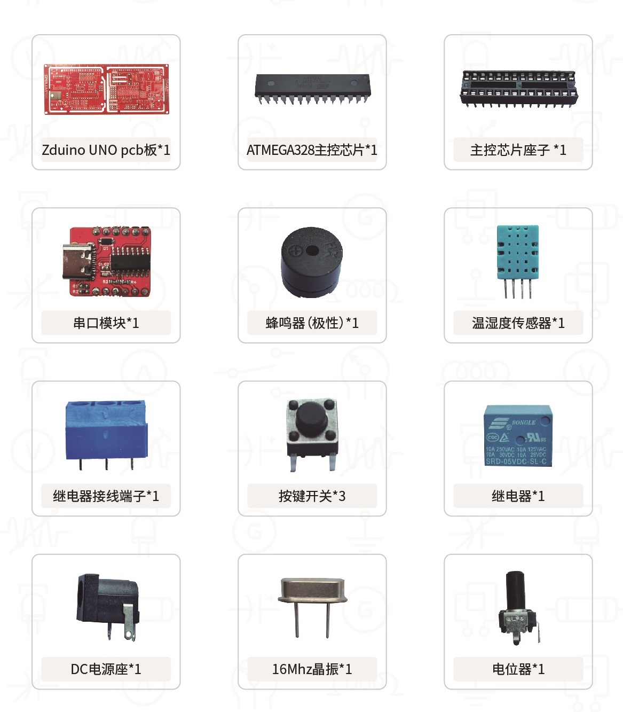
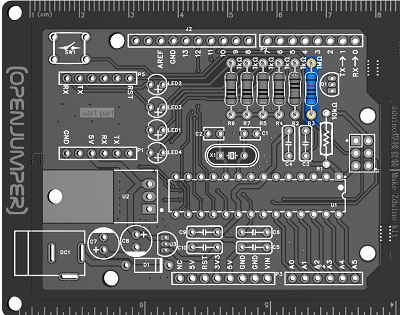
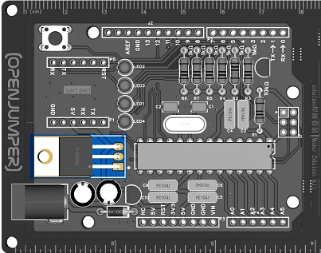
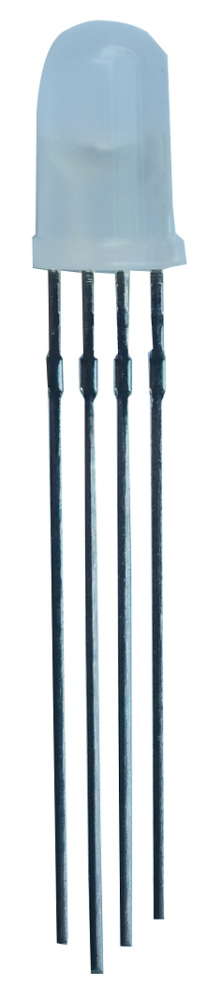

# Make Zduino Kit焊接说明

## 一、套件介绍

Make Zduino Kit是openjumper新推出的焊接练习套件，用户可以在其中学习电子产品的基础知识中并练习电路板的焊接，用户需要有基本的焊接知识，如怎么使用电烙铁等。

在整个过程中，您可以从头开始制作你的Zduino UNO，焊接每个元件，并熟悉电路和电子设备。本次焊接套件总共分为两个部分，一部分是主控板，另一部分是集成蜂鸣器、DHT11温湿度传感器、继电器、电位器、红外发射接收，光敏二极管等功能的扩展板。

在此套件中，我们的目标是：焊接一个属于你的Zduino UNO， 再对Zduino UNO进行编程。

[点此查看焊接视频教程](https://www.bilibili.com/video/BV1Qv4y1Y7YB/?share_source=copy_web&vd_source=79f9b7d6daf45a06fbe9d5cef9296afa)

## 二、套件清单

## 三、焊接准备

### 3.1 准备工具

+ 电烙铁：需要使用电烙铁来完成焊接。如果您以前从未焊接过，可以在网上找一些视频教程学习。

+ 焊锡丝：这是一种在高温下熔化的材料，它可以将元件连接到 PCB 板上

+ 助焊剂：帮可以帮助你更好的完成焊接

+ 斜口钳：用于剪切电子元件多余的针脚

+ 镊子： 对于不好焊接的元器件，可用镊子夹住焊接

+ 通风：焊接过程中会产生大量的烟尘粉末，长期在密闭空间吸入这些烟尘粉末会对身体产生不良影响。

### 3.2 焊接教程

1.准备工作

新烙铁使用前，应用细砂纸将烙铁头打光亮，通电烧热，蘸上松香后用烙铁头刃面接触焊锡丝，使烙铁头上均匀地镀上一层锡。

2.焊前处理

对元件引脚或电路板的焊接部位进行焊前处理，清除焊接部位的氧化层，元件镀锡。

3.焊接方法

右手持电烙铁。左手用尖嘴钳或镊子夹持元件或导线。焊接前，电烙铁要充分预热。烙铁头刃面上要吃锡，即带上一定量焊锡。

4.焊接质量

焊接时候助焊剂（松香和焊油）是关键，新鲜的松香和无腐蚀性的焊油可以帮助很好的完成焊接，可以让表面光洁漂亮，使用的时候可以多用点助焊剂。

5.焊接后的检查

焊接结束后必须检查有无漏焊、虚焊以及由于焊锡流淌造成的元件短路。虚焊较难发现，可用镊子夹住元件引脚轻轻拉动，如发现摇动应立即补焊。

## 四、焊接步骤

现在我们已经准备好了焊接所需的材料和元件，开始焊接练习。

### 4.1焊接主板部分

1.先焊接电阻部分，准备5个**1K欧电阻**，如下图焊接在R6、R7、R5、R4、R2的位置

再将1个**1M欧**电阻焊接在R3上，如图：

取1个**10K欧电阻**焊接在R1上，如图：

2. 取1个二极管焊接在D1上，二极管为有极性的元件，**注意正负极不要接反，银色一端为负极，PCB板上有短线的一侧为负极。** 如图

  

3.取出**电源转换芯片**焊接在U3上，如图：

4.将1个**MOS管**焊接在Q1上，如图：

5.焊接电容，将2个**22pF电容**焊分别接在C1、C2上，如图：

再将6个**100nF电容**分别焊接在C3、C4、C5、C6、C9、C10的位置上，如图：

将2个47uF电容分别焊接在C7、C8上， **注意47uF电容为有极性的元件，电容针脚长的一端为正，PCB板上有+号一侧为正，** 如图

  

**6.取4个3mmLED灯分别焊接在LED1、LED2、LED3、LED4上，注意LED为有极性的元件，LED针脚长的一端为正，PCB板上有+号一侧为正，如图：**

7.将1个**16MHz晶振**焊接在X1上，注意在焊接时候，焊接时间不易过长，容易将晶振损坏，如图：

8.将**1个按键**焊接在SW1上，如图：

9.将**DC电源座**焊接到DC1上，如图：

10.将 **ATMEGA328主控芯片座子** 焊接在U1上，**注意凹陷位置对应** ，一定不可以焊反，如图（使用时再将ATMEGA328主控芯片插在座子上即可，对应凹陷位置，但注意不要插反）

  

11.将 **电源转换芯片（SL7805）** 焊接在U2上，稳压芯片垂直插入后，将它沿着丝印的图示弯曲针脚后再焊接，如图：

12.取1个**1*6的排母**，焊接在P4上，如图：

再取2个**1*8的排母**分别焊接在P2、P3上，如图:

取1个**1*10的排母**焊接在J2上，如图:

13.取2个**1*3的排针**焊在J1上，长针在正面，从正面往下放，焊接的是针脚段短的一侧，背面焊接。如图:

14.将串口模块的排针插在P1、P5上，在PCB板的背面焊接

主板焊接完成后外观如图所示：

焊接完成后将板子背面多余的针脚用斜口钳剪掉。

### 4.2焊接扩展板

1.先焊接电阻

取3个**10K欧电阻**分别焊接在R11、R17、R20上，如图:

取5个**1K欧电阻**分别焊接在R8、R9、R13、R18、R19上，如图:

取6个**220欧电阻**分别焊接在R15、R16、R10、R21、R22、R23上，如图:

取1个**100K欧电阻**焊接在R12上，如图:

取1个**4.7K欧电阻**焊接在R14上，如图 :

2.取3个**三极管**分别焊接在Q2、Q3、Q4上，如图:

**3.取1个二极管焊接在D2上，如图，注意二极管为有极性的元件，注意正负极不要接反，色浅一端为负极。**

**4.取4个3mmLED分别焊接在电源、D12、D13、LED7上，注意LED为有极性的元件,LED针脚长的一端为正，PCB板上有+号一侧为正，如图：**

**5.取1个RGB三色灯焊接在LED12（三色灯）上，注意三色灯最长的引脚对应PCB板上从上往下的第三个孔，如图:**

  

6.取1个**100nF电容**焊接在C11上,如图:

7.取1个**光敏二极管**焊接在LED11上，如图:

8.取1个**红外接收头**焊接在LED9（红外接收）上，如图:

9. **取1个红外发射二极管焊接在LED5（红外发射）上，注意红外发射二极管为有极性的元件,针脚长的一端为正，PCB板上有+号一侧为正，红外发射二极管垂直插入后，可以将针脚朝外侧掰弯。** 如图：

  

10.取2个**按键开关**分别焊接在SW2（A）和SW3（B）上，如图:

11.取出**电位器**焊接在RP1(电位器)上，如图:

12.取出**DHT11温湿度传感器**焊接在U6（温湿度）上，温湿度传感器垂直插入后，将它沿着丝印的方向弯曲针脚后再焊接，如图：

13. **取出蜂鸣器焊接在BUZZER1（蜂鸣器）上，注意蜂鸣器为有极性的元件,蜂鸣器上有＋的一端为为正极，** 如图:

  

14.取出**继电器**焊接在RLY1上，如图，再取出**继电器的接线端子**焊接在Ｕ7上，银色接线端朝外，如图:

15.焊接正面排针，注意：长针在正面，从正面往下放，焊接的都是针脚段短的一侧（背面焊接）

取出1个**1* 6P的白色排针**焊接在S上，取1个**1 * 6P的红色排针**焊接在+上,取1个 **1*6P的黑色排针**焊接在-上,如图:

取3个**1*4的排针**焊接在UART和IIC上，如图：

取1个**1*5的排针**焊接在H15（3V3 5V GND VIN）上，如图：

16.焊接背面排针，注意：长针在背面，从背面往下放，焊接的都是针脚段短的一侧（正面焊接）

取1个**1*10的排针**焊接在H5上，如图：

取1个**1*8的排针**焊接在H4上，如图：

取2个**1*6的排针**焊接H2和H3上，如图：

扩展板焊接完成后外观如图所示：

焊接完成后将板子背面多余的针脚用斜口钳剪掉。

焊接完成后的图

## 五、开始使用

在使用之前我们先安装相关的编程软件

### 5.1 Arduino IDE软件安装
访问[OPENJUMPER文档中心](https://www.openjumper.com/doc/install)，并点击Arduino IDE:

根据自己电脑下载，推荐下载使用1.18.X版本，2.X版本还不太稳定。

双击安装包进行安装：

点击I Agree

按照此默认选择即可

选择安装目录，保存默认即可

现在开始安装软件，等待安装完成即可

软件安装完之后会弹出驱动安装窗口，点击下一步等待安装完成即可

安装完成后点击完成即可

此时软件也安装完成，点击Close即可

最后我们会发现桌面也出现了软件的快捷方式

### 5.2 mixly软件安装

访问[mixly软件安装教程](https://www.openjumper.com/doc/mixly)

### 5.3 make焊接板的使用

#### 5.3.1继电器

打开“1继电器”程序，连接好make焊接板，点击上传。

指示灯未亮时，表示继电器处于未吸合状态，COM与NO端连通，COM与NC端断开。

指示灯点亮时，表示继电器处于吸合状态，COM与NO端断开，COM与NC端连通。

#### 5.3.2 蜂鸣器

打开“2蜂鸣器”程序，连接好make焊接板，点击上传。

此时蜂鸣器就会交替发出两种不同频率的声音。

通过选择不同的音调可以发出不同频率的声音。

#### 5.3.3 红外发射

打开“3红外发射”程序，连接好make焊接板，点击上传。

红外发射的数值通常以16进制数表示。

小知识：众所周知我们的肉眼是无法看到红外线的，但是我们的手机摄像头却可以捕捉到红外线。所以我们打开手机摄像机对准红外发射二极管，就可以在手机屏幕上“看到”红外线了。

#### 5.3.4 红外接收

打开“4红外接收”程序，连接好make焊接板，点击上传。

此时需要打开串口监视器，当然通常情况下它已经自己打开了。若没有或不小心关闭，则点击一下这个“串口”按钮即可。

找一个红外遥控器，对准红外接收管。每当我们按下一个按键时，串口监视器都会输出接收到的数据。

#### 5.3.5 温湿度传感器

打开“5温湿度传感器”程序，连接好make焊接板，点击上传。

此时串口监视器会持续输出传感器检测到周围空气的温湿度。

#### 5.3.6 三色灯

打开“6三色灯”程序，连接好make焊接板，点击上传。

此时能看到三色灯以“红-绿-蓝-呼吸红-呼吸绿-呼吸蓝”的顺序依次点亮三色灯

#### 5.3.7 光敏传感器

打开“7光敏传感器”程序，连接好make焊接板，点击上传。

我们点击“串口”按钮，点击“串口可视化”，将最大值修改为600，可以看到光照强度数据随时间的变化值。当我们将其置于太阳光下或手机光下时，可以看到传感器检测到的数据明显上升。

#### 5.3.8 按键

打开“8按键”程序，连接好make焊接板，点击上传。

此时当我们按下“A”按键时，屏幕会输出“按键A按下”，同时“D12”LED灯会点亮；

当我们按下“B”按键时，屏幕会输出“按键B按下”，同时“D13”LED灯会点亮。

#### 5.3.9 电位器

打开“9电位器”程序，连接好make焊接板，点击上传。

我们点击“串口”按钮，点击“串口可视化”，将最大值修改为1023，可以看到光照强度数据随时间的变化值。

当我们逆时针旋转电位器时，获取到的数据值将会减少；

当我们顺时针旋转电位器时，获取到的数据值将会增大；

## 六、故障排除

如果您未能成功上传程序到开发板上，看看以下的常见问题：

确保您的数据线类型正确，未损坏，并且已连接到计算机。某些数据线仅能充电，但无法识别设备或上传代码。

在焊接步骤结束时使用提供的参考图像交叉检查电路板。组件可能缺失或放置在错误的位置/方向。
如果问题仍然存在，请联系 OpenJumper售后客服。

## 七、总结

在此次学习中，我们通过焊接、编程了Zduino UNO。该板现在可以用于任何与Zduino UNO兼容的项目。

## 七、其他资料

[测试程序下载](http://download.openjumper.cn/MakeZduinoKit%E6%B5%8B%E8%AF%95%E7%A8%8B%E5%BA%8F.rar)
