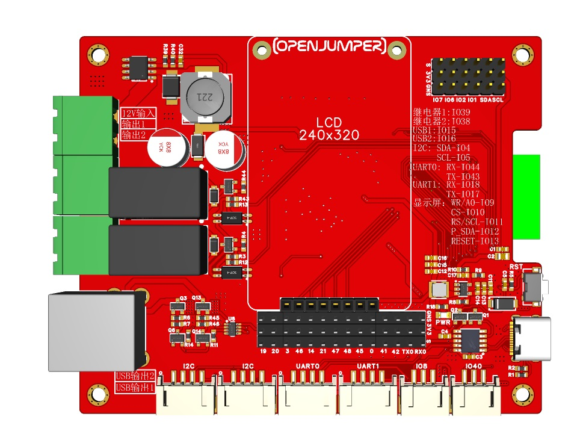
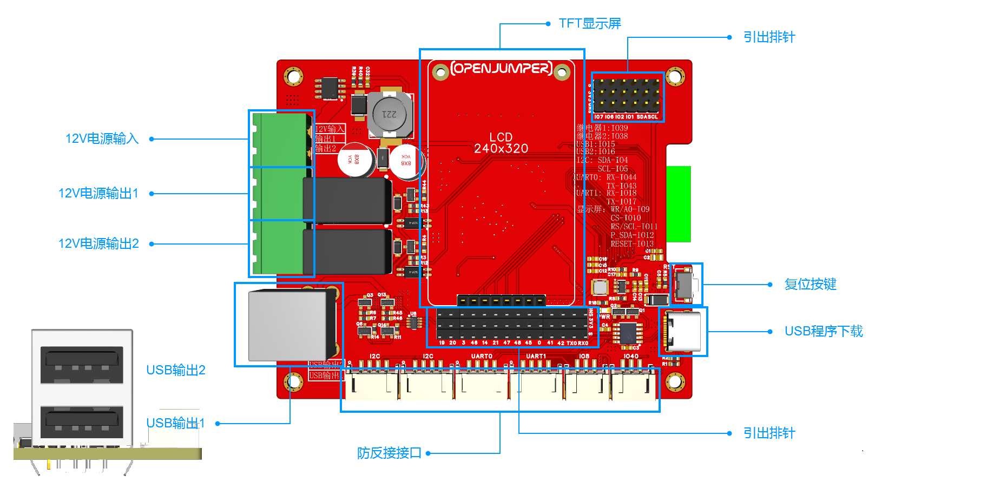
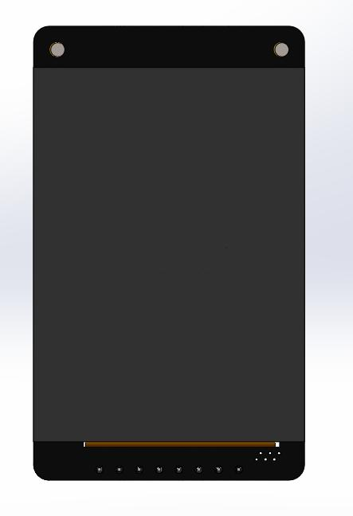
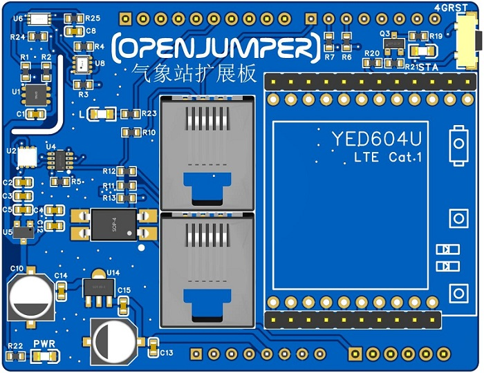

# 智慧物联网

## 一、板卡基本参数

+ 电源电压： 12V（大于 2A）

+ USB 输出电压： 5V

+ 排针 VCC 电压： 3.3V

+ 显示屏 VCC 电压： 3.3V

+ 防反接口 VCC 电压： 3.3V

+ 继电器输出电压： 12V

+ 工作温度：110℃~75℃

+ 板卡尺寸： 98X80（mm）

+ 固定孔： M3

+ 固定孔中心间距： 90*72

+ 引出排针规格： 2.54mm

+ 显示屏排母规格： 2.54mm

+ 防反接口端子规格： PH2.0

+ PWR： 电源指示灯

+ RST： 复位按键

**注意： 继电器输出及 USB 输出电源均来自 12V 输入电源， 即要使用继电器或 USB 输出时必
须接外部 12V 电源。**

## 二、显示屏

+ 驱动： ST7789

+ 尺寸： 2 寸

+ 分辨率： 240X320

+ 固定孔： M2

+ 固定孔中心间距： 28.6mm

+ 排针接口定义（从左往右）：PWM/RST/SDA/CLK/CS/DC/GND/VCC

## 三、可选的气象站扩展板

OpenJumper气象站传感器扩展板，板载4个I2C传感器；通过RJ45网络端子可连接雨量及风速风向传感器；预留YED604U无线4G模块接口。

可测量的气象数据

+ SI7021： 温湿度

+ SGP30： 空气质量

+ BMP280： 气压

+ BH1750： 光照强度

+ RJ45 端子 1： 雨量

+ RJ45 端子 2： 风速风向智慧物联网板

## 四、Arduino IDE下载

### Arduino IDE 安装包下载安装

Arduino IDE 的下载方式通常有以下几种：

1. 通过 Arduino 官网下载 <https://www.arduino.cc/>

2. 通过 Github 下载 <https://github.com/arduino/Arduino>

3. 通过相关社区下载 <https://arduino.me/download>（推荐）

这里我们建议下载 1.18.19 版本的软件， 因为 2.0.x 版本的软件还不太稳定和完善。

###  ESP32 扩展包安装

访问 Arduino 中文社区 <https://arduino.me/download>， 点击“ESP32 离线安装包”。 按照弹出
页面教程进行安装即可。

## 五、其他资料

[示例程序下载](http://download.openjumper.cn/%E6%99%BA%E6%85%A7%E7%89%A9%E8%81%94%E7%BD%91%E6%9D%BF%E7%A4%BA%E4%BE%8B%E7%A8%8B%E5%BA%8F.zip)

[原理图下载](http://download.openjumper.cn/ESP32S3%E6%99%BA%E6%85%A7%E7%89%A9%E8%81%94%E7%BD%91%E6%9D%BF%E5%8E%9F%E7%90%86%E5%9B%BE.pdf)