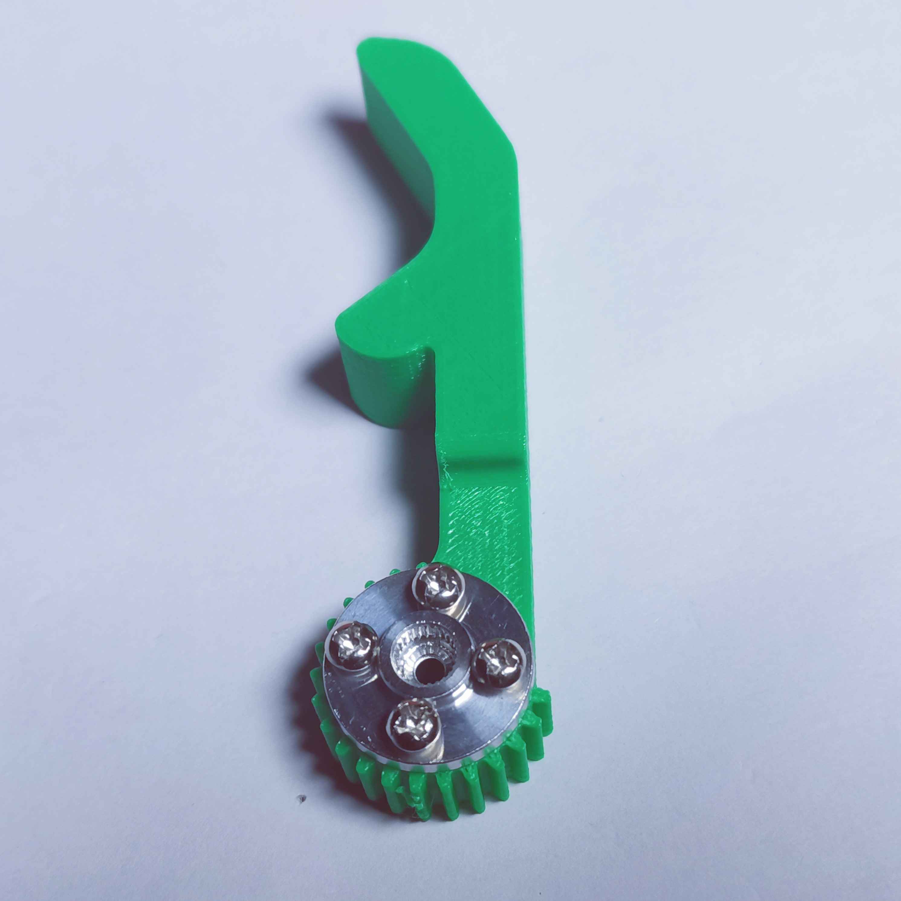

# Arduino机械臂小车组装教程

## 基础介绍

整个小车的主控制器我们选择的是一块我们官方店铺的品牌主板Zduino UNO，方便与电机扩展板板配合使用。

L298N电机驱动扩展板是使用ST公司的L298N作为主驱动芯片，具有驱动能力强，发热量低，抗干扰能力强的特点。它可以使用内置的78M05通过驱动电源部分取电工作，但是为了避免稳压芯片损坏，当使用大于12V驱动电压时，需要使用外置5V逻辑供电。

机械臂舵机采用2个MG995金属齿轮舵机，且舵盘使用一个金属舵盘来替换自带的塑料舵盘，保证云台的刚性、稳定性和耐用性。

   

另外小车前方有两个红外避障模块，用于检测前方的障碍物；3个寻迹模块用来检测导航线。

 

小车的机械臂为钣金材质，下边是机械臂的各个部件，从左到右分别是斜U型件、夹子固定件、舵机固定件、L连接件。

<table border="1">

<tr>
  <td width=25% align="center"></td>
  <td width=25% align="center"></td>
  <td width=25% align="center"></td>
  <td width=25% align="center"></td>
</tr>
</table>

## 一、安装小车下底盘部分

1、首先拿出两个电机，和L298N电机驱动模块。

2、将电机接在电机驱动模块的接线端子OUT2和OUT3上。

3、取4颗螺丝，将电机驱动板安装在小车底盘的下底盘上，安装时将垫块垫在驱动板和底盘中间，注意区分上下两块底盘，新的亚克力材料是有保护膜的，我们需要先将亚克力表面的保护膜撕掉。

4、拿出2个电机固定件，用4颗螺丝将它们安装在小车底盘对应的位置上，用螺母固定好。

5、注意电机的安装方向，有焊接导线的一边朝向内侧，有突出部分的一边朝向外侧；用4颗螺丝将电机固定在电机固定件上，并用螺母固定好，再将电池盒用2颗沉头螺丝安装在小车底盘上，并用螺母固定好

6、再拿出三个巡线模块，用3颗螺丝安装在小车底盘上

7、然后再拿出2个红外避障模块，用2颗螺丝如图安装在底盘上，并用螺母固定好

8、将车轮安装在电机上

9、将万向轮用2颗螺丝安装小车底盘背面，如图所示

10、取4根母对母杜邦线，插在电机驱动模块的IN1 IN2 IN3 IN4上

11、再拿出红并线，将红色端接在电机驱动模块上的+12V上，黑色端接在GND上，如图所示

12、然后拿出DC头，将红黑并线另一端的红线和电池盒上的红线接在DC头的正极，红黑并线另一头的黑线和电池盒上的黑线接在DC头的负极

13、拿一根母对母的杜邦线，剪掉头部，把里面的线露出来，接在电机驱动模块的5V上

14、将4根铜柱用4颗螺丝安装在小车底盘的四个角，再拿出5根3Pin杜邦线接在红外避障模块和巡线模块上，注意接线顺序，白色对应信号端，红色对应正极，黑色对应GND

## 二、安装机械臂

1、拿出机械臂中的钣金件，把L件较短的一边和夹子固定件用4颗M3*8螺丝组装好，用螺母固定好

 

2、再用4颗M3*8螺丝把舵机固定件和L连接件较长的一边固定好

3、将轴承安装斜U型件的一端，用1颗M3*8的螺丝将斜U型件安装在舵机固定件上，并用螺母固定好

4、用1颗M3*8螺丝将左侧夹子固定到夹子固定件的左边位置（注意螺丝不能扭太紧，否则夹指将无法转动）

5、用4颗M3*8螺丝将另一个金属舵盘固定到右侧夹子上

6、安装舵机之前，将舵机复位程序下载到主控板里，等待下载完成。我们将抬升舵机接在主板的D9号引脚，夹子舵机接在主板的D8号引脚，并点击主控板复位按键。这样做是为了将舵机进行复位。待舵机转动一定的角度再停止后，复位完成，然后按着下边的步骤组装即可。

7、再从右侧夹子的背面用1颗M3*8螺丝把舵盘安装到夹子舵机上，注意安装的位置，使夹子可以转动

8、将夹子舵机推进夹子固定件，用4颗M3*8螺丝将夹子舵机安装到夹子固定件上方，注意要使两个夹子处于中间位置。

 

9、用4颗M3*6螺丝将斜U型件和舵盘连接上

10、用1颗M3*8螺丝将金属舵盘和舵机连接起来

11、再用4颗M3*8螺丝将抬升舵机安装在的舵机固定件上，并用螺母固定。

## 三、安装小车上底盘部分

1、拿出小车底盘中的另一块上底盘，将主板Zduino UNO用4颗螺丝安装在底盘上，注意可以将4个垫块垫在主板下，再安装螺丝

2、取出灰度传感器，将它用2颗螺丝安装在底盘的前端，再用螺母固定好，将3pin杜邦线接在模块上，红色为正，黑色为负，白色为信号线，注意灰度传感器应该朝地面方向。

 

3、将机械臂用2颗螺丝安装在小车底盘上，并用螺母固定好。

4、最后将扩展板插在UNO主板上，注意对应方向

5、将模块的线从底盘两边的孔拉出来，方便把模块接在扩展板上，电机驱动板的线和DC头从后边的六边形孔中拉出来

6、将小车底盘的上底盘安装在下底盘铜柱上，用4颗螺丝固定好

## 四、连线

+ 将巡线模块左、中、右分别接A0、A1、A2

+ 左边红外避障模块接D10，右边红外避障模块接D11

+ 夹子舵机接D8，抬升舵机接D9

+ DC头插在主板DC插孔上

+ 灰度传感器接A5

+ IN1、IN2、IN3、IN4四根线分别接在D4、D5、D6、D7

+ 电机驱动板上的＋5V接在扩展板上的5V上（或者红色的引脚）

然后我们就可以得到一个完整帅气的小车啦，使用时记得装上电池哦！

## 其他资料

[舵机复位程序](http://download.openjumper.cn/%E8%88%B5%E6%9C%BA%E5%A4%8D%E4%BD%8D.mp)
