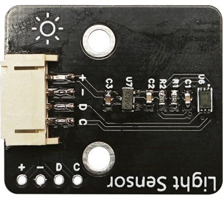
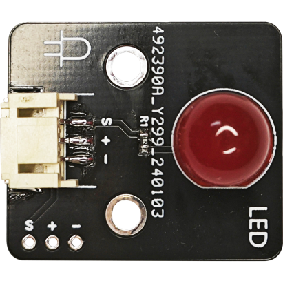
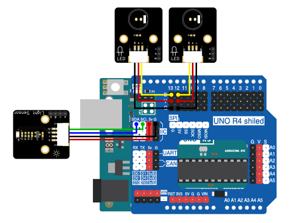

# 第二章 智能电灯

## 1、简介

在这个实验中，我们将使用Arduino uno R3主板、光照传感器、LED灯来制作一个智能电灯。通过感应环境光照的强度控制灯的开关。

## 2、课程目标
+ 了解光照传感器的工作原理及其在智能家居控制系统中的应用。

+ 学习并应用Arduino IDE编程环境，完成光照传感器数据读取和基于光照强度控制LED灯开关的编程。

+ 实现电子电路的基本搭建，制作出能够根据环境光照变化的智能开关灯。

## 3、器材准备

+ Arduino UNO主控板*1

+ 传感器扩展板*1

+ 光照传感器*1

+ LED模块*2

+ 杜邦线*3

+ USB数据线*1

## 4、光照传感器

数字光强度检测，供电电源: 3-5V，数据范围: 0-65535，传感器内置1 6bitAD转换器，
直接数字输出，省略复杂的计算，省略标定。

不区分环境光源接近于视觉灵敏度的分光特性，可对广泛的亮度进行1勒克斯的高精度测定。



## 5、LED灯

LED模块是最简单的执行模块。同时它是一个低功率的光源，有几种颜色可供选择。从一个Arduino的IO供电。Arduino的IO口提供最大40 mA，可通过digitalWrite（）和analogWrite（）函数来点亮LED。



## 6、硬件连接

将客厅LED模块用3P杜邦线连接到传感器扩展板的数字接口D12（黄线S—D12，红线VCC—5V，黑线GND—GND）；

将卧室LED模块用3P杜邦线连接到传感器扩展板的数字接口D13（黄线S—D13，红线VCC—5V，黑线GND—GND）；

将光照传感器用4P杜邦线连接到传感器扩展板的IIC接口（蓝线D—SDA，绿线C—SCL,红线VCC—5V，黑线GND—GND）。

确保所有连接都正确无误。




## 7、实验程序

将以下程序复制到Arduino IDE中，选择好主板和对应的端口，编译上传程序。

```C
/*章节：第二章
 *程序内容：智能电灯
 *程序简介： 通过光照强度传感器控制2个LED的亮灭；
            当光照强度低时，LED自动打开；
            当光照强度高时，LED自动关闭；
            两个灯分别在两个GPIO
 *时间：2024/01/31
 *修改记录：
          2024/01/31:../
*/

#include <BH1750.h>
#include <Wire.h>

BH1750 lightMeter;//声明一个光照传感器对象
#define LedPin1 12//宏定义一个LED控制端口
#define LedPin2 13//宏定义一个LED控制端口
#define light_Min 100//宏定义光照强度低阈值，低于该阈值时关LED
#define light_Max 900//宏定义光照强度高阈值，高于该阈值时开LED
#define ON HIGH//定义开关对应IO状态
#define OFF LOW

void LED_ON(){
  digitalWrite(LedPin1,ON);
  digitalWrite(LedPin2,ON);
}

void LED_OFF(){
  digitalWrite(LedPin1,OFF);
  digitalWrite(LedPin2,OFF);
}

void setup() {
  Serial.begin(9600);//初始化硬串口

  // Initialize the I2C bus (BH1750 library doesn't do this automatically)
  Wire.begin();//初始化IIC
  // On esp8266 you can select SCL and SDA pins using Wire.begin(D4, D3);
  // For Wemos / Lolin D1 Mini Pro and the Ambient Light shield use
  // Wire.begin(D2, D1);

  lightMeter.begin();//初始化传感器
  pinMode(LedPin1,OUTPUT);//定义引脚为输出模式
  pinMode(LedPin2,OUTPUT);

  Serial.println(F("BH1750 Test begin"));
}

void loop() {
  float lux = lightMeter.readLightLevel();//读取光线强度传感器读数
  Serial.print("Light: ");
  Serial.print(lux);
  Serial.print(" lx  ");
 
  if(lux < light_Min){
    LED_ON();
    Serial.print("LED ON!");
  }
  else if(lux > light_Max){
    LED_OFF();
    Serial.print("LED OFF!");
  }

  delay(1000);
}
```

## 8、观察现象
将这段代码上传到Arduino UNO R3主板上，它将会根据光照传感器读取的光照强度数据来控制LED灯的开关。