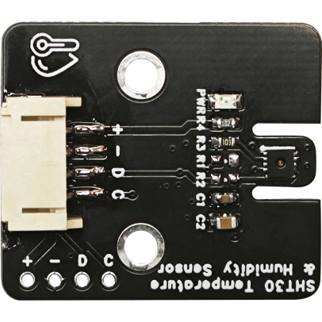
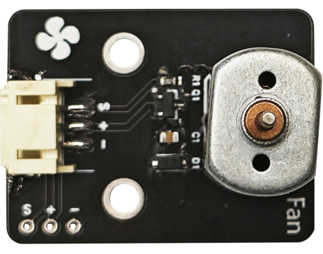
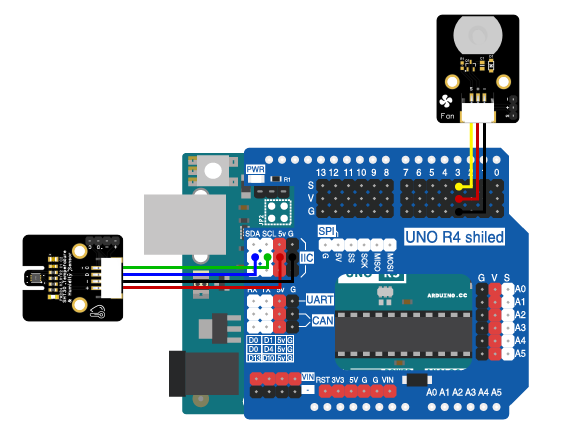

# 第三章 智能温控风扇

## 1、简介

这个实验通过使用Arduino UNO R3主板来控制一个电机风扇模块的开关，从而达到控制温度的目的。我们将使用SHT30温湿度传感器来监测环境的温度和湿度。当温度高于26度时，风扇会自动打开以降温；当温度低于26度时，风扇会自动关闭。

## 2、课程目标

+ 了解温湿度传感器和电机风扇模块的原理及使用

+ 学习温湿度传感器和电机风扇模块的编程控制

+ 制作温控风扇，实现检测温度高时，自动开启风扇

## 3、器材准备

+ Arduino UNO主控板*1

+ 传感器扩展板*1

+ SHT30温湿度传感器*1

+ 电机风扇模块*1

+ 扇叶*1

+ 杜邦线*2

+ USB数据线*1

## 4、SHT30温湿度传感器

SHT30是一款高精度的温湿度传感器，它可以通过I2C接口与Arduino等微控制器通信。该传感器能够提供实时的温湿度数据，非常适合用于各种环境监测项目。



### 模块参数

+ 温度测量范围：-40~125℃

+ 温度测量精度：±0.3℃

+ 湿度测量范围：0~100%RH

+ 湿度测量精度：±3%

+ 工作电压：2.4~5.5VDC

+ 通讯接口：I2C


## 5、电机风扇模块

电机驱动小模块是一款IO口小电流驱动大电流的驱动模块设计有防止反电动势的续流二极管，产品驱动方便，可PWM驱动控制，兼容性强等优点。它包含一个小型的DC电机和一个风扇叶片。在Arduino项目中，你可以通过控制电机的电源来打开或关闭风扇。



## 6、硬件连接

将SHT30温湿度传感器用4P杜邦线连接到传感器扩展板的IIC接口（蓝线D—SDA，绿线C—SCL,红线VCC—5V，黑线GND—GND）；

将电机风扇模块用3P杜邦线连接到传感器扩展板的数字接口D3（黄线S—D3，红线VCC—5V，黑线GND—GND）。扇叶直接上在电机风扇模块的电机上。

确保所有连接都正确无误。



## 7、实验程序

将以下程序复制到Arduino IDE中，选择好主板和对应的端口，编译上传程序。

```C
/*章节：第三章
 *程序内容：智能温控风扇
 *程序简介： 通过温湿度传感器控制风扇的开启和关闭；
            当温度高于26度时，风扇自动打开；
            当温度低于26度时，风扇自动关闭；
             *时间：2024/01/31
 *修改记录：
          2024/01/31:../
*/
#include <Wire.h>
#include "Adafruit_SHT31.h"

Adafruit_SHT31 sht31 = Adafruit_SHT31();//声明一个光照传感器对象

#define FanPin 3//宏定义风扇控制端口
#define temp_Min 26//宏定义温度低阈值，低于该阈值时关风扇
#define temp_Max 26//宏定义温度高阈值，高于该阈值时开风扇
#define ON HIGH//定义开关对应IO状态
#define OFF LOW

void FAN_ON(){
  digitalWrite(FanPin,ON);
}

void FAN_OFF(){
  digitalWrite(FanPin,OFF);
}

void setup() {
  Serial.begin(9600);//初始化硬串口

  Serial.println("Chapter 3");
  if (! sht31.begin(0x44)) {   //初始化温湿度传感器并判断是否正常连接
    Serial.println("Couldn't find SHT31");
    while (1) delay(1);
  }

  pinMode(FanPin,OUTPUT);//定义引脚为输出模式
}

void loop() {
  float t = sht31.readTemperature();//读取温湿度传感器读数
  float h = sht31.readHumidity();

  if (! isnan(t)) {  // check if 'is not a number'
    Serial.print("Temp *C = "); Serial.print(t); Serial.print("\t\t");
  } else { 
    Serial.println("Failed to read temperature");
  }
  if (! isnan(h)) {  // check if 'is not a number'
    Serial.print("Hum. % = "); Serial.println(h);
  } else { 
    Serial.println("Failed to read humidity");
  }
  
  if(t < temp_Min){
    FAN_ON();
    Serial.print("FAN ON!");
  }
  else if(t > temp_Max){
    FAN_OFF();
    Serial.print("FAN OFF!");
  }

  delay(1000);
}
```

## 8、观察现象

将这段代码上传到Arduino UNO R3主板上，它将会根据SHT30读取的温度数据来控制风扇的开关。

## 9、扩展知识

+ 你可以尝试使用PWM（脉冲宽度调制）来控制风扇的速度，而不仅仅是简单地打开或关闭。

+ 可以接入LCD屏幕显示实时的温湿度数据。

+ 为了使系统更加智能，你可以添加一个网络模块（如ESP8266），将数据上传到云端进行远程监控。