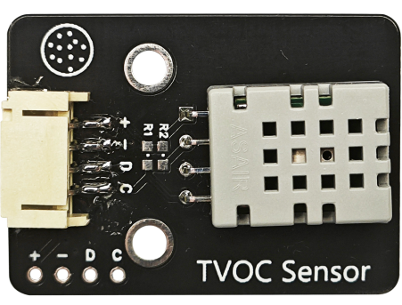
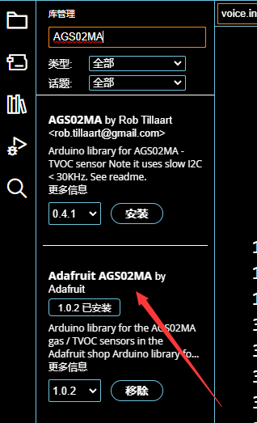
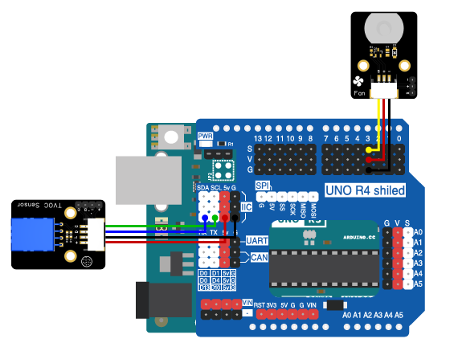

# 第四章 智能室内通风

## 1、简介

智能室内通风系统主要时用来自动检测空气中的总挥发性有机化合物浓度并相应地控制风扇进行通风，用于改善空气质量。这个实验通过使用Arduino UNO R3主板来控制一个电机风扇模块，从而达到室内通风的目的。我们将使用TVOC AGS02MA传感器来检测空气中的总挥发性有机化合物浓度。当总挥发性有机化合物浓度过高时，会自动打开风扇通风；当浓度处于正常值范围时，风扇会自动关闭。

## 2、课程目标

+ 了解TVOC AGS02MA传感器原理及使用

+ 学习TVOC AGS02MA传感器的编程

+ 制作智能室内通风系统，实现检测到TVOC浓度高时，自动开启风扇通风

## 3、器材准备

+ Arduino UNO主控板*1

+ 传感器扩展板*1

+ TVOC AGS02MA传感器*1

+ 电机风扇模块*1

+ 杜邦线*2

+ USB数据线*1

## 4、TVOC AGS02MA传感器

艾克姆科技AGS02MA气体传感器模块是一款支持3.3V或5V单电源供电、支持I2C接口(MCU没有硬件I2C外设时可使用GPIO模拟I2C)的TVOC传感器模块，适用于侦测各类有机挥发性气体，如乙醇、氨气、硫化物、苯系蒸汽、烟雾和其它有害气体的监测。



+ 测量范围：0 ~ 99999ppb

+ 采样周期≥32s

+ 预热时间：> 120s

+ 工作电流：28±5mA


使用时需要在IED中先安装AGS02MA库，在IDE的库管理器中搜Adafruit AGS02MA，点击安装。


## 5、硬件连接

将TVOC AGS02MA传感器用4P杜邦线连接传感器扩展板的IIC接口（蓝线D—SDA，绿线C—SCL,红线VCC—5V，黑线GND—GND）；

将电机风扇模块用3P杜邦线连接到传感器扩展板的数字接口D3（黄线S—D3，红线VCC—5V，黑线GND—GND）。

确保所有连接都正确无误。


## 6、实验程序

将以下程序复制到Arduino IDE中，选择好主板和对应的端口，编译上传程序。

```C
/*章节：第四章
 *程序内容：智能室内通风
 *程序简介： 通过TVOC传感器控制风扇的开启和关闭；
            当TVOC浓度高于时，风扇自动打开；
            当TVOC浓度低于时，风扇自动关闭；
 *时间：2024/01/31
 *修改记录：
          2024/01/31:../
*/

#include "Adafruit_AGS02MA.h"

Adafruit_AGS02MA ags;//声明一个TVOC传感器对象

#define FanPin 3//宏定义风扇控制端口
#define TVOC_Min 26//宏定义TVOC浓度低阈值，低于该阈值时关风扇
#define TVOC_Max 26//宏定义TVOC浓度高阈值，高于该阈值时开风扇
#define ON HIGH//定义开关对应IO状态
#define OFF LOW

void FAN_ON(){
  digitalWrite(FanPin,ON);
}

void FAN_OFF(){
  digitalWrite(FanPin,OFF);
}

void setup() {
  Serial.begin(9600);//初始化硬串口

  Serial.println("Chapter 4");
  if (! ags.begin(&Wire, 0x1A)) {//初始化TVOC传感器并判断是否正常连接
    Serial.println("Couldn't find AGS20MA sensor, check your wiring and pullup resistors!");
    while (1) yield();
  }

  if (ags.getFirmwareVersion() == 0) {
    Serial.println(F("Could not read firmware, I2C communications issue?"));
    while (1) yield();
  }

  pinMode(FanPin,OUTPUT);//定义引脚为输出模式
}

void loop() {
  uint32_t resistance = ags.getGasResistance();//读取TVOC传感器读数
  uint32_t tvoc = ags.getTVOC();

  if (resistance == 0) {
    Serial.println(F("Failure reading resistance, I2C communications issue?"));
  } else {
    float kohm = resistance / 1000.0;
    Serial.print(F("Gas resistance: "));
    Serial.print(kohm);
    Serial.print(" Kohms  ");
  }
  if (tvoc == 0) {
    Serial.println(F("Failure reading TVOC, I2C communications issue?"));
  } else {
    Serial.print(F("TVOC: "));
    Serial.print(tvoc);
    Serial.println(" ppb");
  }
  
  if(tvoc < TVOC_Min){
    FAN_ON();
    Serial.print("FAN ON!");
  }
  else if(tvoc > TVOC_Max){
    FAN_OFF();
    Serial.print("FAN OFF!");
  }

  delay(1000);
}
```
## 8、观察现象

将这段代码上传到Arduino UNO R3主板上，它将会根据TVOC AGS02MA传感器的数值来自动控制风扇的开关。

## 9、扩展知识

+ 如果需要检测不同类型的气体，可能需要使用不同的传感器，并且根据传感器的规格来调整阈值。

+ 为了提高系统的稳定性和响应速度，可以考虑添加传感器预热时间，并使用滤波算法来处理传感器的读数。

+ 可以将系统扩展为可以远程监控，并通过互联网发送警报的智能系统。