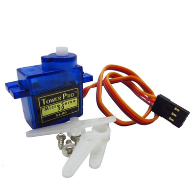
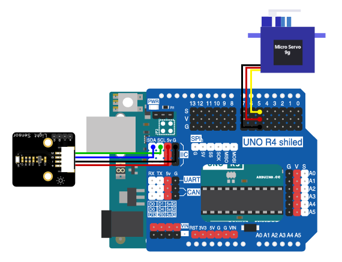

# 第五章 光控自动窗帘

## 1、简介

在这个实验中，我们将使用Arduino uno R3主板、光照强度传感器和9g舵机来制作一个光控自动窗帘系统。通过检测光照强度，我们将实现当光照强度强时自动打开窗帘，光照强度弱时自动关闭窗帘的功能。

## 2、课程目标

+ 了解如何使用Arduino uno R3主板控制舵机；

+ 学习如何使用模拟光线传感器来检测光照强度；

+ 了解360度9g舵机的基本原理和使用方法；

+ 实现光控自动窗帘系统。

## 3、器材准备

+ Arduino UNO主控板*1

+ 传感器扩展板*1

+ 光照强度传感器*1

+ 360度9g舵机*1

+ 杜邦线*1

+ USB数据线*1

## 4、360度9g舵机

### 简介

这是个360度微型舵机。舵机内部采用塑料齿轮传动，轻便小巧。可用于各类应用及DIY制作中，诸如小车，船，风车等等。

360度舵机区别于一般普通舵机的点在于它取消了内部的硬件限位。只能够控制舵机的旋转方向和旋转速度，不能控制旋转角度。所以功能上更趋向于自带电机驱动的电机，可以控制正反转，停止。相对于普通直流电机，360度舵机不需要额外的电机驱动组件，即插即用，小巧方便，Arduino的控制方式与普通舵机相同。



### 注意：

360°舵机只能够控制舵机的旋转方向和旋转速度，不能控制旋转角度。

### 接口说明：  

+ 棕色：GND
+ 红色：VCC
+ 橙色：信号线

## 5、硬件连接

将光线传感器用4P杜邦线连接到传感器扩展板的IIC接口（蓝线D—SDA，绿线C—SCL,红线VCC—5V，黑线GND—GND）；

将9g舵机连接到传感器扩展板的数字接口Ｄ5（橙色S—D5，红线VCC—5V，黑线GND—GND）。

将舵机上在舵机固定件上，将窗帘的轴连接到舵机的齿轮上，通过舵机控制窗帘轴的旋转来控制窗帘的开关。

确保所有连接都正确无误。



## 6、实验程序

将以下程序复制到Arduino IDE中，选择好主板和对应的端口，编译上传程序。
```C
/*章节：第五章
 *程序内容：光控自动窗帘
 *程序简介： 通过光照强度传感器控制窗帘的开启和关闭；
            当光照强度高于时，窗帘自动打开；
            当光照强度低于时，窗帘自动关闭；
*时间：2024/01/31
 *修改记录：
          2024/01/31:../
*/

#include <BH1750.h>
#include <Wire.h>
#include <Servo.h>

BH1750 lightMeter;//声明一个光照强度传感器对象
Servo servo_curtain;//声明窗帘的舵机

#define CurtainPin 3//宏定义风扇控制端口
#define Illum_Min 26//宏定义光照强度低阈值，低于该阈值时关窗帘
#define Illum_Max 26//宏定义光照强度高阈值，高于该阈值时开窗帘

void Curtain_ON(){
  servo_curtain.write(60);
  delay(2000);
  servo_curtain.write(90);
}

void Curtain_OFF(){
  servo_curtain.write(120);
  delay(2000);
  servo_curtain.write(90);
}

void setup() {
  Serial.begin(9600);//初始化硬串口

  Wire.begin();
  lightMeter.begin();//初始化传感器

  servo_curtain.attach(CurtainPin);
}

void loop() {
  float lux = lightMeter.readLightLevel();//读取光照强度传感器读数
  Serial.print("Light: ");
  Serial.print(lux);
  Serial.println(" lx");
  
  if(lux < Illum_Min){
    Serial.print("Curtain ON!");
    Curtain_ON();
  }
  else if(lux > Illum_Max){
    Serial.print("Curtain OFF!");
    Curtain_OFF();
  }

  delay(1000);
}
```

## 7、观察现象

将这段代码上传到Arduino UNO R3主板上，它将会根据光线传感器的数值来自动控制窗帘的开关。

## 8、扩展知识

你还可以进一步扩展这个项目，比如添加无线通信模块，通过手机APP或者远程控制器来控制窗帘的开关，或者添加温度传感器，实现温度自动控制窗帘的功能。