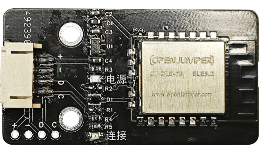
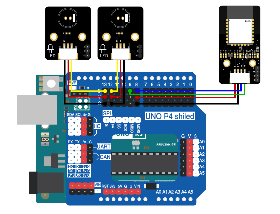

# 第六章 无线智能灯

## 1、简介

在这个实验中，我们将使用Arduino uno R3主板、蓝牙模块、LED灯来制作一个无线智能灯。通过蓝牙控制灯的开关。

## 2、课程目标

+ 学习如何使用Arduino与蓝牙模块通信；

+ 实现无线智能灯。

## 3、器材准备

+ Arduino UNO主控板*1

+ 传感器扩展板*1

+ 蓝牙模块*1

+ LED模块*2

+ 杜邦线*2

+ USB数据线*1

## 4、蓝牙模块

### 简介

蓝牙模块BLE 5.2是蓝牙技术的最新版本之一，它提供了更快的数据传输速度、更低的功耗以及更广泛的覆盖范围。BLE 5.2还引入了一些新的功能，比如LE音频传输和定位服务，为物联网设备和智能家居设备提供了更多的可能性。这使得BLE 5.2成为连接各种设备和传输各种数据的理想选择。蓝牙模块BLE 5.2是一种低功耗蓝牙（BLE）模块，它支持蓝牙5.2标准，提供了更快的数据传输速度和更低的功耗。这些特性使得BLE 5.2模块成为连接各种设备的理想选择，包括智能手机、智能家居设备、穿戴设备和工业物联网设备等。

### 模块参数

|主要参数|	参数值|	描述|
|--|--|--|
|工作电压(V)	|1.8~3.8	|超过3.8V可能永久烧毁模块|
|通信电平(V)	|3.3	|使用5V TTL有风险烧毁|
|工作温度(°C)|	-40~+125	|车规级设计|
|工作频段(MHz)	|2400~ 2480	|支持ISM频段|
|最大发射功率(dBm)|	6	||
|发射电流(mA)	|10.5	||
|接收电流(mA)	|2.5	||
|休眠电流(μA)	|2	||
|接收灵敏度(dBm)|	-98.9	||
|参考距离(m)	|170	|晴朗空旷环境，高度1米 @6dBm,空速1Mbps|
|通信速率GFSK(bps)	|125K~2M	|
|晶振频率(Hz)	|38. 4M	||
|支持协议	|BT5.2	||
|封装方式	|贴片式	||



## 5、硬件连接
将LED模块用3P杜邦线连接到传感器扩展板的数字接口D12（黄线S—D12，红线VCC—5V，黑线GND—GND）；
将LED模块用3P杜邦线连接到传感器扩展板的数字接口D13（黄线S—D13，红线VCC—5V，黑线GND—GND）；

蓝牙模块用4P杜邦线连接到传感器扩展板的串口（蓝线RX—D8，绿线TX-D9，红线VCC—5V，黑线GND—GND）

确保所有连接都正确无误。



## 6、实验程序
将以下程序复制到Arduino IDE中，选择好主板和对应的端口，编译上传程序。
```C
/*章节：第六章
 *程序内容：无线智能灯
 *程序简介： 使用蓝牙通过网页端（APP端）无线控制灯的开启和关闭；
            当按下控制按钮时，灯光打开或关闭；
 *时间：2024/01/31
 *修改记录：
          2024/01/31:../
*/

#include <SoftwareSerial.h>

#define LedPin1 12//宏定义一个LED控制端口
#define LedPin2 13//宏定义一个LED控制端口
#define ON HIGH//定义开关对应IO状态
#define OFF LOW

SoftwareSerial BLESerial(8,9); // RX, TX声明蓝牙端口

void LED_ON(){
  digitalWrite(LedPin1,ON);
  digitalWrite(LedPin2,ON);
}

void LED_OFF(){
  digitalWrite(LedPin1,OFF);
  digitalWrite(LedPin2,OFF);
}

void setup() {
  Serial.begin(9600);//初始化硬串口
  BLESerial.begin(9600);//初始化软串口，用于连接蓝牙
  pinMode(LedPin1,OUTPUT);//定义引脚为输出模式
  pinMode(LedPin2,OUTPUT);
}

void loop() {
  String inputString = "";
  if (BLESerial.available() > 0) {
    inputString = BLESerial.readStringUntil('\n');//读取字符串直到换行符结束
    inputString.trim();//去除前导和后置空格
    int colonIndex = inputString.indexOf(':');//在另一个String中定位一个字符或字符串。默认情况下，搜索从字符串的开头开始，但也可以从给定的索引开始，允许查找字符或字符串的所有实例。返回查找字符串的到位数（由0开始）
    if (colonIndex != -1) {
      String key = inputString.substring(0, colonIndex);
      String valueString = inputString.substring(colonIndex + 1);
    //  Serial.print(key);
    //  Serial.print("-");
    //  Serial.println(valueString);
      if (key == "light") {
        if(valueString == "on")
        {
          Serial.println("light:on");
          LED_ON();
          }
        else if(valueString == "off")
        {
          Serial.println("light:off");
          LED_OFF();
          }
      } 
    }
  }
}
```

## 7、观察现象

将这段代码上传到Arduino UNO R3主板上，然后打开蓝牙控制端，点击连接设备，连接成功后就可以控制开关灯啦。（蓝牙控制端：<https://ble.openjumper.com/connect>）