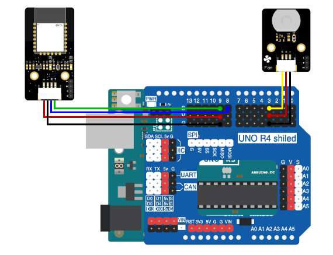

# 第七章 无线风扇

## 1、简介

在这个实验中，我们将使用Arduino uno R3主板、蓝牙模块、电机风扇模块来制作一个无线风扇。通过蓝牙控制风扇的开关。

## 2、课程目标

+ 实现使用蓝牙远程控制风扇的开关。

+ 实现电子电路的搭建

## 3、器材准备

+ Arduino UNO主控板*1

+ 传感器扩展板*1

+ 蓝牙模块*1

+ 电机风扇模块*1

+ 杜邦线*2

+ USB数据线*1

## 4、硬件连接

将电机风扇模块用3P杜邦线连接到传感器扩展板的数字接口D3（黄线S—D3，红线VCC—5V，黑线GND—GND）；

蓝牙模块用4P杜邦线连接到传感器扩展板的串口（蓝线RX—D8，绿线TX—D9，红线VCC—5V，黑线GND—GND）

确保所有连接都正确无误。



## 5、实验程序

将以下程序复制到Arduino IDE中，选择好主板和对应的端口，编译上传程序。

```C
/*章节：第七章
 *程序内容：无线风扇
 *程序简介： 使用蓝牙通过网页端（APP端）无线控制风扇的开启和关闭；
            当按下控制按钮时，风扇打开或关闭；
 *时间：2024/01/31
 *修改记录：
          2024/01/31:../
*/

#include <SoftwareSerial.h>

#define FanPin 3//宏定义一个风扇控制端口
#define ON HIGH//定义开关对应IO状态
#define OFF LOW

SoftwareSerial BLESerial(8,9); // RX, TX声明蓝牙端口

void FAN_ON(){
  digitalWrite(FanPin,ON);
}

void FAN_OFF(){
  digitalWrite(FanPin,OFF);
}

void setup() {
  Serial.begin(9600);//初始化硬串口
  BLESerial.begin(9600);//初始化软串口，用于连接蓝牙
  pinMode(FanPin,OUTPUT);//定义引脚为输出模式
}

void loop() {
  String inputString = "";
  if (BLESerial.available() > 0) {
    inputString = BLESerial.readStringUntil('\n');//读取字符串直到换行符结束
    inputString.trim();//去除前导和后置空格
    int colonIndex = inputString.indexOf(':');//在另一个String中定位一个字符或字符串。默认情况下，搜索从字符串的开头开始，但也可以从给定的索引开始，允许查找字符或字符串的所有实例。返回查找字符串的到位数（由0开始）
    if (colonIndex != -1) {
      String key = inputString.substring(0, colonIndex);
      String valueString = inputString.substring(colonIndex + 1);
    //  Serial.print(key);
    //  Serial.print("-");
    //  Serial.println(valueString);
      if (key == "fan") {
        if(valueString == "on")
        {
          Serial.println("fan:on");
          FAN_ON();
          }
        else if(valueString == "off")
        {
          Serial.println("fan:off");
          FAN_OFF();
          }
      } 
    }
  }
}
```

## 6、观察现象

将这段代码上传到Arduino UNO R3主板上，然后打开蓝牙控制端，点击连接设备，连接成功后就可以远程控制开关风扇啦。（蓝牙控制端：<https://ble.openjumper.com/connect>）
