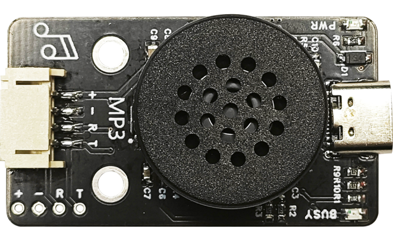
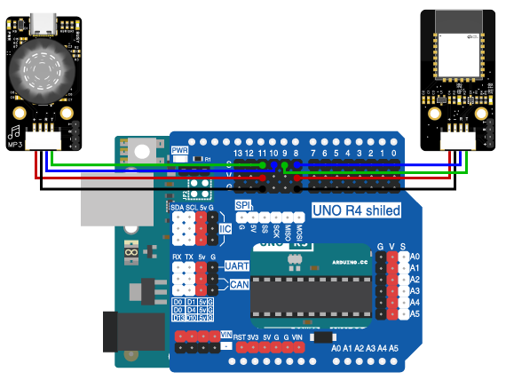

# 第八章 无线蓝牙音乐

## 1、简介

在这个实验中，我们将使用Arduino uno R3主板、蓝牙模块、MP3模块来制作一个可以通过蓝牙与手机连接并控制MP3模块播放音乐的系统。

## 2、课程目标

+ 学习MP3模块的基本使用方法。

+ 实现使用蓝牙控制MP3模块播放和停止音乐。

## 3、器材准备

+ Arduino UNO主控板*1

+ 传感器扩展板*1

+ 蓝牙模块*1

+ MP3模块*1

+ 杜邦线*2

+ SB数据线*1

## 4、MP3模块

### 简介

MP3模块是一个串口MP3模块，完美的集成了MP3、WAV的硬解码。支持电脑直接更新spi flash的内容，通过简单的串口指令即可完成播放指定的音乐，以及如何播放音乐等功能，无需繁琐的底层操作，使用方便，稳定可靠。使用时只需提前将音频文件拷贝到模块即可。




### 使用步骤

1.使用一根micro USB数据线连接模块，此时模块相当于一个U盘，我们可以直接将需要播放的音频拷贝到里面即可。注意模块在第一次连接电脑拷贝音频前，按照电脑提示，是需要对模块存储器进行格式化操作。

2.使用Micro USB数据线将模块与电脑相连接（一般情况下模块已经在测试环节完成格式化。若没有格式化，点击格式化即可）；

3.此时模块会模拟为一个U盘，将准备好的音频文件拷贝到里面即可，然后断开USB连接；（音频文件格式为mp3，文件名需要改为00001 、00002以此类推）

4.将模块通过一根4Pin线与Arduino连接好；

5.上传程序即可开始正常使用。


## 5、硬件连接

将MP3模块用4P杜邦线连接到传感器扩展板的串口（蓝线RX—D10，绿线TX—D11，红线VCC—5V，黑线GND—GND）；

蓝牙模块用4P杜邦线连接到传感器扩展板的串口（蓝线RX—D8，绿线TX—D9，红线VCC—5V，黑线GND—GND）

确保所有连接都正确无误。



## 6、实验程序

将以下程序复制到Arduino IDE中，选择好主板和对应的端口，编译上传程序。

```C
/*章节：第八章
 *程序内容：无线蓝牙音乐播放器
 *程序简介： 使用蓝牙通过网页端（APP端）无线控制MP3模块播放和关闭；
            当按下控制按钮时，MP3模块播放或关闭；
 *时间：2024/01/31
 *修改记录：
          2024/01/31:../
*/

#include <SoftwareSerial.h>
#include <GD3800_Serial.h>

GD3800_Serial mp3(10,11); //（rx,tx）声明mp3播放模块
SoftwareSerial BLESerial(8,9); // RX, TX声明蓝牙端口

void mp3play(void){
  BLESerial.end();
  mp3.begin(9600);
  delay(10);
  mp3.setVolume(20);//设置音量,0-30
  mp3.setLoopMode(MP3_LOOP_ALL);//设置循环模式
  mp3.setEqualizer(MP3_EQ_NORMAL);//设置EQ
  mp3.playFileByIndexNumber(1);
  mp3.end();
  BLESerial.begin(9600);
  delay(10);
}

void mp3end(void){
  BLESerial.end();
  mp3.begin(9600);
  delay(10);
  mp3.pause();  //暂停
  mp3.end();
  BLESerial.begin(9600);
  delay(10);
}

void setup() {
  Serial.begin(9600);//初始化硬串口
  BLESerial.begin(9600);//初始化软串口，用于连接蓝牙
}

void loop() {
  String inputString = "";
  if (BLESerial.available() > 0) {
    inputString = BLESerial.readStringUntil('\n');//读取字符串直到换行符结束
    inputString.trim();//去除前导和后置空格
    int colonIndex = inputString.indexOf(':');//在另一个String中定位一个字符或字符串。默认情况下，搜索从字符串的开头开始，但也可以从给定的索引开始，允许查找字符或字符串的所有实例。返回查找字符串的到位数（由0开始）
    if (colonIndex != -1) {
      String key = inputString.substring(0, colonIndex);
      String valueString = inputString.substring(colonIndex + 1);
    //  Serial.print(key);
    //  Serial.print("-");
    //  Serial.println(valueString);
      if (key == "music") {
        if(valueString == "on")
        {
          Serial.println("music:on");
          mp3play();
          }
        else if(valueString == "off")
        {
          Serial.println("music:off");
          mp3end();
          }
      }
    }
  }
}
```

## 7、观察现象

将这段代码上传到Arduino UNO R3主板上，然后打开蓝牙控制端，点击连接设备，连接成功后就可以控制音乐播放与停止播放啦。（蓝牙控制端：<https://ble.openjumper.com/connect>）

## 8、扩展知识

+ 学习如何使用AT命令来配置和测试蓝牙模块。

+ 探索不同的MP3模块命令，实现音量控制、歌曲选择等功能。

+ 开发自己的手机APP来提供更丰富的用户界面和控制选项。
