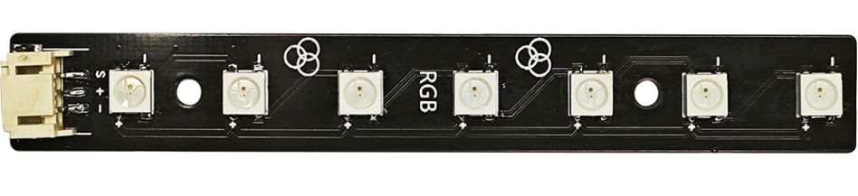
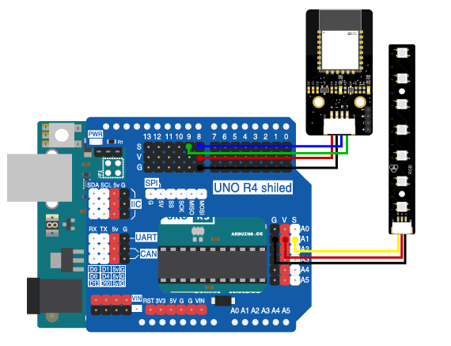

# 第九章 室内氛围灯

## 1、简介

在这个实验中，我们将使用Arduino uno R3主板、蓝牙模块、2812RGB LED灯条来制作一个可以通过蓝牙与手机连接并控制RGB灯颜色的氛围灯。

## 2、课程目标

+ 学习RGBLED模块的基本使用方法。

+ 实现使用蓝牙控制RGBLED模块的颜色与亮灭。

## 3、器材准备

+ Arduino UNO主控板*1

+ 传感器扩展板*1

+ 蓝牙模块*1

+ 2812 RGB LED灯条*1

+ 杜邦线*2

+ USB数据线*1

## 4、2812RGB LED灯条模块

在我们的街头巷尾，总有各种色彩斑斓的LED灯，装饰着我们这个世界，夜晚多彩的LED灯尤其的漂亮。这里我们一起来探索彩色LED的玩法吧。

首先理解我们的灯光几乎是有三原色组成，也就是R（红色）、G（绿色）、B（蓝色），所以调节三种颜色不同的亮度比例，就可得到不同亮度的其他想要的颜色。在程序中，这个亮度值设定为0~255，所以程序输出RGB对应的亮度分别为（255,255,255）的时候，我们可以得到最大亮度的白色光。

RGB-LED灯条模块由7个贴片全彩LED制成，通过R、G、B三个引脚的PWM电压输入可以调节三种基色（红/蓝/绿）的强度从而实现全彩的混色效果。通过程序控制模块中的每个灯珠的颜色和亮暗程度。



## 5、硬件连接
将RGB-LED灯条模块用3P杜邦线连接到传感器扩展板的模拟接口A1（黄线S—A1，红线VCC—5V，黑线GND—GND）；

蓝牙模块用4P杜邦线连接到传感器扩展板的串口（蓝线RX—D8，绿线TX—D9，红线VCC—5V，黑线GND—GND）

确保所有连接都正确无误。



## 6、实验程序

将以下程序复制到Arduino IDE中，选择好主板和对应的端口，编译上传程序。
```C
/*章节：第九章
 *程序内容：室内氛围灯
 *程序简介： 使用蓝牙通过网页端（APP端）无线控制氛围灯;
            当按下开关按钮时，氛围灯打开或关闭;
            点击取色盘时，氛围灯显示相应颜色;
 *时间：2024/01/31
 *修改记录：
          2024/01/31:../
*/

#include <Adafruit_NeoPixel.h>
#include <SoftwareSerial.h>

SoftwareSerial mySerial(8,9); // RX, TX
Adafruit_NeoPixel rgb = Adafruit_NeoPixel(4,A0,NEO_GRB + NEO_KHZ800);

int light_brightness = 0;//存储灯的亮度
float luminance_factor = 1.0;//亮度系数,默认为1.0，最大亮度
int colour_R = 0;//灯的色彩
int colour_G = 0;
int colour_B = 0;
int LED_Display_R = 0;//灯的显示值
int LED_Display_G = 0;
int LED_Display_B = 0;
long testtime = 0;

void setup() {
  rgb.begin();
  rgb.setBrightness(20);//亮度
  rgb.setPixelColor(0,0);
  rgb.setPixelColor(1,0);
  rgb.setPixelColor(2,0);
  rgb.setPixelColor(3,0);
  rgb.show();
  // 初始化串口通信
  Serial.begin(115200);
  mySerial.begin(9600);
  pinMode(2,INPUT);
}

void loop() {
  // 检查串口数据并解析命令
  checkSerial();

}

// 检查串口数据并解析命令
void checkSerial() {
  if(testtime < millis()/1000){
    testtime = millis()/1000;
    mySerial.println("temperature:20");
    Serial.println("temperature:20");
    Serial.println("humidity:75");
    Serial.println("illuminance:3000");
    Serial.println("pressure:10012");
    Serial.println("winDirection:111");
    Serial.println("winSpeed:2222");
    Serial.println("waterQuality:111");
    Serial.println("rainfall:11");
      
//    Serial.println(millis()/1000);   
    }
  String inputString = "";
  if (mySerial.available() > 0) {
    inputString = mySerial.readStringUntil('\n');
    inputString.trim();//去除前导和后置空格
    int colonIndex = inputString.indexOf(':');//在另一个String中定位一个字符或字符串。默认情况下，
                                              //搜索从字符串的开头开始，但也可以从给定的索引开始，
                                              //允许查找字符或字符串的所有实例。返回查找字符串的到位数（由0开始）
//    Serial.println(colonIndex);
    if (colonIndex != -1) {
      String key = inputString.substring(0, colonIndex);
      String valueString = inputString.substring(colonIndex + 1);
      Serial.print(key);
      Serial.print("---");
      Serial.println(valueString);
      if (key == "rgb") {
        int R_number = valueString.indexOf(',');//分离颜色值
        String R_val = valueString.substring(0,R_number);
        String otherString = valueString.substring(R_number + 1);
        
        int G_number = otherString.indexOf(',');
        String G_val = otherString.substring(0,G_number);
        otherString = otherString.substring(G_number + 1);
        
        int B_number = otherString.indexOf(',');
        String B_val = otherString.substring(0,B_number);

//        Serial.print("-");
//        Serial.print(R_val);
//        Serial.print("-");
//        Serial.print(G_val);
//        Serial.print("-");
//        Serial.print(B_val);

        colour_R = atoi(R_val.c_str());//转换为整数
        colour_G = atoi(G_val.c_str());
        colour_B = atoi(B_val.c_str());
//        Serial.print("--");
//        Serial.print(colour_R);
//        Serial.print("-");
//        Serial.print(colour_G);
//        Serial.print("-");
//        Serial.println(colour_B);
        int cl_R = colour_R;
        int cl_G = colour_G;
        int cl_B = colour_B;

        LED_Display_R =cl_R * luminance_factor;
        LED_Display_G =cl_G * luminance_factor;
        LED_Display_B =cl_B * luminance_factor;

        RGBON(LED_Display_R,LED_Display_G,LED_Display_B);
        
      } 
      else if (key == "brightness") {
        light_brightness = atoi(valueString.c_str());  //灯的亮度值
        luminance_factor = light_brightness / 255.0;//灯的亮度系数

        if(light_brightness == 0){
          RGBOFF();
          }
        else{
          rgb.setBrightness(light_brightness);
          rgb.show();
          }         
      } 
      else if (key == "turn") {
        if(valueString == "on"){
          RGBON(LED_Display_R,LED_Display_G,LED_Display_B);
          }
        else if(valueString == "off"){
          RGBOFF();
        }
      }
      // 其他命令处理...
    }
  }
}

void RGBON(int COLOR_VAL_R,int COLOR_VAL_G,int COLOR_VAL_B){
  rgb.setPixelColor(0, (((COLOR_VAL_R & 0xffffff) << 16) | ((COLOR_VAL_G & 0xffffff) << 8) | COLOR_VAL_B));
  rgb.setPixelColor(1, (((COLOR_VAL_R & 0xffffff) << 16) | ((COLOR_VAL_G & 0xffffff) << 8) | COLOR_VAL_B));
  rgb.setPixelColor(2, (((COLOR_VAL_R & 0xffffff) << 16) | ((COLOR_VAL_G & 0xffffff) << 8) | COLOR_VAL_B));
  rgb.setPixelColor(3, (((COLOR_VAL_R & 0xffffff) << 16) | ((COLOR_VAL_G & 0xffffff) << 8) | COLOR_VAL_B));
  rgb.show();
  }
  
void RGBOFF(){
  rgb.setPixelColor(0, (((0 & 0xffffff) << 16) | ((0 & 0xffffff) << 8) | 0));
  rgb.setPixelColor(1, (((0 & 0xffffff) << 16) | ((0 & 0xffffff) << 8) | 0));
  rgb.setPixelColor(2, (((0 & 0xffffff) << 16) | ((0 & 0xffffff) << 8) | 0));
  rgb.setPixelColor(3, (((0 & 0xffffff) << 16) | ((0 & 0xffffff) << 8) | 0));
  rgb.show();
  }
```

## 7、观察现象
将这段代码上传到Arduino UNO R3主板上，然后打开蓝牙控制端，点击连接设备，连接成功后就可以控制氛围灯的色彩、亮度、开关啦。
（蓝牙控制端：<https://ble.openjumper.com/connect>）
