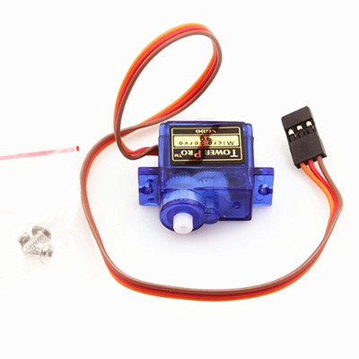

# 第十章 蓝牙门窗帘

## 1、简介

本章实验是在通过Arduino Uno R3主板、蓝牙模块、两个不同角度的9g舵机，实现通过手机APP来控制门和窗帘的开关。通过蓝牙连接到手机APP，用户可以通过控制端上的按钮来实现开门、关门，打开窗帘和关闭窗帘等功能。

## 2、课程目标

+ 了解180度9g舵机的基本原理和使用方法；

+ 实现通过蓝牙模块远程控制门和窗帘的开关。

## 3、器材准备

+ Arduino UNO主控板*1

+ 传感器扩展板*1

+ 蓝牙模块*1

+ 180度9g舵机*1

+ 360度9g舵机*1

+ 杜邦线*1

+ USB数据线*1

## 4、180度9g舵机

该舵机属于180°微型舵机，采用高强度ABS透明外壳配以内部高精度尼龙齿轮组，加上精准的控制电路、高档轻量化空心杯电机使该微型舵机的重量只有9克，而输出力矩达到了惊人的1.6kg*cm。在代码中，我们将使用舵机库来控制舵机的旋转角度，从而实现自动开门和关门



+ 反应转速：0.12-0.13秒/60度

+ 使用温度：-30~+60°

+ 死区设定：5微秒

+ 转动角度：最大180度

+ 结构材质：塑料齿

**接口说明：**  

棕色：GND

红色：VCC

橙色：信号线


## 5、硬件连接
将180度9g舵机连接到传感器扩展板的数字接口D4（黄线S—D4，红线VCC—5V，黑线GND—GND）；

将360度9g舵机连接到传感器扩展板的数字接口D5（黄线S—D5，红线VCC—5V，黑线GND—GND）；

蓝牙模块用4P杜邦线连接到传感器扩展板的串口（蓝线RX—D8，绿线TX—D9，红线VCC—5V，黑线GND—GND）。

将舵机配的舵盘安装在舵机上，安装舵盘之前舵机需要先复位（先将舵机接在主板的数字接口D4，将程序下载到主板上，舵机就会进行自动复位），安装时门是处于关闭状态。舵机安装在舵机固定件上，将门的拉杆一边连接到舵机的舵盘上，一边连接到门上。通过舵机控制舵盘的角度来控制门的开关

将360度9g舵机上在舵机固定件上，将窗帘的轴连接到舵机的齿轮上，通过舵机控制窗帘轴的旋转来控制窗帘的开关。

确保所有连接都正确无误。


## 6、实验程序

将以下程序复制到Arduino IDE中，选择好主板和对应的端口，编译上传程序。
```C
/*章节：第十章
 *程序内容：蓝牙门窗
 *程序简介： 使用蓝牙通过网页端（APP端）无线控制门窗;
            当按下门按钮时，门打开或关闭;
            当按下窗帘按钮时，窗帘打开或关闭;
 *时间：2024/02/4
 *修改记录：
          2024/02/4:../
*/

#include <Servo.h>
#include <SoftwareSerial.h>
#define Delay_ctime 2000//设定开窗转动时间

SoftwareSerial BLESerial(8,9); // RX, TX
Servo door_servo;
Servo curtain_servo;

long testtime = 0;

void setup() {
  // 初始化串口通信
  Serial.begin(9600);
  BLESerial.begin(9600);
  
  door_servo.attach(4);
  curtain_servo.attach(5);
  door_servo.write(20);
}

void loop() {
  // 检查串口数据并解析命令
  checkSerial();
}

// 检查串口数据并解析命令
void checkSerial() {
  if(testtime < millis()/1000){
    testtime = millis()/1000;
//    Serial.println(millis()/1000);
  }
  String inputString = "";
  if (BLESerial.available() > 0) {
    inputString = BLESerial.readStringUntil('\n');
    inputString.trim();//去除前导和后置空格
    int colonIndex = inputString.indexOf(':');//在另一个String中定位一个字符或字符串。默认情况下，
                                              //搜索从字符串的开头开始，但也可以从给定的索引开始，
                                              //允许查找字符或字符串的所有实例。返回查找字符串的到位数（由0开始）
//    Serial.println(colonIndex);
    if (colonIndex != -1) {
      String key = inputString.substring(0, colonIndex);
      String valueString = inputString.substring(colonIndex + 1);
      Serial.print(key);
      Serial.print("---");
      Serial.println(valueString);
      if (key == "door") {
        if(valueString == "on")
        {
          Serial.println("door:on");
          door_servo.write(120);
          }
        else if(valueString == "off")
        {
          Serial.println("door:off");
          door_servo.write(20);
          }
      }
      else if (key == "curtain") {
        if(valueString == "on")
        {
          Serial.println("curtain:on");
          curtain_servo.write(120);
          delay(Delay_ctime);
          curtain_servo.write(90);
          }
        else if(valueString == "off")
        {
          Serial.println("curtain:off");
          curtain_servo.write(60);
          delay(Delay_ctime);
          curtain_servo.write(90);
          }
      }      
      // 其他命令处理...
    }
  }
}
```

## 7、观察现象

将这段代码上传到Arduino UNO R3主板上，然后打开蓝牙控制端，点击连接设备，连接成功后就可以控制门的开关和窗帘的开关啦。
（蓝牙控制端：https://ble.openjumper.com/connect）