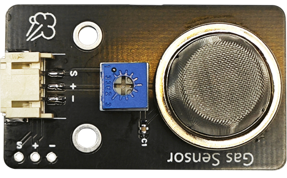
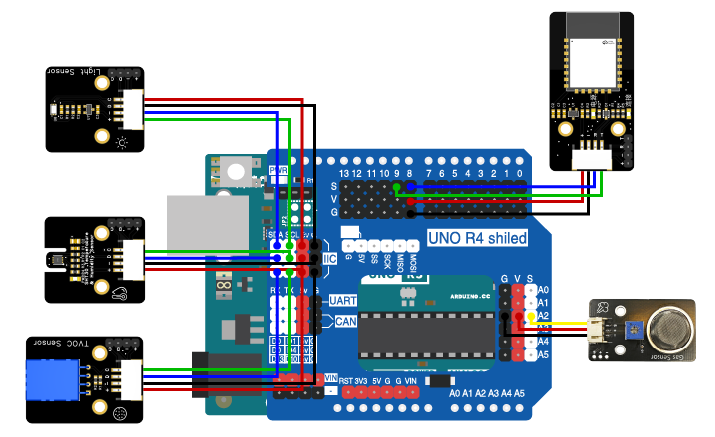

# 第十一章 室内环境监测

## 1、简介

这一章主要是通过蓝牙将各个传感器数据监测到的数据传输到移动端，在移动端的控制界面观察传感器数据的变化。

## 2、课程目标

+ 学习如何使用光照强度传感器来检测光照强度;

+ 学习如何使用温湿度传感器来检测空气中的湿度和温度;

+ 学习如何使用TVOC传感器来检测总挥发性有机化合物;

+ 学习如何使用MQ2烟雾传感器来检测空气中的烟雾浓度。

## 3、器材准备

+ Arduino UNO主控板*1

+ 传感器扩展板*1

+ 蓝牙模块*1

+ SHT30温湿度传感器*1

+ 光照强度传感器*1

+ TVOC AGS02MA传感器*1

+ MQ2气体传感器*1

+ 杜邦线*5

+ USB数据线*1

## 4、MQ2气体传感器

MQ2是一款常用的气体传感器，可检测多种可燃性气体。它对液化气、丙烷、氢气的灵敏度高，对天然气和其它可燃蒸汽的检测也很理想。它通过其内部的化学传感器来检测空气中的气体浓度变化。



**注意**

MQ2气体传感器需要预热一段时间后，才能输出稳定的数据。

电压对于内部加热器来说是相当重要的。在使用MQ2气体传感器模块时，需要使用5V给加热器供电，这样可以很快的使加热器达到50-60摄氏度，加热器通电后，大约过3分钟，返回的电压值才能稳定。

在该模块上有一个可调负载电阻，阻值越低，传感器越不灵敏；阻值越高，对于高浓度的气体越不准确。如果你的测量环境只有一种要测量的特定气体，且知道其浓度，则可以通过调节该电阻来校准创传感器（请在传感器加热至稳定后校准）。

## 5、硬件连接

+ 将SHT30温湿度传感器用4P杜邦线连接到传感器扩展板的IIC接口（蓝线D—SDA，绿线C—SCL,红线VCC—5V，黑线GND—GND）（连第2个IIC接口）；

+ 将光照传感器用4P杜邦线连接到传感器扩板的IIC接口（蓝线D—SDA，绿线C—SCL,红线VCC—5V，黑线GND—GND）（连第1个IIC接口）；

+ 将TVOC AGS02MA传感器用4P杜邦线连接到传感器扩展板的IIC接口（蓝线D—SDA，绿线C—SCL,红线VCC—5V，黑线GND—GND）（连第3个IIC接口）；

+ 将MQ2气体传感器用3P杜邦线连接到传感器扩展板的模拟接口A2（黄线S—A2，红线VCC—5V，黑线GND—GND）；

+ 蓝牙模块用4P杜邦线连接到传感器扩展板的串口（蓝线RX—D8，绿线TX—D9，红线VCC—5V，黑线GND—GND）

确保所有连接都正确无误。



## 6、实验程序

将以下程序复制到Arduino IDE中，选择好主板和对应的端口，编译上传程序。

```C
/*章节：第十一章
 *程序内容：室内环境监测
 *程序简介： 使用蓝牙通过网页端（APP端），实时传输室内温湿度、光照强度、TVOC、烟雾浓度信息;
 *时间：2024/02/4
 *修改记录：
          2024/02/4:../
*/

#include "Adafruit_SHT31.h"
#include <BH1750.h>
#include <Wire.h>
#include "Adafruit_AGS02MA.h"
#include <SoftwareSerial.h>
#define Delay_ctime 2000//设定开窗转动时间
#define MQ2Pin A2

SoftwareSerial BLESerial(8,9); // RX, TX
Adafruit_SHT31 sht31 = Adafruit_SHT31();
float t,h;

bool enableHeater = false;
uint8_t loopCnt = 0;

BH1750 lightMeter;
float lux;

Adafruit_AGS02MA ags;
uint32_t resistance,tvoc;

long testtime = 0;
int smk;

void setup() {
  // 初始化串口通信
  Serial.begin(9600);
  BLESerial.begin(9600);
  
  if (! sht31.begin(0x44)) {   // Set to 0x45 for alternate i2c addr
    Serial.println("Couldn't find SHT31");
    while (1) delay(1);
  }
  Serial.print("Heater Enabled State: ");
  if (sht31.isHeaterEnabled())
    Serial.println("ENABLED");
  else
    Serial.println("DISABLED");

  Wire.begin();
  lightMeter.begin();

  if (! ags.begin(&Wire, 0x1A)) {
  //if (! ags.begin(&Wire1, 0x1A)) { // or use Wire1 instead!
    Serial.println("Couldn't find AGS20MA sensor, check your wiring and pullup resistors!");
    while (1) yield();
  }
  if (ags.getFirmwareVersion() == 0) {
    Serial.println(F("Could not read firmware, I2C communications issue?"));
    while (1) yield();
  }

  Serial.println(F("Indoor environmental monitoring"));
}

void loop() {
  if(testtime < millis()/1000){
    testtime = millis()/1000;
//    Serial.println(millis()/1000);
  t = sht31.readTemperature();
  h = sht31.readHumidity();

   if (! isnan(t)) {  // check if 'is not a number'
    Serial.print("Temp *C = "); Serial.print(t); Serial.print("\t\t");
  } else { 
    Serial.println("Failed to read temperature");
  }
  if (! isnan(h)) {  // check if 'is not a number'
    Serial.print("Hum. % = "); Serial.println(h);
  } else { 
    Serial.println("Failed to read humidity");
  }

  lux = lightMeter.readLightLevel();
  Serial.print("Light: ");
  Serial.print(lux);
  Serial.println(" lx");

  resistance = ags.getGasResistance();
  tvoc = ags.getTVOC();

  if (resistance == 0) {
    Serial.println(F("Failure reading resistance, I2C communications issue?"));
  } else {
    float kohm = resistance / 1000.0;
    Serial.print(F("Gas resistance: "));
    Serial.print(kohm);
    Serial.println(" Kohms");
  }
  if (tvoc == 0) {
    Serial.println(F("Failure reading TVOC, I2C communications issue?"));
  } else {
    Serial.print(F("TVOC: "));
    Serial.print(tvoc);
    Serial.println(" ppb");
  }
  smk = analogRead(MQ2Pin);

  BLESerial.print("temperature:");//智能家居
  BLESerial.println(t);
  BLESerial.print("humidity:");
  BLESerial.println(h);
  BLESerial.print("smoke:");
  BLESerial.println(smk);
  BLESerial.print("illuminance:1000");
  BLESerial.println(lux);
  BLESerial.print("tvoc:");
  BLESerial.println(tvoc);
  }
  if (loopCnt >= 30) {
    enableHeater = !enableHeater;
    sht31.heater(enableHeater);
    Serial.print("Heater Enabled State: ");
    if (sht31.isHeaterEnabled())
      Serial.println("ENABLED");
    else
      Serial.println("DISABLED");

    loopCnt = 0;
  }
  loopCnt++;
}
```

## 7、观察现象

将这段代码上传到Arduino UNO R3主板上，然后打开蓝牙控制端，点击连接设备，连接成功后就可以在移动端上显示出传感器监测到的数据了，以及还可以看到温度湿度随着时间变化的图表。（蓝牙控制端：<https://ble.openjumper.com/connect>）
