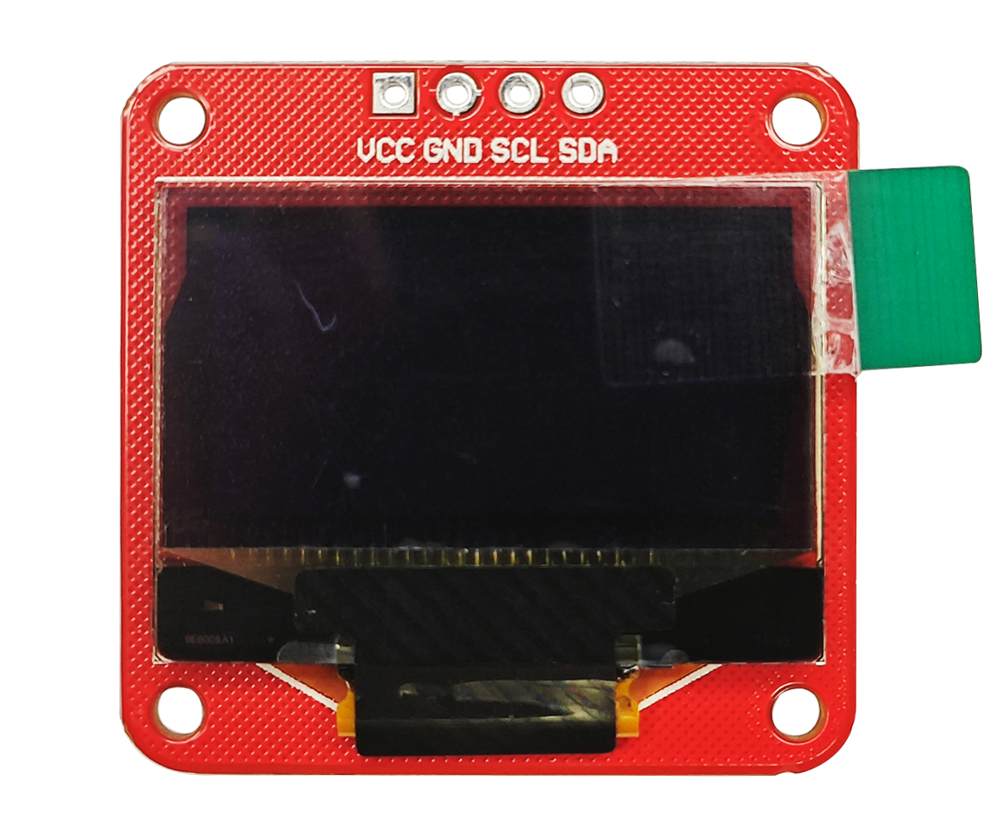
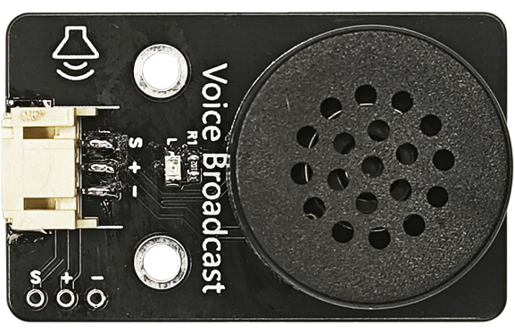
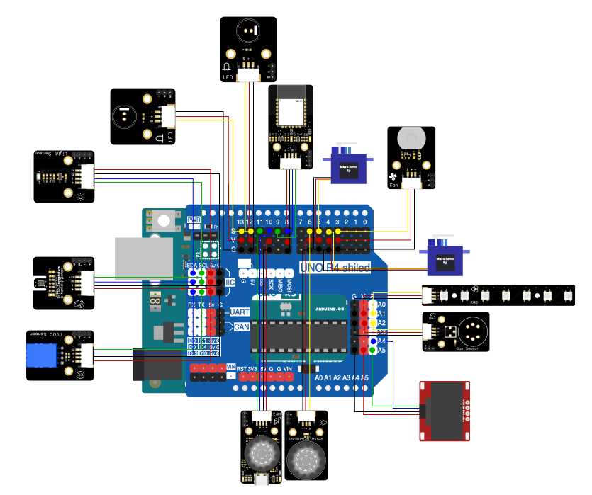

# 第十二章 智能家居综合案例

## 1、简介

此章节是结合了前边的几个章节的综合案列，将所有传感器和模块连接到Arduino UNO主板上，通过蓝牙模块连接到我们的蓝牙BLE遥控软件（<https://ble.openjumper.com/connect>）上。用户可以监测家中的环境数据，并控制家居设备，包括灯光、风扇、门、窗帘、音乐等。

## 2、课程目标

+ 学会搭建智能家居外观

+ 了解OLED显示屏的使用方式

+ 掌握语音识别播报模块的使用

## 3、器材准备

+ Arduino UNO主控板*1

+ 传感器扩展板*1

+ 蓝牙模块*1

+ LED模块*2

+ SHT30温湿度传感器*1

+ 光照强度传感器*1

+ TVOC AGS02MA传感器*1
+ MQ2气体传感器*1

+ 2812RGB LED氛围灯*1

+ MP3模块*1

+ 电机风扇模块（含扇叶）*1

+ OLED显示屏*1

+ 语言识别播报模块*1

+ 180度舵机*1

+ 360度舵机*1

+ 杜邦线*若干

+ USB数据线*1

## 4、OLED显示屏

屏幕尺寸:0.96英寸，点阵格式:128*64，通过使用u8glib 、AdafruitSSD1306库文件或自己编写驱动，连接OLED至Arduino的IIC通信接口就可以很方便的进行显示。
屏幕工作电压为DC 5V。



## 5、语音播报模块

语音播报模块采用高清语音芯片，内置69端日常语音，编程简单，声音播放采用8欧铷磁铁扬声器，声音洪亮清晰。

这款语音识别播报模块内置脑神经网络处理器，支持DNN\TDNNARNN等神经网络及卷积运算硬件运算，非软件运算。持语音识别、语音增强、语音检测、单麦克风降噪增强单麦克风回 声消除、360度全方位拾音等功能。



### 模块基本参数

+ 电源电压：5V（大于 500mA）

+ 串口电平：3.3V

+ 工作温度：-40℃~85℃

+ 模块尺寸：45.2 * 27（mm）

+ 固定孔：标准乐高孔

+ 固定孔中心间距：16mm（两个乐高单位）

+ 串口连接方式：PH2.0\*4P 或 XH2.54\*4P（两个同一个串口不同连接方式）

+ 喇叭接口：XH2.54*2P

+ 驱动的喇叭参数：3.3W/4Ω或 5.4W/2Ω（推荐使用 4Ω3W 左右的喇叭）

+ PWR：电源指示灯

+ STE：板载指示灯

+ DLOD：手动下载按键（未自动下载时使用）

## 6、硬件连接

可根据之前的章节进行连线。

+ 将客厅LED模块用3P杜邦线连接到传感器扩展板的数字接口D12（黄线S—D12，红线VCC—5V，黑线GND—GND）；

+ 将卧室LED模块用3P杜邦线连接到传感器扩展板的数字接口D13（黄线S—D13，红线VCC—5V，黑线GND—GND）；

+ 将SHT30温湿度传感器用4P杜邦线连接到传感器扩展板的IIC接口（蓝线D—SDA，绿线C—SCL,红线VCC—5V，黑线GND—GND）（连第2个IIC接口）；

+ 将光照传感器用4P杜邦线连接到传感器扩展板的IIC接口（蓝线D—SDA，绿线C—SCL,红线VCC—5V，黑线GND—GND）（连第1个IIC接口）。

+ 将TVOC AGS02MA传感器用4P杜邦线连接传感器扩展板的IIC接口（蓝线D—SDA，绿线C—SCL,红线VCC—5V，黑线GND—GND）（连第3个IIC接口）；

+ 将ＭQ2烟雾传感器用3P杜邦线连接传感器扩展板模拟的接口A2（黄线S—A2，红线VCC—5V，黑线GND—GND）；

+ 将RGB-LED灯条模块用3P杜邦线连接到传感器扩展板的模拟接口A1（黄线S—A1，红线VCC—5V，黑线GND—GND）；

+ 将MP3模块用4P杜邦线连接到传感器扩展板的串口（蓝线RX—D10，绿线TX—D11，红线VCC—5V，黑线GND—GND）；

+ 将电机风扇模块用3P杜邦线连接到传感器扩展板的数字接口D3（黄线S—D3，红线VCC—5V，黑线GND—GND）；

+ 将180度9g舵机连接到传感器扩展板的数字接口D4（黄线S—D4，红线VCC—5V，黑线GND—GND）；

+ 将360度9g舵机连接到传感器扩展板的数字接口D5（黄线S—D5，红线VCC—5V，黑线GND—GND）；

+ OLED显示屏用4P杜邦线连接到IIC接口（蓝线D—A4，绿线C—A5,红线VCC—5V，黑线GND—GND）；

+ 语音播报模块用3P杜邦线连接到数字接口D6（黄线S—D6，红线VCC—5V，黑线GND—GND）；

+ 蓝牙模块用4P杜邦线连接到传感器扩展板的串口（蓝线RX—D8，绿线TX—D9，红线VCC—5V，黑线GND—GND）

确保所有连接都正确无误。




## 7、实验程序

将以下程序复制到Arduino IDE中，选择好主板和对应的端口，编译上传程序。

```C
/*章节：第十二章
 *程序内容：智能家居综合案例一
 *程序简介： 使用蓝牙通过网页端（APP端），实时传输室内温湿度、光照强度、TVOC、烟雾浓度信息
            并可以控制智能家居的设备;
 *时间：2024/02/4
 *修改记录：
          2024/02/4:../
*/

#include <Arduino.h>
#include <Wire.h>
#include "Adafruit_SHT31.h"
#include <BH1750.h>
#include <Adafruit_NeoPixel.h>
#include <SoftwareSerial.h>
#include <GD3800_Serial.h>
#include "U8glib.h"
#include "Adafruit_AGS02MA.h"
#include <Servo.h>

bool enableHeater = false;
uint8_t loopCnt = 0;
Adafruit_SHT31 sht31 = Adafruit_SHT31();
float h,t;

BH1750 lightMeter;
float lux;
int smk;

SoftwareSerial BLESerial(8,9); // RX, TX
GD3800_Serial mp3(10,11); //（rx,tx）MP3

U8GLIB_SSD1306_128X64 u8g(U8G_I2C_OPT_DEV_0|U8G_I2C_OPT_NO_ACK|U8G_I2C_OPT_FAST);

#define NUM_LEDS 7
Adafruit_NeoPixel rgb = Adafruit_NeoPixel(NUM_LEDS,A1,NEO_GRB + NEO_KHZ800);

Servo servo_door; 
Servo servo_curtain;
#define Delay_ctime 2000//设定开窗转动时间

#define PIN_FAN 3//风扇
#define Pin_illuminance A0//光敏
#define PIN_RGB A1//氛围灯
#define Pin_smoke A2//烟雾
#define PIN_LIGHT 12//照明灯
#define PIN_LIGHT2 13//照明灯

bool rgb_state = 0;

String STRprint[] = {};
unsigned long systime = 0;
unsigned long oldtime = 0;
unsigned long delayTime = 1500;
bool Lstate = LOW;

String str = "";

void mp3play(void){
  BLESerial.end();
  mp3.begin(9600);
  delay(10);
  mp3.setVolume(20);//设置音量,0-30
  mp3.setLoopMode(MP3_LOOP_ALL);//设置循环模式
  mp3.setEqualizer(MP3_EQ_NORMAL);//设置EQ
  mp3.playFileByIndexNumber(1);
  mp3.end();
  BLESerial.begin(9600);
  delay(10);
}

void mp3end(void){
  BLESerial.end();
  mp3.begin(9600);
  delay(10);
  mp3.pause();  //暂停
  mp3.end();
  BLESerial.begin(9600);
  delay(10);
}

void draw(void) {
  // graphic commands to redraw the complete screen should be placed here  
  u8g.setFont(u8g_font_unifont);
  //u8g.setFont(u8g_font_osb21);
  u8g.drawStr(26,12,"OpenJumper");

  //u8g.setPrintPos(40, 20); 
  //u8g.print("Hello World!");
  u8g.setPrintPos(0, 40);
  u8g.print(str);
}

void SSD1306_Refresh(void){
  u8g.firstPage();  
        do {
          draw();
        } while( u8g.nextPage() );
}

void setup() {
  // 初始化串口通信
  Serial.begin(9600);
  BLESerial.begin(9600);
  // BLESerial.begin(9600);

  if (! sht31.begin(0x44)) {   // Set to 0x45 for alternate i2c addr
    Serial.println("Couldn't find SHT31");
    while (1) delay(1);
  }
  Serial.print("Heater Enabled State: ");
  if (sht31.isHeaterEnabled())
    Serial.println("ENABLED");
  else
    Serial.println("DISABLED");

  pinMode(PIN_LIGHT,OUTPUT);
  pinMode(PIN_LIGHT2,OUTPUT);
  pinMode(PIN_FAN,OUTPUT);

  rgb.begin();
  rgb.setBrightness(20);
  for(int a=0;a<NUM_LEDS;a++){
  rgb.setPixelColor(a, (((0 & 0xffffff) << 16) | ((200 & 0xffffff) << 8) | 0)); 
  }
  rgb.show();
  delay(100);
  for(int a=0;a<NUM_LEDS;a++){
  rgb.setPixelColor(a, (((0 & 0xffffff) << 16) | ((0 & 0xffffff) << 8) | 0)); 
  }
  rgb.show();

  Wire.begin();
  lightMeter.begin();

  servo_door.attach(5);
  servo_door.write(135);
  servo_curtain.attach(5);
  servo_door.write(90);

  SSD1306_Refresh();
}

void loop() { 
  checkSerial();

  if(rgb_state){
    for(int a=0;a<NUM_LEDS;a++){
      rgb.setPixelColor(a, (((0 & 0xffffff) << 16) | ((255 & 0xffffff) << 8) | 0)); 
    }
    rgb.show();
  }
  else{
    for(int a=0;a<NUM_LEDS;a++){
      rgb.setPixelColor(a, (((0 & 0xffffff) << 16) | ((0 & 0xffffff) << 8) | 0)); 
    }
    rgb.show();
  }
  systime = millis();
  /**/

  if(systime - oldtime >= delayTime){
    oldtime = systime;
    
    t = sht31.readTemperature();//读取温湿度传感器读数
    h = sht31.readHumidity();
    if (! isnan(t)) {  // check if 'is not a number'
    Serial.print("Temp *C = "); Serial.print(t); Serial.print("\t\t");
    } else { 
      Serial.println("Failed to read temperature");
    }
    if (! isnan(h)) {  // check if 'is not a number'
      Serial.print("Hum. % = "); Serial.println(h);
    } else { 
      Serial.println("Failed to read humidity");
    } 
    lux = lightMeter.readLightLevel();
    smk = analogRead(Pin_smoke);

    BLESerial.print("temperature:");
    BLESerial.println(t);
    BLESerial.print("humidity:");
    BLESerial.println((int)h);
    BLESerial.print("smoke:");
    BLESerial.println(smk);
    BLESerial.print("illuminance:");
    BLESerial.println(lux);

    Serial.print("temperature:");
    Serial.print(t);
    Serial.print("-humidity:");
    Serial.print(h);
    Serial.print("-smoke:");
    Serial.print(smk);
    Serial.print("-illuminance:");
    Serial.println(lux);

    if(Lstate == LOW){     
      //BLESerial.println("tvoc:2000");
      Lstate = HIGH;
      }   
    else if(Lstate == HIGH){
      //BLESerial.println("tvoc:1111");
      Lstate = LOW;
      }
  }
 
}

void checkSerial() {
  String inputString = "";
  if (BLESerial.available() > 0) {
    inputString = BLESerial.readStringUntil('\n');
    inputString.trim();//去除前导和后置空格
    int colonIndex = inputString.indexOf(':');//在另一个String中定位一个字符或String。默认情况下，搜索从String的开头开始，但也可以从给定的索引开始，允许查找字符或String的所有实例。返回查找字符串得到位数（由0开始）
    if (colonIndex != -1) {
      String key = inputString.substring(0, colonIndex);
      String valueString = inputString.substring(colonIndex + 1);
    //  Serial.print(key);
    //  Serial.print("-");
    //  Serial.println(valueString);
      if (key == "light") {
        if(valueString == "on")
        {
          //Serial.println("light:on");
          digitalWrite(PIN_LIGHT,HIGH);
          digitalWrite(PIN_LIGHT2,HIGH);
          }
        else if(valueString == "off")
        {
          //Serial.println("light:off");
          digitalWrite(PIN_LIGHT,LOW);
          digitalWrite(PIN_LIGHT2,LOW);
          }
      }
      else if (key == "light2") {
        if(valueString == "on")
        {
          //Serial.println("fan:on");
          rgb_state = 1;
          }
        else if(valueString == "off")
        {
          //Serial.println("fan:off");
          rgb_state = 0;
          }
      }
      else if (key == "door") {
        if(valueString == "on")
        {
          Serial.println("door:on");
          servo_door.write(0);
          }
        else if(valueString == "off")
        {
          Serial.println("door:off");
          servo_door.write(135);
          }
      }
      else if (key == "curtain") {
        if(valueString == "on")
        {
          //Serial.println("door:on");
          servo_door.write(60);
          delay(Delay_ctime);
          servo_door.write(90);
          }
        else if(valueString == "off")
        {
          //Serial.println("door:off");
          servo_door.write(120);
          delay(Delay_ctime);
          servo_door.write(90);
          }
      }      
      else if (key == "fan") {
        if(valueString == "on")
        {
          //Serial.println("fan:on");
          digitalWrite(PIN_FAN,HIGH);
          }
        else if(valueString == "off")
        {
          //Serial.println("fan:off");
          digitalWrite(PIN_FAN,LOW);
          }
      }
      else if (key == "music") {
        if(valueString == "on")
        {
          //Serial.println("music:on");
          mp3play();
          }
        else if(valueString == "off")
        {
          //Serial.println("music:off");
          mp3end();
          }
      }
      else if (key == "voice") {
        if(valueString == "on")
        {
          //Serial.println("custom:on");
          }
        else if(valueString == "off")
        {
          //Serial.println("custom:off");
          }
      }
      else if (key == "display") {        
        Serial.println(valueString);
        str = valueString;

        SSD1306_Refresh();       
      }
      // 其他命令处理...
    }
  }
}
```

## 8、观察现象

将这段代码上传到Arduino UNO R3主板上，然后打开蓝牙控制端，点击连接设备，连接成功后就可以在移动端监测传感器的各项数据及控制模块执行发出的指令啦。

例如：开灯、关灯，打开氛围灯，关闭氛围灯，打开风扇、关闭风扇，播放音乐、关闭音乐，打开窗帘、关闭窗帘，开门、关门等。还可以在移动端输入想要显示的信息显示在OLED显示屏上。

还可以进行语音播报，播报温度湿度、光照强度、烟雾浓度、TVOC数值等。
（蓝牙控制端：<https://ble.openjumper.com/connect>）


## 9、扩展知识

语音识别播报模块需要烧录固件，但默认带出厂固件。只有当默认固件无法满足您的使用要求时才需要进行修改。

如果您需要修改固件，可打开语音识别播报模块的资料网站自行学习编写固件。
（<https://www.openjumper.com/doc/speech-recognition-module>）