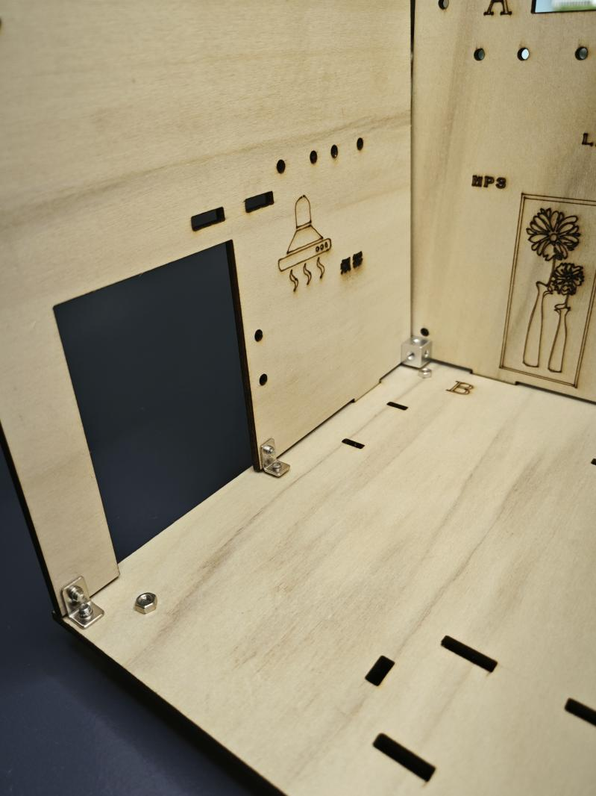
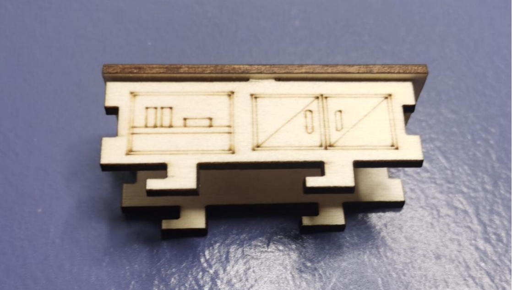
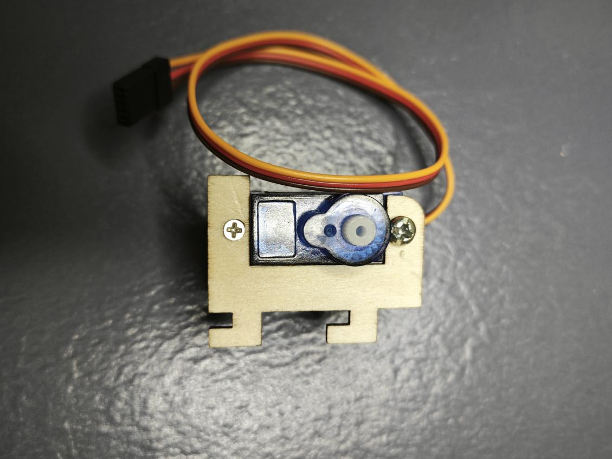
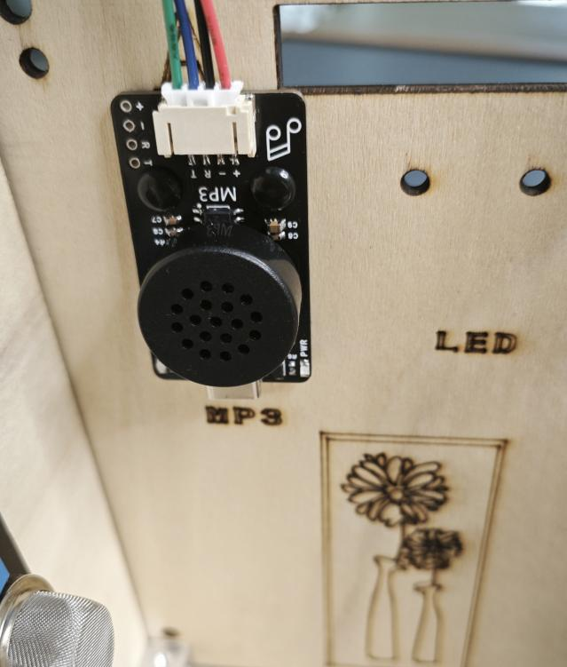
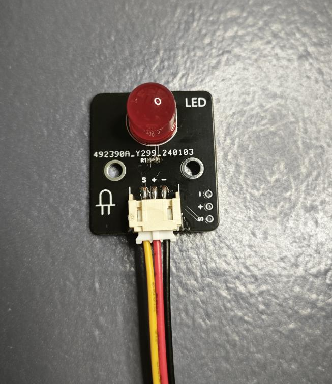
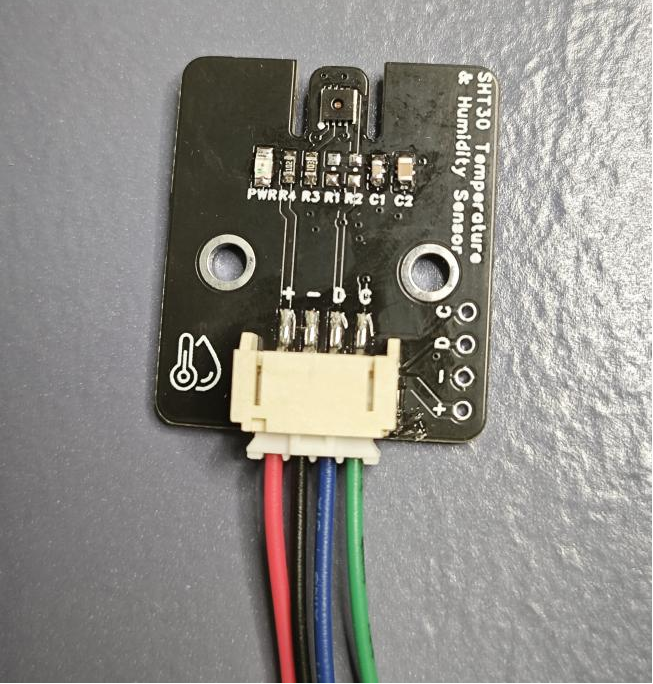

# 智能家居组装教程

## 一、安装整体框架

1.1 首先取出B号木板

1.2 取4颗M3*15的螺丝，4颗M3螺母，4个脚垫，用螺丝刀将脚垫固定在B号木板的背面上。

1.3 取出A号木板

1.4 取4颗M3*6的螺丝将4根5cm铜柱固定在A号木板的背面

1.5 将A号木板对准B号木板的卡槽，竖直的安装进去

1.6 取出C号木板

1.7 将C号木板对准B号木板的卡槽，竖直的安装上去

1.8 取1颗L型连接件，2颗M3*6的螺丝，用螺丝刀对B号木板和C号木板进行加固

1.9 取1颗M3的六面螺母，2颗M3*6的螺丝，用螺丝刀对A号木板和B号木板进行加固。

1.10取1颗L型连接件，2颗M3*6的螺丝，用螺丝刀对B号木板和C号木板的中间进行加固

加固完成后如下图所示

1.11 取出D号木板

1.12 将D号木板对准B板卡槽，竖直的安装进去

1.13 取2颗L型连接件，4颗M3*6的螺丝，用螺丝刀对B号木板和C号木板的两头进行加固

1.14 取出E号木板

1.15 将E号木板对准B号木板的卡槽，竖直的安装进去

1.16 取1颗L型连接件，2颗M3*6的螺丝，用螺丝刀对B号木板和E号木板进行加固

1.17 取1颗L型连接件，2颗M3*6的螺丝，用螺丝刀对A号木板和E号木板进行加固

## 二、安装灶台

2.1 取出灶台木板包，一共有以下6块木板

2.2 将左右两块木板对准灶台顶板的卡槽，安装卡紧

2.3 将中间的固定木板对准左右两块木板的卡槽，安装卡紧

2.4将灶台正面的木板卡进灶台顶板的卡槽，并与左右两块木板扣住

2.5 将灶台背面的木板同样卡进灶台顶板的卡槽，并与左右两块木板扣住

2.6 组装好的灶台如下图所示

2.7 将灶台安装在B号木板上，对准B号木板的卡槽，安装上去

## 三、安装电视柜

3.1 取出电视柜木板包，一共有以下7块木板

3.2 先将电视柜正面的木板对准电视柜顶板的卡槽，安装进去

3.3 同样，再将电视柜背面的木板对准顶板的卡槽安装进去

3.4 将电视柜的右侧木板对准顶板的卡槽安装上去，并与前后两块木板扣住

3.5 同样，将电视柜的左侧木板对准顶板的卡槽安装上去，并与前后两块木板扣住

3.6 将电视柜的显示屏固定木板插在椭圆型木板的卡槽中，并对准顶板中间的卡槽安装卡紧

3.7 拿出OLED液晶显示屏，先插上4P杜邦线

3.8 取出4颗M2*10的螺丝，4颗M2螺母，将OLED液晶显示屏固定在显示屏固定木板上

3.9 将电视柜安装在B号木板上，对准B号木板的卡槽，安装上去后向左推进卡紧

3.10 这里要先将连接线从A号木板的孔拉出去

## 四、安装餐桌结构

4.1 取出餐桌的木板包，一共有以下5块木板

4.2 将餐桌的背面的木板对准顶板的卡槽安装上去

4.3 将餐桌正面的木板也对准顶板的卡槽安装进去

4.4 将餐桌左右两边的木板卡紧顶板的卡槽，并与前后两块木板扣住

4.5 将餐桌安装在B号木板上，对准B号木板的卡槽，安装上去后向左推进卡紧

## 五、安装木板床

5.1 取出床的木板包，一共有以下5块木板

5.2 将床底板对准右测木板的卡槽，安装卡紧

5.3 将床底板对准左测木板的卡槽，安装卡紧

5.4 将床头板与床左右两侧木板衔接卡紧

5.5 再将床尾板与左右两木板衔接卡紧

5.6 取出2颗尼龙铆钉将床固定在B号木板上，尼龙铆钉需要用力按紧

## 六、安装门

6.1 取出木板门

6.2 取1个合页，4颗M3*6螺丝，4颗M3螺母，将门连接在C号木板上

6.3 取出门的拉杆和拉杆固定件

6.4 先将拉杆固定件上在门的卡槽上

6.5 取出180度的9g舵机，将舵机配的舵盘安装在舵机上，安装舵盘之前舵机需要先复位（先将舵机接在主板的数字接口D4，将程序下载到主板上，舵机就会进行自动复位），安装时门需要处于关闭状态。

6.6 取出1个舵机固定件

6.7 先取2颗M3*6的螺丝，将舵机用螺丝刀固定在舵机固定件上，再取1颗舵机里自带的自攻螺丝，将门的拉杆连接在舵盘最小的孔上，注意拉杆的方向

6.8 将舵机固定件安装在C号木板上，对准卡槽安装并向右推进

6.9 取1颗M2*10螺丝，1颗M2螺母，将拉杆固定在拉杆固定件上

## 七、安装窗帘

7.1 取2颗M3*6的螺丝，1个360度9g舵机，1个舵机固定件，将舵机用螺丝刀固定在舵机固定件上

7.2 取出窗帘连接轴，将窗帘连接轴安装在舵机上

7.3 取出窗帘布，将窗帘布裁剪到合适的宽度

7.4 在窗帘布的顶端贴上双面胶

7.5 将窗帘固定在连接轴上

7.6 取出窗帘支架

7.7 将窗帘的一端插进窗帘支架上

7.8 然后将电机固定件和窗帘支架安装在E号木板上，对准E号木板的卡槽，向下推进

## 八、安装传感器设备

8.1 取出MQ2烟雾传感器，接上3P杜邦线，取2颗尼龙铆钉，将MQ2烟雾传感器固定在C号木板上

8.2 取出MP3模块，接上4P杜邦线，取2颗尼龙铆钉，将MP3模块固定在A号木板上

8.3 取出 LED模块，接上3P杜邦线，取2颗尼龙铆钉，将LED模块固定在A号木板上

8.4 取出语音播报模块，接上3P杜邦线，取2颗尼龙铆钉，将语音播报模块固定在A号木板上

8.5 取出SHT30温湿度传感器，接上4P杜邦线，取2颗尼龙铆钉，将SHT30温湿度传感器固定在A号木板上

8.6 取出RGB灯条模块，接上3P杜邦线，取2颗尼龙铆钉，将RGB灯条模块固定在D号木板上

8.7 取出电机风扇模块，接上3P杜邦线，取2颗尼龙铆钉，将电机风扇模块固定在D号木板上

8.8 取出TVOC传感器，接上4P杜邦线，取2颗尼龙铆钉，将TVOC传感器固定在A号木板上

8.9 取出LED模块，接上3P杜邦线，取2颗尼龙铆钉，将LED模块固定在A号木板上

## 九、安装亚克力顶板

9.1 取出亚克力顶板

9.2 取出光照强度传感器，接上4P杜邦线，取2颗尼龙铆钉，将光照强度传感器固定在亚克力顶板上

9.3将亚克力顶板安装在智能家居框架的顶上，与C号、A号、D号、E号木板衔接卡紧，这里记得先将所有传感器的先从A号木板的线槽中引出。

9.4取1颗M3的六面螺母，3颗M3*6的螺丝，用螺丝刀对亚克力顶板、A号木板和C号木板进行加固。
 

9.5取1颗M3的六面螺母，3颗M3*6的螺丝，用螺丝刀对亚克力顶板、A号木板和E号木板进行加固。

9.6取1颗L型连接件，2颗M3*6的螺丝，用螺丝刀对亚克力顶板和C号木板进行加固

9.7取1颗L型连接件，2颗M3*6的螺丝，用螺丝刀对亚克力顶板和E号木板进行加固

## 十、安装主板和蓝牙

10.1取出F号木板

10.2取4颗M3*10的螺丝，4颗M3螺母，将Arduino uno主板固定在F号木板上

10.3将传感器扩展板堆积插在Arduino uno主板上

10.4取出蓝牙模块，接上4P杜邦线，取2颗尼龙铆钉，将蓝牙模块固定在F号木板上

## 十一、连线

+ 将客厅LED模块用3P杜邦线连接到传感器扩展板的数字接口D12（黄线S—D12，红线VCC—5V，黑线GND—GND）；

+ 将卧室LED模块用3P杜邦线连接到传感器扩展板的数字接口D13（黄线S—D13，红线VCC—5V，黑线GND—GND）；

+ 将SHT30温湿度传感器用4P杜邦线连接到传感器扩展板的IIC接口（蓝线D—SDA，绿线C—SCL,红线VCC—5V，黑线GND—GND）（连第2个IIC接口）；

+ 将光照传感器用4P杜邦线连接到传感器扩展板的IIC接口（蓝线D—SDA，绿线C—SCL,红线VCC—5V，黑线GND—GND）（连第1个IIC接口）;

+ 将TVOC AGS02MA传感器用4P杜邦线连接传感器扩展板的IIC接口（蓝线D—SDA，绿线C—SCL,红线VCC—5V，黑线GND—GND）（连第3个IIC接口）；

+ 将MQ2烟雾传感器用3P杜邦线连接传感器扩展板模拟的接口A2（黄线S—A2，红线VCC—5V，黑线GND—GND）；

+ 将RGB-LED灯条模块用3P杜邦线连接到传感器扩展板的模拟接口A1（黄线S—A1，红线VCC—5V，黑线GND—GND）；

+ 将MP3模块用4P杜邦线连接到传感器扩展板的串口（蓝线RX—D10，绿线TX—D11，红线VCC—5V，黑线GND—GND）；

+ 将电机风扇模块用3P杜邦线连接到传感器扩展板的数字接口D3（黄线S—D3，红线VCC—5V，黑线GND—GND）；

+ 将180度9g舵机连接到传感器扩展板的数字接口D4（黄线S—D4，红线VCC—5V，黑线GND—GND）；

+ 将360度9g舵机连接到传感器扩展板的数字接口D5（黄线S—D5，红线VCC—5V，黑线GND—GND）；

+ OLED显示屏用4P杜邦线连接到IIC接口（蓝线D—A4，绿线C—A5,红线VCC—5V，黑线GND—GND）；

+ 语音播报模块用3P杜邦线连接到数字接口D6（黄线S—D6，红线VCC—5V，黑线GND—GND）；

+ 蓝牙模块用4P杜邦线连接到传感器扩展板的串口（蓝线RX—D8，绿线TX—D9，红线VCC—5V，黑线GND—GND）

连线图

## 十二、安装背板

12.1取4颗M3*6的螺丝，将F号木板固定在A号木板背面的铜柱上

12.2取出G号木板

12.3取2颗L型连接件，4颗M3*6的螺丝，用螺丝刀对G号木板和F号木板进行加固

12.4安装完成后如下图所示

