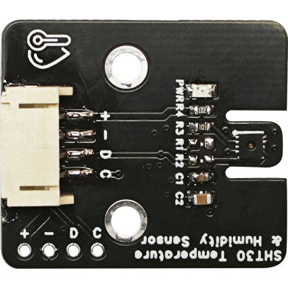
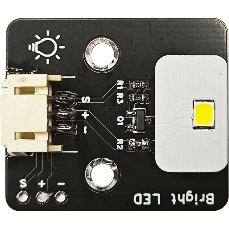
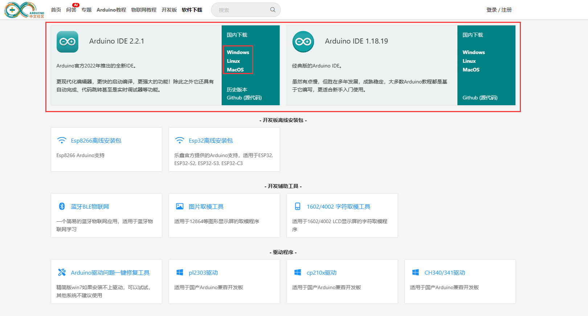

# 第一章 认识智慧农场

## 1、智慧农场概述

农业是人类赖以生存的基础之一，然而现代农业面临了许多挑战，包括气候变化、土地覆盖等问题。农业智能化或农场智能化，是目前广泛研究的解决方案之一。智慧农场通过数字化技术、物联网（IoT）、人工智能（AI）等方式，将农业生产过程中的各个环节进行数据化、自动化和智能化。实现农业环境监测、环境调节、水资源利用等方面优势。

这是一个基于Arduino UNO的智慧农业系统，利用传感器、无线网络和互联网技术，可以收集数据、快速传输数据、实现互联互通。这些数据包括土壤温度、气温、空气湿度、光照、CO2浓度等多种信息。通过学习各种传感器模块的原理和使用控制方法，了解农业怎么实现智能化的。通过蓝牙模块连接到我们的蓝牙BLE遥控软件上。用户可以监控农场的环境数据，并控制补光灯、风扇、水泵、加热等模块。

## 2、课程目标

+ 了解智慧农场的概念和搭建

+ 了解Arduino主板及其他所需硬件

+ 学会安装Arduino IDE

## 3、硬件准备

### （1）Arduino UNO主板

Arduino Uno R3是基于ATmega328的微控制器板。它具有 14 个数字输入/输出引脚（其中 6个可用作 PWM 输出）、6个模拟输入、一个 16 MHz 陶瓷谐振器 （CSTCE16M0V53-R0）、一个 USB 连接、一个电源插孔、一个 ICSP 接头和一个复位按键。
它包含支持微控制器所需的一切；只需使用USB电缆将其连接到计算机，或使用AC-DC适配器或电池为其供电即可开始使用。

### （2）传感器扩展板

传感器扩展板用于堆叠在Arduino主板上，将主板的IO口扩展出来的同时，为每个IO口添加了一个供电，这样我们可以更加方便的连接传感器模块或者其他扩展硬件模块。

### （3）蓝牙模块

用来连接控制端，通过蓝牙发出指令控制模块，以及收集传感器数据。

### （4）土壤湿度传感器

土壤湿度传感器是一个简易的水分传感器，可用于检测土壤的湿度。

### （5）光照传感器

光照传感器是利用半导体的光电导效应制成的一种电阻值随入射光的强弱而改变的电阻器，又称为光电导探测器。当入射光强，电阻减小，入射光弱，电阻增大。可用来对周围环境光的强度进行检测，结合Arduino控制器可实现光的测量。

### （6）CO2模块

缺图

### （7）SHT30温湿度传感器

温湿度传感器用于感知空气的温度湿度，根据温度高低来调节风扇是否开启。采用I2C的通讯方式。应用广泛，精度高。

### （8）电机风扇模块

通过风扇转动来调节空气流通、降温散热等。

### （9）加热模块

通过内置的发热片恒温发热，体积小，结构简单，使用方便。

### （10）高亮LED模块

Bright LED可以将电能转化为光能，工作电压：5V，工作电流：15-20mA。

### （11）MOS管模块

用来连接水泵或加热器，通过控制MOS管的开关来控制水泵或加热器是否导电。

### （12）水泵

直流电机3V立式小水泵，导电性好，性能稳定，可以应用于自动化设备水循环，是制冷，饮水机，太阳能喷泉，蓄水池补水等多种用途。

## 4、开发环境

开始使用Arduino前，需要在电脑上安装Arduino的集成开发环境（Integrated Development Environment ，此后简称IDE）和开发板对应的驱动程序。

### 下载安装Arduino IDE

IDE下载地址:

<https://arduino.me/download>

**Windows系统**

点击Windows Installer下载安装包，安装过程中勾选上Install USB driver，并指定地址安装Arduino IDE。安装完成后，通过桌面快捷方式即可打开Arduino IDE。

也可以下载Windows zip压缩包，解压文件到任意位置，双击解压出的Arduino.exe即可打开Arduino IDE。

**Mac OS X系统**

点击Mac OS X下载并解压zip文件，双击Arduino.app进入Arduino IDE。

如果没有安装过Java运行库，系统会提示安装，安装完成后，即可运行Arduino IDE。

**Linux系统**

根据系统版本，选择32位或64位版本下载，下载后需要使用make install命令安装。

如果使用的是Ubuntu系统。推荐通过Ubuntu软件中心安装Arduino IDE。

### 安装Arduino驱动程序

如果使用Arduino UNO、Arduino MEGA、Arduino Leonardo等原版开发板，并且通过Windows Installer安装IDE，那此时直接将Arduino开发板和电脑连接，电脑即可检测到设备。

如果通过zip压缩包解压出IDE，那么需要运行 IDE目录>drivers>dpinst-amd64.exe 安装驱动。

对于Windows系统，安装好驱动程序后，可以在设备管理器中看到设备对应的串口号，如图：

**windows查看串口设备方法:**
1.右键点击开始图标，选择设备管理器
2.选择端口（COM和LPT）即可看到已连接的串口设备

IDE自带的一个简单的串口监视器程序，用它可以查看串口发送接收到的数据。

相较于IAR、Keil等专业的硬件开发环境，Arduino的开发环境给人简单明了的感觉，但正是这种简单，省去了很多不常用的功能，让没有太多基础的使用者更容易上手。

### 蓝牙BLE遥控软件

这是我们自主研发的一款蓝牙遥控软件，将以下地址复制到浏览器打开
（<https://ble.openjumper.com/connect>）

注意：本软件需要使用Edge或Chrome等现代浏览器方可正常使用

**移动端**

访问 https://ble.openjumper.com

仅支持android手机使用，如自带浏览器无法正常使用，请安装Edge或Chrome浏览器

**设备支持**
市面上的大部分BLE串口透传模块均可使用。

已测试可用模块：HC-42、JDY-18

已知不可用的模块型号：JDY-10

**使用说明**

点击连接设备后会搜索附近的设备，选择你要连接的设备，然后选择对应的控制界面。下面
对智慧农场界面的通信指令进行说明：

本软件中通信指令统一格式为：

key:value\n

每条指令都以换行符\n结束

**智慧农场**

|组件|	key	|value|	指令示例|
|--|--|--|--|
|温度	|temperature|	数值	|temperature:100|
|湿度	|humidity	|	数值|	humidity:100|
|光照	|illuminance|	数值|	light:100|
|气压|	pressure	|数值	|pressure:100|
|风向|	windDirection|	数值	|windDirection:100|
|风速|	windSpeed|	数值	|windSpeed:100|
|水质	|waterQuality|	数值|	waterQuality:100|
|降雨量	|rainfall|	数值	|rainfall:100|
|灌溉	|irrigation	|on \| off	|	irrigation:on|
|通风|	fan	|on \| off		|fan:on|
|补光灯|	light|	on \| off	|	light:on|
|风车|	windmill|	on \| off	|	windmill:on|
|其他功能|	custom|	on \| off	|	custom:on|
|文本编辑|	text	|文本	|text:欢迎光临|

打开智慧农场操作界面，可以看到这个界面总共分了两个部分，第一部分是主要是收集监测传感器的数据，比如温环境度、空气湿度、土壤湿度、CO2浓度，光照强度等数据。

第二部分为控制中心，用来发出控制模块的指令。比如打开补光灯/关闭补光灯，打开水泵/关闭水泵，打开风扇/关闭风扇，打开加热器/关闭加热器等。点击界面上的操作按钮，模块就会执行对应的指令。
 
