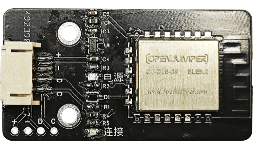
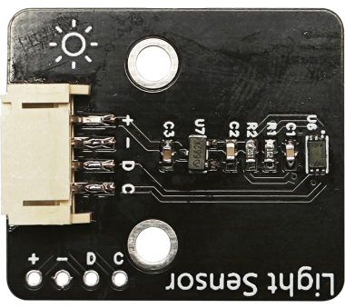
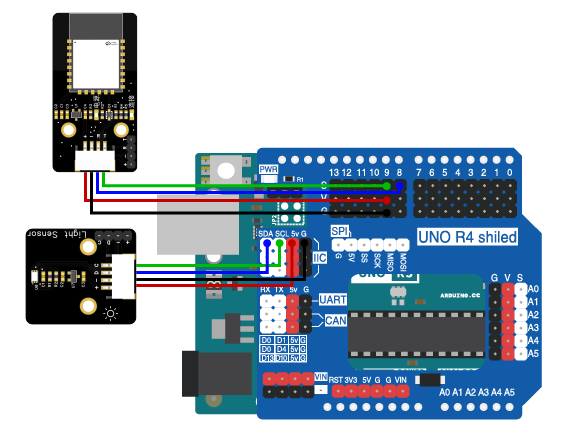

# 第二章 光照强度监测

## 1、简介

在这一章，我们将使用Arduino uno R3主板、蓝牙模块、光照传感器来实现这个实验。通过蓝牙模块来传输光照强度的数据，在移动端远程监测光照强度。

## 2、课程目标

+ 了解蓝牙模块的基本原理和使用方法；

+ 了解光照传感器的基本原理和使用方法；

+ 学习如何使用Arduino Uno R3主板获取光照强度。

## 3、器材准备

+ Arduino UNO主控板*1

+ 传感器扩展板*1

+ 蓝牙模块*1

+ 光照传感器*1

+ 杜邦线*2

+ USB数据线*1

## 4、蓝牙模块

### 简介

蓝牙模块BLE 5.2是蓝牙技术的最新版本之一，它提供了更快的数据传输速度、更低的功耗以及更广泛的覆盖范围。BLE 5.2还引入了一些新的功能，比如LE音频传输和定位服务，为物联网设备和智能家居设备提供了更多的可能性。这使得BLE 5.2成为连接各种设备和传输各种数据的理想选择。蓝牙模块BLE 5.2是一种低功耗蓝牙（BLE）模块，它支持蓝牙5.2标准，提供了更快的数据传输速度和更低的功耗。这些特性使得BLE 5.2模块成为连接各种设备的理想选择，包括智能手机、智能家居设备、穿戴设备和工业物联网设备等。



### 模块参数

|主要参数|	参数值	|描述|
|--|--|--|
|工作电压(V)|	1.8~3.8	|超过3.8V可能永久烧毁模块|
|通信电平(V)|	3.3	|使用5V TTL有风险烧毁|
|工作温度(°C)	|-40~+125	|车规级设计|
|工作频段(MHz)|	2400~ 2480	|支持ISM频段|
|最大发射功率(dBm)|	6	||
|发射电流(mA)	|10.5	||
|接收电流(mA)	|2.5	||
|休眠电流(μA)	|2	||
|接收灵敏度(dBm)	|-98.9|	|
|参考距离(m)	|170	|晴朗空旷环境，高度1米 @6dBm,空速1Mbps|
|通信速率GFSK(bps)	|125K~2M	||
|晶振频率(Hz)	|38. 4M	||
|支持协议|	BT5.2	||
|封装方式|	贴片式	||


## 5、光照传感器

光敏电阻器是利用半导体的光电导效应制成的一种电阻值随入射光的强弱而改变的电阻器，又称为光电导探测器。当入射光强，电阻减小，入射光弱，电阻增大。可用来对周围环境光的强度进行检测，结合Arduino控制器可实现光的测量，可通过3P传感器连接线与Arduino专用传感器扩展板结合使用，可以制作光感相关的互动作品。



## 6、硬件连接

将光线传感器用4P杜邦线连接到传感器扩展板的IIC接口（蓝线D—SDA，绿线C—SCL,红线VCC—5V，黑线GND—GND）；

蓝牙模块用4P杜邦线连接到传感器扩展板的串口（蓝线RX—D8，绿线TX—D9，红线VCC—5V，黑线GND—GND）

确保所有连接都正确无误。



## 7、实验程序

将以下程序复制到Arduino IDE中，选择好主板和对应的端口，编译上传程序。

```C
//缺程序
```

## 8、观察现象

将这段代码上传到Arduino UNO R3主板上，然后打开蓝牙控制端，点击连接设备，连接成功后就可以实时获取光照强度的数据啦。（蓝牙控制端：<https://ble.openjumper.com/connect>）
