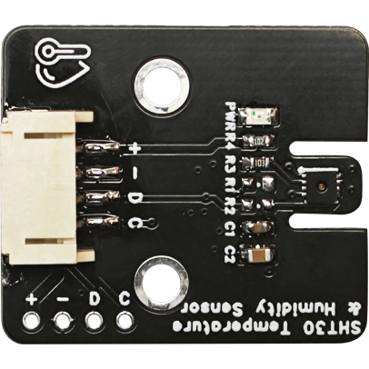
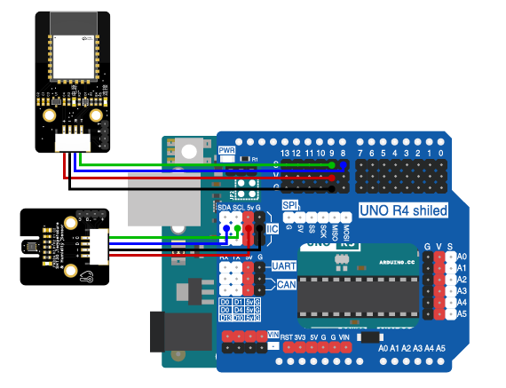

# 第三章 环境温湿度监测

## 1、简介

在这一章，我们将使用Arduino uno R3主板、蓝牙模块、SHT30温湿度传感器来实现这个实验。通过蓝牙模块来传输温度湿度的数据，在移动端远程监测环境的温度和湿度情况。

## 2、课程目标

+ 了解学习温湿度传感器的工作原理及应用。

+ 学习并应用Arduino IDE编程环境，完成温湿度传感器数据读取。

+ 实践电子电路的基本搭建。

## 3、器材准备

+ Arduino UNO主控板*1

+ 传感器扩展板*1

+ 蓝牙模块*1

+ SHT30温湿度传感器*1

+ 杜邦线*2

+ USB数据线*1

## 4、SHT30温湿度传感器

SHT30是一款高精度的温湿度传感器，它可以通过I2C接口与Arduino等微控制器通信。该传感器能够提供实时的温湿度数据，非常适合用于各种环境监测项目。



## 5、硬件连接

SHT30温湿度传感器4P杜邦线连接到传感器扩展板的IIC接口（蓝线D—SDA，绿线C—SCL,红线VCC—5V，黑线GND—GND）（连第2个IIC接口）；

蓝牙模块用4P杜邦线连接到传感器扩展板的串口（蓝线RX—D8，绿线TX—D9，红线VCC—5V，黑线GND—GND）


确保所有连接都正确无误。




## 6、实验程序

将以下程序复制到Arduino IDE中，选择好主板和对应的端口，编译上传程序。
```C
//缺程序
```

## 7、观察现象

将这段代码上传到Arduino UNO R3主板上，然后打开蓝牙控制端，点击连接设备，连接成功后就可以实时获取环境的温度和湿度啦。
（蓝牙控制端：<https://ble.openjumper.com/connect>）
