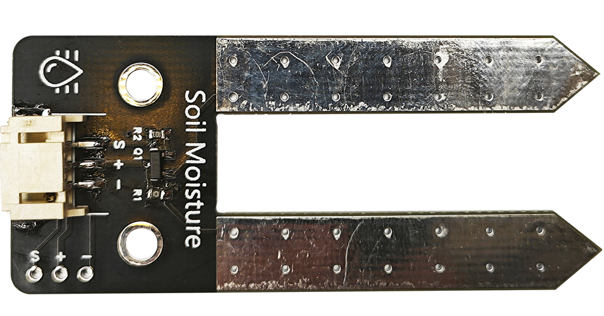
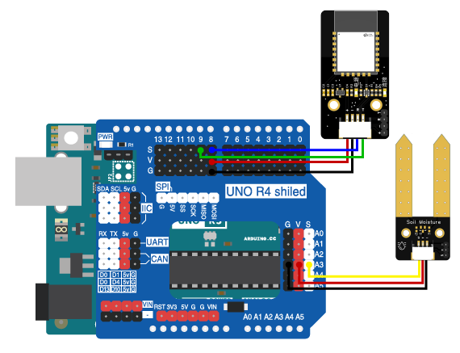

# 第四章 土壤湿度监测

## 1、简介

在农业中，土壤湿度是一项非常重要的数据，我们需要根据土壤的湿度来判断是否需要浇水。在这个实验中，我们将使用Arduino uno R3主板、蓝牙模块、土壤湿度传感器来制作一个土壤湿度监测系统。通过蓝牙模块将获取的土壤湿度数据传输到蓝牙控制端，实时显示土壤湿度数据达到监测的效果。

## 2、课程目标

+ 了解土壤湿度传感器的工作原理及应用。

+ 学习并应用Arduino IDE编程，完成土壤湿度数据读取和通过蓝牙传输数据的编程。

+ 实践电子电路的基本搭建，最终制作出土壤湿度监测系统。

## 3、器材准备

+ Arduino UNO主控板*1

+ 传感器扩展板*1

+ 蓝牙模块*1

+ 土壤湿度传感器*1

+ 杜邦线*2

+ USB数据线*1

## 4、土壤湿度传感器

### 概述

土壤湿度传感器是一个简易的水分传感器，可用于检测土壤的湿度，当土壤湿度低时，传感器的输出值将减小，反之将增大。使用这个传感器可以自动对菜园，花园自动浇水，家庭花盆土壤湿度的控制。该传感器可以提高导电性能，可防止接触土壤容易生锈的问题，可以延长它的使用寿命。将它插入土壤，然后使用AD转换器读取它。



### 工作原理

土壤湿度传感器是判断土壤中水分含量的多少来判定土壤的湿度大小。

当插入土壤中时由于土壤中水分含量不同，土壤的电阻值就不同，三极管的基极就提供了大小变化的导通电流，三极管集电极到发射极的导通电流受到基极控制，经过发射极的下拉电阻后转换成电压。


## 5、硬件连接

土壤湿度传感器用3P杜邦线连接到传感器扩展板的模拟接口A3（黄线S—A3，红线VCC—5V，黑线GND—GND）；

蓝牙模块用4P杜邦线连接到传感器扩展板的串口（蓝线RX—D8，绿线TX—D9，红线VCC—5V，黑线GND—GND）

确保所有连接都正确无误。



## 6、实验程序

将以下程序复制到Arduino IDE中，选择好主板和对应的端口，编译上传程序。
```C
#include <SoftwareSerial.h>

SoftwareSerial mySerial(8,9); // RX, TX

#define Pin_soilmoisture A3//土壤湿度

unsigned long systime = 0;
unsigned long oldtime = 0;
unsigned long delayTime = 1500;
bool Lstate = LOW;

void setup() {
  // 初始化串口通信
  Serial.begin(9600);
  mySerial.begin(9600);
}

void loop() { 
  systime = millis();

  if(systime - oldtime >= delayTime){
    oldtime = systime;    

    int sl = analogRead(Pin_soilmoisture);
    mySerial.print("soil_moisture:");
    mySerial.println(sl);  

    Serial.print("soil moisture:");
    Serial.println(sl);
  }
 
}
```

## 7、观察现象

将这段代码上传到Arduino UNO R3主板上，然后打开蓝牙控制端，点击连接设备，连接成功后就可以实时获取土壤的湿度啦。（蓝牙控制端：<https://ble.openjumper.com/connect>）
