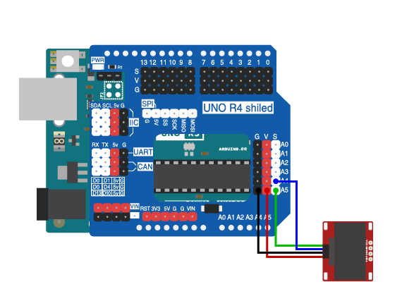

# 第五章 OLED显示屏的使用

## 1、简介

这一章通过介绍OLED液晶显示屏的原理及使用方式，了解OLED液晶显示屏是如何工作的，通过一个简单的例程来学习OLED液晶显示屏的驱动方式。

## 2、课程目标

+ 了解OELD液晶显示屏的工作原理及应用。

+ 学习Arduino IDE编程，驱动OLED显示屏

## 3、器材准备

+ Arduino UNO主控板*1

+ 传感器扩展板*1

+ OLED液晶显示屏*1

+ 杜邦线*1

+ USB数据线*1

## 4、OELD液晶显示屏

OLED（Organic Light Emitting Diode）液晶显示屏是一种采用有机发光二极管作为发光材料的显示技术。它的工作原理是在有机材料之间加上电压，通过电子的注入和复合来产生光。OLED液晶显示屏具有高对比度、快速响应、视角宽、薄、轻、低功耗等特点，因此在很多电子产品中得到广泛应用。


12864 OLED ，使用IIC接口，占用IO口少，屏幕尺寸:0.96英寸，点阵格式:128*64，通过使用u8glib 、AdafruitSSD1306库文件或自己编写驱动，连接OLED至Arduino的IIC通信接口就可以很方便的进行显示。屏幕工作电压为DC 5V。使用方式是通过控制芯片SSD1306来控制显示内容。通过向控制芯片发送指令和数据，可以控制显示屏上的像素点，从而显示图像和文字。

## 5、硬件连接

OLED显示屏用4P杜邦线连接到IIC接口（蓝线D—A4，绿线C—A5,红线VCC—5V，黑线GND—GND）；

确保所有连接都正确无误。



## 6、实验程序

将以下程序复制到Arduino IDE中，选择好主板和对应的端口，编译上传程序。
```C
#include "U8glib.h"// 包含U8glib库

U8GLIB_SSD1306_128X64 u8g(U8G_I2C_OPT_DEV_0|U8G_I2C_OPT_NO_ACK|U8G_I2C_OPT_FAST); // Fast I2C / TWI

int a = 0;// 定义变量a并初始化为0

void draw(void) {
  // graphic commands to redraw the complete screen should be placed here  
  u8g.setFont(u8g_font_unifont);// 设置字体为unifont
  //u8g.setFont(u8g_font_osb21);
  u8g.drawStr(26,12,"OpenJumper");在坐标(26,12)处绘制字符串"OpenJumper"

  //u8g.setPrintPos(40, 20); 
  //u8g.print("Hello World!");
  u8g.setPrintPos(0, 40);// 设置打印位置为(0,40)
  u8g.print(a);// 打印变量a的值
}

void setup(void) {
  Serial.begin(9600);// 初始化串口通信，波特率为9600
  u8g.setRot180();// 设置显示屏旋转180度
}

void loop(void) {
  // picture loop
  u8g.firstPage();  
  do {
    draw();// 调用draw函数
  } while( u8g.nextPage() );// 显示下一页内容
  
  // rebuild the picture after some delay
  delay(50);// 延迟50毫秒
}
```
## 7、观察现象

将这段代码上传到Arduino UNO R3主板上，在128x64 OLED液晶显示屏上显示字符串"OpenJumper"和变量a的值。它使用U8glib库来控制SSD1306型号的OLED显示屏，通过draw函数在屏幕上绘制指定的内容，然后在循环中不断重绘内容，实现屏幕的持续显示。同时，通过设置旋转角度和延迟时间，可以调整显示效果。
