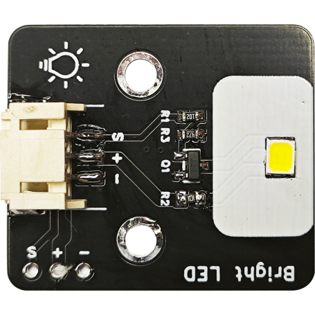
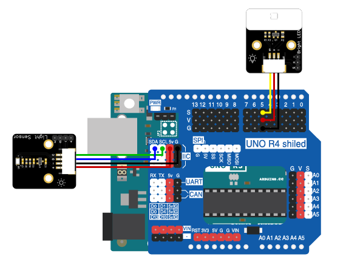

# 第七章 智能光控系统

## 1、简介

在这个实验中，我们将使用Arduino uno R3主板、光照传感器、高亮LED模块来制作一个智能光控系统。通过感应环境光照的强度控制补光灯的开关。

## 2、课程目标

+ 了解光照传感器和高亮LED模块的工作原理及应用。

+ 学习并应用Arduino IDE编程环境，完成光照传感器数据读取和基于光照强度控制高亮LED模块开关的编程。

+ 实现电子电路的基本搭建。制作出能够响应环境光照变化的智能光控系统。

## 3、器材准备

+ Arduino UNO主控板*1

+ 传感器扩展板*1

+ 光照传感器*1

+ 高亮LED模块*1

+ 杜邦线*2

+ USB数据线*1

## 4、高亮LED模块

Bright LED可以将电能转化为光能，工作电压：5V，工作电流：15-20mA。




## 5、硬件连接

将高亮LED模块用3P杜邦线连接到传感器扩展板的数字接口D5（黄线S—D5，红线VCC—5V，黑线GND—GND）；

将光线传感器用4P杜邦线连接到传感器扩展板的IIC接口（蓝线D—SDA，绿线C—SCL,红线VCC—5V，黑线GND—GND）

确保所有连接都正确无误。




## 6、实验程序

将以下程序复制到Arduino IDE中，选择好主板和对应的端口，编译上传程序。

```C
int lightSensorPin = A0;  // 光照强度传感器连接到Arduino的模拟引脚A0
int ledPin =5;          //高亮 LED连接到Arduino的数字引脚5

void setup() {
  pinMode(ledPin, OUTPUT);  // 设置LED引脚为输出模式
  Serial.begin(9600);       // 初始化串口通信
}

void loop() {
  int lightIntensity = analogRead(lightSensorPin);  // 读取光照强度传感器的数值
  Serial.print("光照强度: ");
  Serial.println(lightIntensity);

  if (lightIntensity > 500) {
    digitalWrite(ledPin, LOW);  // 当光照强度强时，关闭高亮LED灯
    Serial.println("关闭LED灯");
  } else {
    digitalWrite(ledPin, HIGH);  // 当光照强度弱时，打开高亮LED灯
    Serial.println("打开LED灯");
  }

  delay(1000);  // 延迟1秒
}
```

## 7、观察现象

将这段代码上传到Arduino UNO R3主板上，它将会根据光照传感器读取的光照强度数据来自动控制高亮LED灯的开关。